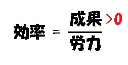
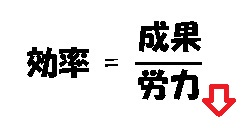
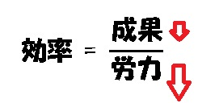
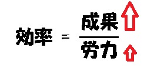
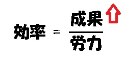

# このドキュメントについて
(特に仕事や作業に関する)「効率」について考察した文書である。

# 効率の定義

## 効率とは
効率(Efficiency)とはある仕事に対する作業効率(Working Efficiency)を指す。ただし効率について議論する際は、後述の「効率のコンテキスト(Efficy Context)」に従う。

## 効率という指標の存在意義
成果に要する労力は小さいに越したことはないが、労力の過多について議論する際、労力という指標単体を扱うよりも「労力と成果の比」を扱う方がより実用的である。というのも、成果次第で労力のボリュームは大幅に異なるからである。

この「労力と成果の比」を効率と呼ぶ。

## 効率の式
効率を式で表現すると、以下のようになる。

```
(効率) = (成果) / (労力)
(労力) > 0
(成果) >= 0
```

英語でも記しておく。

```
(Efficiency) = (Output) / (Cost)
```

効率とは定量的尺度であるとは限らない。上記式も概念的なイメージである。この式が表しているのは、成果が大きいほ
ど効率が高くなること、労力が小さいほど効率が高くなることなどである。

# 効率のコンテキスト
効率のコンテキスト(Efficy Context)とは、効率について議論する際に前提とする背景や条件である。

効率のコンテキスト:

- 仕事(Task)に対して、成果(Output)を出すことを目指す
- 成果(Output)を出すためには、何らかの作業(Work)を行う
- 作業には労力(Cost)がかかる
- 成果を出した時、それまでに費やした労力が存在する

構成要素:

- 仕事(Task)
- 成果(Output)
- 作業(Work)
- 労力(Cost)

## 仕事
仕事(Task)とは何らかのアクションを要する事項。

## 成果
成果(Output)とは仕事に取り組んだことにより生じた、何らかの肯定的な結果(Positive Result)。

成果は肯定的な結果でなくてはならない。逆を言えば否定的な結果(Negative Result)は成果ではない。式で表せば `(成果) >= 0` が成立する。効率論においては議論を単純にするため、否定的な結果については考慮しないのである。

## 作業
作業(Work)とはある成果を上げるために必要な行動。

### 作業の種類
作業は直接と間接に分かれる。

- 直接作業
- 間接作業

直接作業とは毎回必ず必要となる行動。ただし効率化により不要となることはある。

間接作業とは直接作業でない行動。

間接作業にはいくつか種類がある。

- 準備作業
- 突発作業
- ……

準備作業とは環境次第で要否が変化するが、必要な環境下では必要となる行動。たとえば PC で行う作業には「PC のある場所に行く」「PC の前に座る」といった行動が必要であり、これは準備作業にあたる。

突発作業とは普段は不要だが突発的に必要となる行動。たとえば PC を使う作業において PC、ネットワーク、利用サービスなどが故障した場合はメンテナンスや代替手段の検討が必要となるが、これは突発作業にあたる。

### 効率 = 作業効率 = 直接作業効率
一般的に効率論で扱うのは直接作業のみである。本文書でも特に断りがなければ、作業という言葉は直接作業を指すことにする。

### 作業の三条件
ある「成果を上げるために必要な行動」が作業であるためには、以下を満たす必要がある。

- 記述できる(Writable)
  - 過程(プロセス/Process)として第三者が理解できる言葉で記述できる
- 反復できる(Repeatable)
  - 過程を複数回繰り返すことができる
- 完了できる(Finishable)
  - 過程を現実的に終えることができる

これを満たさない行動は作業ではなく、したがって効率を議論することもできない。

- 例1: 記述できない行動
  - 世界で A さんしか仕上げることのできない小説の執筆
- 例2: 反復できない行動
  - 正解で一つのみ存在する隕石の破片を用いた実験(実験後に破片が残らないとする)
- 例3: 完了できない行動
  - リーマン予想を証明する(未解決問題)

## 労力
労力(Cost)とは作業(特に断りがなければ直接作業)に要した手間を指す。

ただし手間は定量的に表現できる必要がある。定量的に表現できないものは手間ではなく、したがって労力とはみなさない。

労力の例:

- n 時間かかった
- n 円費やした
- n 人を費やした
- n 個使った

労力でない例:

- いつもよりも疲れた
- いつもよりも集中できた
- いつもよりも機嫌良く仕事できた

### ゼロコスト
ゼロコスト、つまりは `労力 = 0` は存在しない。あらゆる作業には少なからず労力が必要である。

もっともゼロコストで成果を上げること自体は可能である。自動化や委譲といった方法がある。ただし、ゼロコストでは効率について議論できないため、ゼロコストは効率論の範疇外とする。しかしながら、自動化や委譲には間接作業が発生するため、この間接作業に関する効率を議論することはできる。

間接作業が発生する契機の例:

- 自動テストがイレギュラーで稀に失敗する
- 委譲先の人間が病気で死亡した

# 効率論
効率について扱う理論として「効率論」をつくることにした。効率論に関連する用語をここで整理しておく。

## まとめ
造語については意味欄も記述した。

| 用語       | 英語       | 品詞   | 意味 |
| ---------- | ---------- | ------ | ---- |
| 効率       | Efficiency | 名詞   | - |
| 効率的な   | Efficient  | 形容詞 | - |
| 効率化     | Efficy     | 名詞   | 効率化を行うこと、という行動、発想、体系。 |
| 効率化する | Effice     | 動詞   | 効率化を行うこと。 |
| 効率論     | Effisology | 名詞   | 効率化について扱う分野。 |
| 効率主義   | Efficism   | 名詞   | 効率化に傾注する主義。 |
| 効率主義者 | Efficist   | 名詞   | 効率主義を持つ者。 |
| 効率家     | Efficer    | 名詞   | 効率化をご飯の種にしている者。 |

## 効率化
効率化(Efficy)とは効率を高めること。

Efficy は造語である。2019/03 現在、英語圏に効率化という概念を表す英単語は存在しない。一応 Streamline はあるものの意味が直感的ではない。また Optimize や Improve といった別用語も存在するものの、これらは広義である。「効率化」という概念を表す「専用の用語」に対する適切な英単語が存在しない。ゆえに Efficy という造語をつくるに至った。

## 効率化する
効率化する(Effice)とは効率を高めること。Efficy の動詞である。

## 効率論
効率論(Effisology)とは効率化について扱う分野。

## 効率主義と効率主義者と効率家
効率主義(Efficism)とは効率化に傾注する主義。

効率主義者(Efficist)とは効率主義者。

効率家(Efficer)とは効率化に関する仕事でご飯を食べている者。

# Efficy Approaches
効率論ではアプローチ(Approach)を用いて効率化を試みる。アプローチとは効率について議論しやすくするための、何らかの発想(により制約を追加すること)。

# アプローチ - Value Approach
Value Approach とは `(効率) = (成果) / (労力)` という式をもとにして、いかにして効率を高めるかという発想で効率化を行うこと。

## まとめ
Value Approach はさらに 5 つのアプローチがある。

| 略称 | 英語名 | 意味 |
| ---- | ------ | ---- |
| EZ   | Escape from Zero | とりあえず成果を出す |
| KI   | Keep and Increase | 労力はそのままに、成果を大きくする |
| KD   | Keep and Decrease | 成果はそのままに、労力を小さくする |
| LDMD | Little Decrease and Many Decrease | 成果を少し小さくし、労力をとても小さくする |
| MILI | Many Increase and Little Increase | 成果をとても大きくし、労力を少し大きくする |

所感:

- EZ: 一番簡単
- KD: 効率化と言えば一般的にこれを指す
- LDMD: ネガティブなステージシフト
- MILI: ポジティブなステージシフト
- KI: 一般的に効率化の範疇ではない

## (1) EZ - Escape Zero/まずは成果を出す


成果ゼロは効率ゼロであるため、何よりもまずは成果を出すことが第一である。

成果を出すだけなので一番簡単。

## (2) KD - Keep and Decrease/成果はそのままに、労力を小さくする


効率化というと一般的には KD を指す。

既に何らかの成果を出す仕事があったとして、これにかかる労力を減らすことを考える。

## (3) LDMD - Little Decrease and Many Decrease/成果を少し小さくし、労力をとても小さくする


これは「効率的にこなせる舞台(仕事や環境)を選ぶ」アプローチである。これをステージシフトと呼ぶ。

ステージシフトは一般的に LDMD になることが多い。というのも、シフト前のステージが過酷だったり不向きだったりするがゆえに、そこから逃避する意味で効率化を求める――もっと言えば自分が出す成果は小さくてもいいから、もっと効率的にこなせるステージに行きたい、というケースが多いからである。

## (4) MILI - Many Increase and Little Increase/成果をとても大きくし、労力を少し大きくする


これもステージシフトの一つであるが、シフト先のステージが自分の才能とマッチする場合は、LDMD ではなく MILI になる。つまり、才能があって向いているがゆえに、少ない労力で大きな成果を上げることができる。

## (5) KI - Keep and Increase/労力はそのままに、成果を大きくする


最も難しいのが KI である。

KI は厳密に言えば「労力はそのままだが、成果が大きくなっていく」ことを表す。たとえばコロッケを販売する店があるとして、店主が普段どおりにコロッケの調理をしているとする。ある日、このコロッケ屋がテレビに紹介されて、客が 10 倍に増えたとする。この時、店主はコロッケの値段を 3 倍に釣り上げたとする。人気があるからそれでも普段通りに売れる。これは「コロッケの調理」という労力を変更していないにもかかわらず、3 倍の効率を手に入れたことを意味する。

KI は一般的に効率化ではなく広報である。

# アプローチ - InOut Approach
InOut Approach とは、効率化の対象を効率化実施者の「内外」で分類するという発想から効率化を行うアプローチ。

## 内的対象と外的対象
内的対象(Inside Target)と外的対象(Outside Target)がある。内的対象とは自分自身のこと。外的対象とはそれ以外のこと。

## 弱化と強化
弱化(Weaken)とは対象を弱くすること。特に外的対象を弱くする。

強化(Strengthen)とは対象を強くすること。特に内的対象を強くする。

## 弱化的効率化とは
弱化的効率化とは対象を弱化させる方向性の効率化。外的対象の効率化ともいう。

弱化とは何か:

- 削除(Remove)
- 削減(Reduce)

弱化の対象( **CRRPT** と呼ぶ):

- Culture …… 風土、価値観
- Rule …… 制度、規則
- Resource …… 資源(ヒト、モノ、コト、カネ、トキ)
- Process …… 手順
- Tool …… 手段

## 強化的効率化とは
強化的効率化とは自分自身を強化させる方向性の効率化。内的対象の効率化ともいう。

例:

- 特化的な強化
  - 無知から脱する(やり方を知り、従う)
  - 手続き記憶を鍛える(反復練習して染み込ませる)
- 汎用的な強化
  - 語彙力を高める(事象を抽象的に捉えるための手札を増やす)
  - 言語処理効率を高める(会話経験を積むなど)
- 俯瞰的な強化
  - 効率化そのものや効率論について学ぶ

## 効率化対象マトリクス
効率化対象マトリクスとは、弱化・強化という観点で効率化の対象を決めたい場合に重宝するマトリクス。あなたが行おうとしている効率化は、このマトリクスのどの領域に該当するか――これをを意識すると、その効率化に対する難易度や方向性が見えてくる。

### マトリクス

|      | 弱化                 | 強化                 |
| ---- | -------------------- | -------------------- |
| 個人 | 個人的な弱化的効率化 | 個人的な強化的効率化 |
| 組織 | 組織的な弱化的効率化 | 組織的な強化的効率化 |

### 個人-弱化
個人的な弱化的効率化。個人の CRRPT を削減・削除する。

- 最も簡単に行える
- 一般的に答えは存在しない(個人的な作業は他に二つとない唯一無二であることが多く、当然ながら効率化の前例などあるはずもない)ため、試行錯誤は不可避

### 個人-強化
個人的な強化的効率化。自分自身を強化する。

- 実現不可能ではないが、長期的な鍛錬が必要となる
- 単なる学習、改善、鍛錬担ってしまわないよう注意が必要
  - 目的はあくまで効率を高めること
  - もっと言えば「少ない労力で済むよう」自分をパワーアップさせること

### 組織-弱化
組織的な弱化的効率化。組織の CRRPT を削減・削除する。

- 権力や立場があれば実施は難しくない
  - 例: 社長命令
- 全体最適化が難しい
  - 部署 A が効率化する一方、部署 B は非効率化するかもしれない

### 組織-強化
組織的な強化的効率化。組織の各員自身を強化する。

- 最も難しい
- 自発的に鍛えてもらうか、教育などで無理矢理鍛えるか
  - 自発的 → 優秀かつ少数の組織以外は機能しない
  - 無理矢理 → 教育実績は増えるが実際に強化されにくい or されても表面的な知識のみ

# アプローチ - RAWOS Approach
RAWOS Approach とは効率化の対象を「各個人の手順」と「組織的に定められた手順」とに分類するという発想で効率化を行うアプローチ。RAWOS とは Right And Wrong Of Selectiveness の略。

## 個人的作業と規範的作業
個人的作業(Personal Work または Selective Work)とは、成果を出すために行う作業を作業者各個人が自由に選択できること、あるいはそのような作業。

例:

- 「結果さえ出せば手段は問わない」仕事(に必要な作業)全般

規範的作業(Common Work または Unselective Work)とは、成果を出すために行う作業が組織的に統一的に定められ、選択の余地無く各個人が従わなければならないこと、あるいはそのような作業。ルール、手順、規約、ガイドラインなどで整備されていることが多い。

例:

- 「新製品開発を行うためには役員 2 人以上に対して企画会議を行い、双方から合意をもらわなければならない」というルールにおける各種作業(特に企画会議に絡む作業)
- 「週報は毎週月曜日の午前 10 時までに所定フォーマットで提出しなければならない」というルールにおける各種作業(特に週報作成や提出に絡む作業)

## 個人的作業の効率化
個人的作業を行う方法は人それぞれであるため、特定の方法を強要してはならない(多様性の阻害になりかねない)。あくまでも「こんな方法がある」という選択肢を提示し、各々が自由に選択できるようにする。

この効率化を推進するために必要なこと:

- 有益な方法の提示
- 方法を変えることに関する自発性の醸成
- 方法について学習するためのゆとり
- 方法について試行するためのゆとり

## 規範的作業の効率化
規範的作業を効率化するには、単にその作業を効率化すれば良いが、様々な壁に阻まれるため実践は難しい。

壁の例:

- 作業手順を変更できる権限が非常に限られている
- 作業手順を変更するための手順が難解、煩雑、また非現実的である
- 上位権限者が何らかの理由で作業手順の変更を認めない
  - 例1. 怠惰(面倒くさい)
  - 例2. 体裁(自分がつくった手順を崩したくない)
  - 例3. 多忙(変更について検討する余裕がない)

ただし、手順に従わなくても良いという例外を定めることにより、部分的に(免除による)効率化を行えることはある。

# 効率心理学
効率化において直面する人々の傾向や心理などをまとめる。

## 効率化とはオーダーメイドである
効率化の対象となる作業にはドメイン(その個人や組織に関する各種知識、制約、運用、事情など)が密接に結びついており、軽率に「汎用的な効率化のアイデアやノウハウ」を当てはめられないことがある。

たとえば一見すると無駄な会議であっても、「あらかじめ n 時間は働くという契約が結ばれている」という前提があったとしたら、形式的に n 時間までは労働している事実を見せねばならない。この場合、n 時間未満になってしまわない程度にしか(会議含め)業務時間を削減できないことになる。この「あらかじめ n 時間は働くという契約が結ばれている」制約はドメインであり、効率化において考慮しなければならない部分である。

このようなドメインは対象によってまちまちであるため、ドメインを考慮した効率化はその対象にのみ通用する特化的なものとなりやすい。つまりはオーダーメイドである。

このオーダーメイドという性質上、下手に効率化を仕事にしてしまうと、案件ごとにオーダーメイドを抱えることになってしまい負荷が増大してしまう。SI と同様、本質的に苦しい仕事になりかねない。したがって、効率化を仕事にする者は、オーダーメイドにまで踏み入れてしまわないよう、コンサルのように汎用的な知見のみ提供するといった工夫をするのが良い。

## 効率化とは無関心の表明である
A を効率化することは、A は最悪無くても良いと言っていることに等しい。これを無関心の表明という。

一方で、人には無関心を表明できないものもあり、このようなものが効率化の対象となってしまうと心理的抵抗感が増大してしまう。離職といった行動に結びつくことも少なくない。

最も有名な例は「コミュニケーションの効率化」であろう。コミュニケーションに対する立場は手段派と必須派に分かれるが、

- 手段派: コミュニケーションは情報伝達の手段でしかないため、出来るだけ少ないに越したことはない
- 必須派: コミュニケーションは単なる手段以上に意義のある活動である、コミュニケーションは人として行うべき当然の行動である etc

コミュニケーションの効率化を行えるのは手段派だけである。

## ルール至上主義者
ルール至上主義者(Rule Supremacist)とは既存のルールを盲信し、いかなる理由があろうとも逸脱を許さない主義者。

効率化はしばしばルールから外れるものだが、彼らはその外れることを決して認めないため、効率化も認めない。特に立場を持つ場合は、保身が強く働くため、この傾向が強い。認めさせるのは不可能に等しい。

ルール至上主義者は自身の正当化のために法律などを持ち出すが、法律とルールとでは意味合いが全く異なる。ルールの多くは便宜のために暫定的に定められたものでしかないため、必要に応じて変更しても良いし、変更も比較的簡単に行える(自律志向)のだが、彼らはこのことを知らない、また信じない。

## 自律志向と他律志向
自律志向とは既存に対して自らの意見をぶつける価値観。他律志向とは既存に盲目的に従い、既存を疑うことをしない価値観。

他律志向は効率化に無頓着で、少なくとも自ら効率化しようと動くことはない。自分は取るに足らない存在だと思っており、既存を変えようという発想さえも抱かない。あるいは抱こうとしても「自分なんかが」と卑下するか、「苦労するくらいなら今のままでいい」と諦観する。

一方、自律志向は既存を「暫定的な」事物、つまりは変更可能であると捉える。行き過ぎると法や倫理をも超えてしまうが、効率化に向いているのは自律志向である。

一般的に組織を効率化するためには、立場を持つ自律志向者が必要である。

## 被害者の加害者化
非効率な事物(組織、制約、仲間、手段や環境など)に苦しむ者は「優れた SASAE(効率的な視点や知見)や QoE(効率化に対する素養や能力)を持つ自分達に、これを持たぬ者達を前提とした事物を強要することは間違っている」「事物を効率化するべきだ」と考えているが、その効率化を行えば「持たぬ者達」を苦しめる結果になってしまう。この危険性を説いた言葉。

SASAE や QoE は人それぞれであり、無闇にある者のそれを推進することは、それ以外の者のそれを無視することになる――つまりは多様性を削いでしまうため注意が必要である。

## SASAE
Style And Stance About Efficy の略。ある人の効率化に対する価値観、考え方や捉え方などを表した言葉。

## QoE
Quality of Efficy の略。ある人の効率化に対する素養や能力を指す言葉。

# 効率家を目指して
効率化ネタで稼ぎ、ご飯を食べるためには。

## 効率化で貢献する 3 の方法
- ノウハウの提供
  - 汎用的なノウハウを提供する
  - 生かすかどうか、生かせるかどうかは各人次第
  - ノウハウに関する責任は一切負わない
  - o 一方的に提供するだけで済むため楽
  - x ノウハウを伝えるのが難しい
- ノウフーの提供
  - 効率化に詳しい誰か(一人活動なら自分自身)が PJ に参画してコンサルティングする
  - o 実績を積みやすい
  - x 責任が発生する上、効率化はオーダーメイドであり本質的に仕事が大変であるから、大変になりがち
- サンプルの提供
  - 実際に効率化を実現した何かを提供する
    - 例1. 手順書のボリューム 1/2 にしてみました
    - 例2. Web で使える承認システムをつくってみました
    - 例3. これこれの作業を手作業 30 分 → 自動化 3 秒にするツールを公開しました
  - o ごくごく一般的なビジネス形態であり親しみやすい
  - x 効率化を形にする実力と、形にしたものの需要がなければ立ち行かない

# ●misc
効率化のメリット

- リソースアップ
  - 時間が浮く
- ストレスフリー
  - 精神的負担が減る(退屈、無成長、受動的、消費的)
- パワーアップ
  - 効率論的なスキルや視点

2時間効率化本ネタ

- 効率化対象を 5 に大別
  - 待ち時間
  - 操作コスト
  - 労力
  - プロセス
  - モチベーション
- 具体的な効率化対称
  - PC（電源付けっ放しでいいなど）
  - 周辺機器、パーツ（キーボこだわれなど）
  - PC 設定（Windowsやデフォソフトらの設定）
  - フリーソフトなど（ローカルアプリ）
  - クラウド
  - 仕事術系 ★荒い
  - ドメイン ★荒い

ドメイン。ドメインとは効率化対象の分野・領域固有のCRRPTのこと。
クローズドドメイン（ローカルドメイン）。業務情報、会社情報、社内ルールやチーム内プロセスといった機密情報など。
オープンドメイン（グローバルドメイン）。金融業界や医療業界の常識、一般的な業務フローなど。平たく言えば業界知識。

受動性とモチベーション。効率化にはモチベーションが大事。効率化の先に何があるか、効率化して何が嬉しいか。これがないとモチベーションが起こらない。

効率化のモチベーションを阻むもの（サラリーマン前提）

- 金（生活残業など）
- 無趣味（時間あってもやることがない）
- 会社以外に居場所がない（家に居場所がないパパなど）
- 会社の居心地が良い（設備整ってるし仲間いるし掃除要らないしネットサーフィンで時間潰せるしなど）
- 無知（知らない）
- 無気力（よくわからんけど面倒くさいからやらなくていいや）

効率化の対象範囲
・Self 自分
・Family ごくごく親しい相手（直属上司、メンター、メンティー、その他特に仲の良いメンバー）
・Team 自分が属するPJチーム（課長単位）
・Group 自分が属する部署（部長単位）
・Organization 複数のGroupを束ねる組織単位
まだ性質は見いだせてない。上に行くほど〜〜、みたいな語り方になるかな？

メソッド、ナレッジ、フレームワーク。この辺整理したい。効率化の手段として浮上しないだろうか？

|       | 汎用的 | 特化的 | 
| ----- | ------ | ----- |
| 実用的 | 1 | 2 |
| 形式的 | 3 | 4 |

↑ 特に何もひらめかないが。

