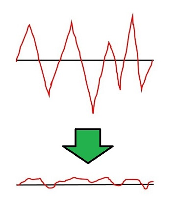

# フラティズム
フラティズム(Flatism)とはフラットな生き方を目指す主義。

## フラットな生き方とは
フラットとは安定的に平坦であること。つまりフラットな生き方とは「安定的に平坦な生き方」である。平坦な生き方を持続させると言い換えることもできる。

## 起伏的人生、平坦的人生、フラティズム
起伏的人生とは山も谷もあるような人生のこと。「人生山あり谷あり」ということわざもあるように、一般的に人生は起伏的であるとされる。つまり人生には山(大きなプラス)と谷(大きなマイナス)がある。

平坦的人生とは山と谷の少ない、起伏に乏しい人生のこと。大きなプラスが無い代わりに、大きなマイナスもないため、物足りなさはあるものの穏やかな人生だと言える。

慌ただしい現代社会においては、自然と平坦的人生になることはまずない。意識的に行動しなければ手に入らない。この平坦的人生を目指すのがフラティズムである。

## フラティズム提唱の背景
フラティズムは、一言で言えば「人生山あり谷あり」へのアンチテーゼである。

「人生山あり谷あり」とは、山があるから谷も我慢しようというプラス思考を説いたことわざであるが、提唱者の私は以下のような不服をおぼえていた。

- 誰もが山と出会えるとは限らない
- 誰もが山を登れるとは限らない
  - 努力できるとは限らない
  - 努力が報われるとは限らない
- 谷は一瞬でも通りたくないこともある
  - 例: 1億円もらえるから拷問を受けてもいいかというと、そうではない

やがて起伏型人生という前提を疑うという視点がひらめき、山(大きなプラス)が無い代わりに谷(大きなマイナス)もない「平坦な(フラットな)人生」を歩き続けることを着想。このようなライフスタイルもとい主義思想をフラティズムと名付けて、整備し始めた。

## フラティズムのイメージ
フラティズムをイメージで示せば、以下のようになる。



起伏を平坦にしたい。ただし、できれば平坦でも山側に振りたい。富士山からの眺望を諦める代わりに、手近な小山や小丘の眺望で妥協するのである。

## 4 approaches to flatism
フラティズムを実現するためには、以下の 4 つのアプローチを用いる。

- 1: ストレスを減らす(NF - Noise Free)
- 2: 欲張らない(DG - Decrease Greed)
- 3: 選択肢を増やす(IS - Increase Selection)
- 4: 自分の嗜好、志向、指向を知る(KM - Know Myself)

## フラティスト
フラティズムに取り組む者をフラティスト(Flatist)と呼ぶ。

# [app.1/4] ストレスを減らす
フラティズムの肝は「谷(マイナス)を減らす」ことにある。そして谷の主因となっているのはストレスである。ストレスを減らすことでフラティズムに近づける。

## 二つの前提
フラティズムでは「ストレスを減らす」ことを議論するために、いくつかの前提を設ける。

- Stress is Noise
- Flatist is Performer

### 前提1: Stress is Noise
フラティズムではストレスをノイズ(Noise)とも呼ぶ。

ストレスを減らすというとイメージが湧きづらいが、ノイズを減らすと考えると湧きやすいため、フラティズムではノイズという言葉を用いる。

### 前提2: Flatist is Performer
フラティズムでは、フラティストは「パフォーマンスを要する何かに従事すること」が人生の主活動である、という前提を取る。このような生き方をパフォーマー(Performer)と呼ぶ。つまりフラティストはパフォーマーである。したがって、パフォーマンスの担保は重要なテーマと言える。

このパフォーマンスを削ぐものこそがノイズである。

### 関連用語: パフォーマンスとノイズ
本来のパフォーマンス(Essential Performance)または単にパフォーマンス(Performance)とは力の発揮具合を指す言葉であり、以下 3 つのパラメーターから構成される。

```
Performance = Ability x Condition x Concentration
```

- パフォーマンス(Performance)
  - 能力(Ability)
  - 調子(Condition)
  - 集中力(Concentration)

パフォーマンスを十分に発揮できない時は、発揮を削いでいる要因が働いている。この要因をノイズ(Noise)という。ノイズは各因子ごとに異なり、それぞれ能力ノイズ、調子ノイズ、集中ノイズがある。

## 能力ノイズ

### 能力とは
★脳の体力 ヒットポイント どんな感じ？ HP=10000 とかそういうのじゃない。HP=10 くらいのが1000個並列してる感じ。どこかが10超えて死んだら、もう動かない or 動くけど迂回に時間かかる。回復するまで待たないと。寝たら回復する。
http://theanine.jp/feature/attention/ 注意資源 慣れてきた作業に資源使わない = 簡単な経路通れるようになった or 超回復みたく経路が部分的に強くなった……学問手を出すときりない。簡単で直感的なメタファで。

★古い五大ではこれ
- 情報ノイズ
  - インプット過多で脳が疲労すること
  - 注意資源の無駄遣いとも言える
  - 例：スマホ等で何時間も SNS やネットサーフィンをする
- 選択ノイズ
  - 主に所有物の多さにより 選択肢が多いせいで選択・判断に手間がかかる こと
  - 消耗していることを自覚していないことも多い
  - いわゆる断捨離やミニマリズムで削減できる

## 調子ノイズ
★調子 病気怪我など健康的なやつ 気分や感情
★古い五大ではこれ
- 健康ノイズ
  - 病気や負傷全般
  - 運動不足による体力低下、行動範囲縮小も含む

## 集中ノイズ
★手段が非効率的 割り込み 
★古い五大ではこれ
- ペースノイズ
  - 自分のペースが乱されること
  - 例：インターホン、上司「ちょっといいか？」、ドタキャン、タイヤがパンクした
- 不便ノイズ
  - 不便なこと全般
  - 例：通信が遅い、スーパーが遠い、タイピングが遅い

## ノイズを減らすには
上記ノイズを減らすには、以下の心がけを意識します。

- 発生源の対処
  - ノイズの発生源には近寄らない
  - ノイズの発生源から離れる
  - ノイズの発生源に働きかけて発生を軽減させる
- 習慣と継続
  - 習慣的に、少しずつ片付ける
  - 毎日無理なく、少しずつ積み重ねる
- システム化
  - 自分の頭や意識だけでは限界がある
  - ツール、システム、方法論などは積極的に取り入れる
- ミニマイズ
  - 断捨離やミニマリズムなどを用いて、本当に重要なもの以外はバッサリ手放す
  - もの = モノ、人間関係、情報、仕事や趣味 etc...
- 安定的サイクル
  - 規則正しい生活習慣、食生活を心がける
  - 日常生活に運動を取り入れる

具体的なノウハウについては、長くなるので割愛します。

# ●misc

## 2019/03/30 ふとひらめいた「自由」視点
やりたいときに、やりたいことをやりたいだけやれる。
手に届くやりたいことを死守する。
やりたいことがなければ成立しない。
やりたいことが非現実的でも成立しない。

必要なこと
基礎体力：やりたいことを探し、追求するための生活的余裕（金銭時間精神体調）
やりたいこと（want can のバランス。want でかくてでも cannot ならダメ。can でも want not ならだめ）
やりたくないこと（cannot と want not は絶対に割ける。勝負すら避けるために）

コアとなる概念
基礎体力は既存に頼りまくれ。本、ネット、人。人は真理知ってることもあるけど引き出すのがむずい（大体無自覚。普通の人はそこまで自己分析や文章表現に優れてない）
やりたくないことは自分の思いを。常識とかそういうのいいから。恋人友達要らないならそれもあり。本読まないならそれもあり。パソコン持たないならそれもあり。消費しかしない（ものづくりがイヤ）ならそれもあり。働きたくないならそれもあり。/やりたくないことを続けると死ぬ。絶対に逃げる。迂闊に手に入る可能性のあることをしない（結婚や子供は好例。一度手にしたら逃げられないor逃げるの大変）
やりたいことは二つのアプロチ。一、自分が自然にやってること（私の場合だと過程や言語化して蓄積するのが好き一日一万文字は何か書いてる）から拡張する。一、何かを見てインスパイア受ける。端的なのはマンガアニメドラマなど絵で訴えるもの（わかりやすい）。

# 関連資料
- [ゴミ](flatism_gomi.md)
