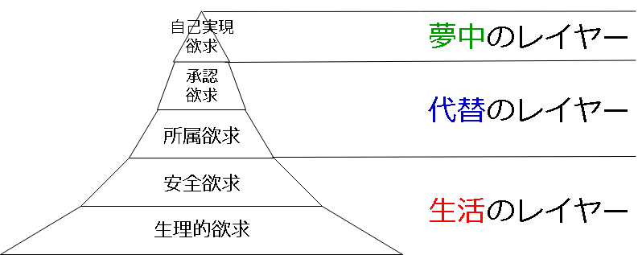

# ヒトリズムとは
Hitorism(ヒトリズム) とは対人関係を本質的に小さくすることで、対人関係に要するしがらみから逃避することを目指したライフスタイル。

## ヒトリズムの例
- 恋人をつくらない、友達をつくらない
- ビジネスやプライベートにおける対人的割り込みおよび雑談をゼロに近づける
- 一日一言も発声する必要のない生活
- 通話と LINE のない生活

## なぜヒトリズムか
対人関係という「本質的に時間と気力を消耗する事物」にとらわれたくないから。

## ヒトリズム誕生の背景
対人関係の現状は以下のようになっている。

- 対人関係は不可避(必須で抗えないもの・抗うべきでないもの)とされている
- 対人関係に向いていない者(※1)も存在するが、対人関係が不可避であるがゆえに避けることができず、苦痛を強いられている
  - ※1 対人関係の要領が無い者や指向・嗜好として対人関係を好まない者

「向いていない者」には苦しい現実がある。

「向いていない者」がこの苦痛から逃れるためには、「対人関係は不可避である」という前提を崩すしかない。

幸いにも、現代では様々な固定観念から脱するためのパラダイム(見方)が多々生まれている。以下に、すでに逃げ道のある固定観念の例を示す。

- 男は仕事、女は家事
- 長時間労働と出世が美徳
- カネとモノが幸福をもたらす
  - → [ミニマリズム](minimalism.md)

これらと同様、対人関係についても(不可避であるという)固定観念を崩せば良い。そのようなパラダイム(やこれに通じるヒント)は何かしら存在するはずだし、存在せずとも生み出せば良い。

このような試みをヒトリズムと名付け、整備していくことにした。

# ヒトリズムで手に入るものと手に入らないもの

## 手に入るもの
- 時間
  - 対人関係の維持向上に時間を使う必要がない
- 安寧
  - 失恋や裏切りといったインパクトを受けない
- 充実
  - やりたいことにやりたいだけ夢中になれる
- コントローラブルライフ
  - いつ何をどれだけやるか制御しやすい、予定や計画を立てやすい、守りやすい
- 主体性
  - 空気、常識、評判などに振り回されず自分で考えて決断し行動できる

## 手に入らないもの
- 幸福
- 利他的精神

まずヒトリズムでは幸福を諦める。というのも、幸せは、深く相互依存した対人関係でしか満たせないから。

またヒトリズムでは利他的精神も身に付かない。というのもヒトリズムとは自分の、自分による、自分のための生き方であり、対人関係をやめてその分を自分自身に費やすという利己的側面が強いから。

# ヒトリストの例
ヒトリズムに取り組む者を Hitorist(ヒトリスト) という。

:warning: ヒトリストという言葉は「一人でスキーやスノボを行う者」も意味するが、本ページでは扱わない。

本章ではヒトリストである筆者の例を挙げる。

## 能動的な「いない歴＝年齢」
最初から恋人をつくることを諦めている(※1)ため、時間や気力を費やす必要さえない。その分、別のことに費やすことができるし、実際できた。

※1 ただし恋人自体は欲しかったため、時間や気力を費やさない程度にアピールは行っていた。つまり「あわよくばこんな自分を好いてくれる子が現れないかな」という受け身の姿勢である。

## 割り込みのない生活
恋人ゼロ、友達ゼロなので連絡手段で割り込まれることがない。

仮に割り込まれたとしても、通知はすべて切っており、あとでこちらから折り返す形にすれば良い。仕事や家族(両親・兄弟)相手ではそうしている。このスタンスを崩すつもりはないし、そもそも崩す必要(性が迫られるような対人関係を構築することそのもの)もない。

## スマホのない生活
前述のとおり、早く返事する必要がないので、スマホも要らない。

空き時間は読書、考え事、のんびりするなど自分のために使える。

## 毎日片手で数えられる程度だけ喋る + 定時退社
人並以下の仕事量とコミュニケーション量で済んでいるため、毎日定時退社できる上、一日一言も喋らない(※2)こともある。

※2 ただし出社時と退社時の挨拶はする。以前はしていなかったが、挨拶をしないことによる関係性の悪化が深刻(上司が「気に入らない」として部署から追い出そうと動くかどうかの分水嶺になる)であるとわかり、するようになった。

## 体裁無きフットワーク
対人関係というしがらみがないため見栄や体裁もなく、それゆえ気になったことに片っ端から手を出すことができる。

手を出してきたものの例:

- [タスク管理](task_management.md)
- 風俗
- キックスケーター
- [ダンスラ](runningman.md)
- [ミニマリズム](minimalism.md)

# ヒトリズムと周辺概念

## Q: ミニマリズムとの違いは？
Ans: ミニマリズムはヒトリズムの一部である。

ヒトリズムは、対人関係に関するミニマリズムである。

しかしミニマリストの中でヒトリズムに取り組んでいる者は(筆者の観測範囲では)いない。せいぜい交友関係を絞る程度で、依然としてパートナーや多数の友人がいたりする。そもそもパートナーや友人さえもミニマイズする、という発想には至らない。これは、ミニマリストであっても対人関係をミニマイズの対象とすることが難しい、と言えるのではないか。

だからこそヒトリズムには意味がある。ヒトリズムとは、ミニマイズの対象にしづらい対人関係に、意識的に焦点を当てたものなのである。

## Q: ソリズムとの違いは？
Ans: 同義語であるが、ソリズムはあまり体系的にまとまっていない。

[ソリズム](soloism.md) とは筆者が 2019/02 頃からまとめはじめた概念であり、ヒトリズムの前身であるが、上手くまとめあげられず頓挫している。そんなソリズムを一から構築し直したのがヒトリズムである。

ソリズムとの主な相違点は、以下のとおり。

- ヒトリズムでは Solo- ではなく Hitori- という接頭辞を採用した
  - Hitori- の方が日本語圏で直感的にわかりやすいから
- ヒトリズムでは「なぜヒトリズムか」を明確にするための道具を二つ導入した
  - →「ミニマリズム」と「マズローの欲求階層説」

# ヒトリズムと三つのレイヤー
ヒトリズムで行う活動には三つのレイヤーがある。レイヤーはマズローの欲求段階説における段階ピラミッドと対応している。

ヒトリズムでは、各段階の欲求をどのように満たすかというアプローチをレイヤーごとに扱う。

## 生活のレイヤー
生活のレイヤーでは、生理的欲求と安全を恒常的に満たすことを目指す。

- 生理的欲求を満たすとは、生活基盤を整えること
- 安全欲求を満たすとは、危険から逃げること

## 代替のレイヤー
代替のレイヤーでは、本来なら対人関係で満たすべき部分を、対人関係以外の何か代わりのもので満たすことを目指す。

- 所属欲求を満たすとは、傍観すること
- 承認欲求を満たすとは、対戦または発信を行うこと

## 夢中のレイヤー
夢中のレイヤーでは、精神的な物足りなさを満たすために、何かに夢中になることを目指す。

- 自己実現欲求を満たすとは、夢中になること

# 生活のレイヤー > 生活基盤

## 生活基盤とは
生活基盤とは、心身的健康を恒常的に維持するための生活様式、手段、環境などのこと。

- 維持できるなら収入はなくてもいい(が無いとダメなことが多い)
- 収入があっても維持できているとは限らない

健康には以下の二つがある。

- 身体的健康
- 精神的健康

身体的健康の維持方法は、おおよそ万人に共通する。たとえば酒や煙草を絶つことや、十分な睡眠時間を取り入れる(ショートスリーパー体質でなければ 7～8 時間)ことなどは、取り入れれば誰でも健康に通じる。

精神的健康の維持方法は、人によって相当異なってくる。たとえば一人暮らしを好む者と、一人暮らしに耐えられない者がいる。前者が集団生活を行えばストレスが溜まるし、後者が一人暮らしをしても同様である。いかにしてストレスを溜めないか、と言い換えても良い。

:warning: ここで「 [社会的健康](https://www.japan-who.or.jp/commodity/kenko.html) は無いのか」という指摘もあるだろうが、ヒトリズムでは扱わない。そもそもヒトリズムはその社会的要因に極力頼らずに現代社会を生きていくことを目指すものである。

## 生活基盤を整えるための三つの活動
- 収入活動
  - お金を得るための活動
  - ほぼ労働を意味する
- 健康活動
  - 健康を維持向上させるための活動
  - 生活習慣、運動、食事、ストレスコントロール etc
- 情報活動
  - 変化と搾取の激しい現代で振り回されないために情報を集める活動
  - 書籍やネットを用いた情報収集と、必要に応じた生活への取り入れ

# 生活のレイヤー > 生活基盤 > 三活動 > 収入活動

## 収入活動の二つのアプローチ
- 収入を増やす
  - 残業、(給料の高い仕事に)転職、(我慢して耐えて)昇進、副業 etc
  - インクリーサー(Increaser)という
- 支出を減らす
  - 節約、倹約、ミニマリズム etc
  - デクリーサー(Decreaser)という

## 労働の二つのアプローチ
収入活動とは多かれ少なかれ労働を意味する。

- 受動的労働
  - (好き嫌いや得意不得意によらず)言われたことをやる
  - :o: 言われたことさえやれば良いため収入は得やすい
  - :x: 主体性が満たされないため、精神的健康を損ねやすい
- 主体的労働
  - 自分がやりたいこと(好きなことや得意なこと)をやる
  - :o: 精神的健康が損なわれない
  - :x: 人のニーズを自ら切り開く必要があり、基盤が整うレベルの収入を得るまでが至難

## 不労の種類
労働せずとも収入を手に入れる手段、いわゆる不労という手段も存在する。

- 不労取得
  - 資産運用、不動産運営、特許、長期的安定的に PV や購入者を集めるコンテンツの運営(ブログ/ソフトウェア/Webサービス) etc
- 分業
  - 専業主婦(主夫)
- 社会的保護
  - 生活保護

しかし不労は人並以上の才能・幸運が要求されたり、(特に専業主婦主夫は)ヒトリズムと相反するため、ヒトリズムでは不労については深く立ち入らない。

## ヒトリズムの生活アプローチマトリックス
ヒトリズムとしてどのように収入活動を行えば良いか、という目安となるマトリックスがある。

|            | 収入を増やす | 支出を減らす |
| ---------- | ------------ | ------------ |
| 主体的労働 | 1            | 2            |
| 受動的労働 | 3            | 4            |

### マトリックスについて
- どのタイプが適するかは人によって異なる
- ヒトリストは自分に合ったタイプを追い求めるのが良い
- 主なパターン
  - ポテンシャルと努力動機に恵まれているヒトリスト → 1 か、最初は 2
  - 日常生活を楽しめるヒトリスト → 4
  - それ以外 → 2 + 3。1 には届かず、2 も部分的にしか届かない(生活のレイヤーを満たしきれない)ので、3 でカバーする

### 各タイプについて
1:

- 欲張り、野心家、人並以上の努力とポテンシャル
- 仕事で夢中のレイヤーを満たし続けられるほど野心的で、かつ没頭可能な何かを持ち、結果を出す(結果が自然と出る)タイプ
- ヒトリストには向いていない(結果を出すにはよほどの才能が必要か、あるいはヒトリズムとは相反する対人関係の人並以上の活用が必須となるため)

2:

- 頑固、自由や時間を好む、見栄や承認にとらわれない
- 夢中のレイヤーには届きづらいが、コンパクトに充実を維持しやすいタイプ
- ヒトリストに向いている(ただし主体的に過ごすという前提での最低限の収入確保と抜本的な支出改革が必要であり、安定するまでがしんどい)

3:

- 堅実、我慢、発散
- 会社員・年功序列・結婚などレールを歩くことに耐えられるタイプ
- ヒトリストには向いていない(ヒトリズムはそもそも対人的要素でレールから外れた生き方であるため)

4:

- 停滞、安定、惰性
- 倹約生活の慌ただしさや創意工夫に喜びを見出すタイプ
- ヒトリストに向いている(ただし自炊をするなど日常生活に苦痛を感じない感性が必要)

# 生活のレイヤー > 生活基盤 > 三活動 > 健康活動
身体的健康とは以下をすべて満たすこと。

- 健康診断の結果はオール A か、あるいは病院通いが必要になるほどの所見が無いことを維持する
- 一日四時間以上の知的活動(※1)を行える程度の脳力(※2)を維持する
  - ※1 知的活動とは「マルチタスクによる効率化が不可能な、集中を要する活動」
  - ※2 脳力とは頭の体力のこと
- 一日一時間以上の有酸素運動 or 無酸素運動を行える程度の体力を維持する

精神的健康とは以下をすべて満たすこと。

- お酒、たばこ、その他薬物など飲食物によるストレス解消が不要である
- セックスやオナニーなど性的快楽に一日一回以上溺れることが不要である
- 感覚麻痺に一瞬でも陥ることがない
  - 麻痺の例: 金銭感覚麻痺(借金してても深く考えず平気で買い物する etc)、恐怖心麻痺(5%以上の率で怪我する身体的チャレンジをする etc)
- [緒切れ](#緒切れ) が起きかねない精神状態に陥ることがない
- (体力、脳力、注意資源が切れていない限りは)常に何かしらやりたいことがある

# 生活のレイヤー > 生活基盤 > 三活動 > 情報活動
情報とは:

- 自分が知らない・持っていない事実、知識、事例、知恵、パラダイム(見方)などのこと
- 知っている・持っているだけでは価値が無く、何らかの行動に活かすことができてはじめて価値になる

情報活動とは:

- 情報を自ら能動的に収集、取捨選択し、適宜生活に取り入れていく行動や習慣のこと
- ステップ
  - (1) 収集
  - (2) 解釈(情報を自分なりに解釈する)
  - (3) 選別(行動に起こすことを取捨選択する)
  - (4) 行動(行動に起こす。中長期的な場合は計画や進捗のモニタリングも要する)
- 特に重要なのが (2) の解釈。情報に価値があるかどうか主観的に決まる(決めて良い)ため、情報を鵜呑みにせず主観的に捉え直すことが重要

情報活動の意義:

- 各レイヤーをより満たしやすくするためのヒントを得るため
  - より効果的に
  - より効率的に
  - より恒久的に

情報活動が必要な理由:

- ヒトリストは他者と直接関わること、またはそのような場にいることの経験が絶対的に少ないがゆえに、受動的な生活では情報が集まらないから
- ヒトリストは自分の世界に閉じこもって現状維持に終止しがちであり、社会の変化に伴う機会を損失するリスクが高いから

情報源:

- 書籍
- インターネット
- コミュニティ
  - 会社、趣味、何らかのイベント etc

# 生活のレイヤー > 危険を回避する

## 危険とは
危険とは心身的に致命的な事態に陥ること全般。

例:

- 財布やスマホの紛失盗難
- ウイルス等による情報の破壊、流出
- 治安の悪い地域で暴行や強盗に遭う
- 自ら運転する乗り物で事故をする
- 他人の運転する乗り物に巻き込まれる
- 過労死(過剰な労働)
- アルコール中毒(過剰な飲酒)
- ネットで晒し者になり誹謗中傷の集中砲火を受ける
- 信頼かつ依存していた相手に裏切られる
  - 恋愛的裏切り(浮気など)
  - 経済的裏切り(詐欺など)
- [緒切れ(堪忍袋の緒が切れること)](#緒切れ)

## 危険を回避するには
- 危険から回避するための労力は惜しまない
- 一度依存した後で絶つのは苦労するので最初から手を出さない
- 危険に陥ったら全力で速やかに逃げる

## 緒切れ
緒切れとは「堪忍袋の緒が切れること」をもじった造語であるが、ここでは許容値を超えて蓄積された精神的負荷が暴発することを指す。

緒切れが起こると、いわゆる「カッとなってやった」「すべてがどうでも良くなった」「死にたかった」などの精神状態に陥り、主に社会的に致命打になるレベルの言動をする率が急上昇する。緒切れは感情であり、意思では制御できないから、そもそも緒が切れないように立ち回ることが重要。

ある精神的負荷が堪忍袋にどれだけ溜まるかは、人によって異なる。自分にとって「どんな負荷が溜まりやすいのか」「どんな負荷が残りやすいのか」を把握し、そのような負荷を受けないよう立ち回ることが重要。

# 代替のレイヤー > 代替案
ヒトリズムでは「対人関係による充足」を代替する手段を多数用意し、使い分けることで対人関係という手段に対抗する。これを代替案という。

主な代替案を挙げる。

- 趣味による充実
  - EHIEL(Enhancement of Hobby Is Enhancement of Life / 趣味の充実は人生の充実)
- 接続による関与
  - 瞬間的接続(目的のある集まりの一員になって当日行動する)
- 傍観による認知
  - 従事しているのが自分一人ではないことを知る
- 対戦による勝利
  - 対戦(ゲーム)は最も手軽かつ深く没頭できることの一つ
- 好奇による充足
  - 知的好奇心を満たす
- 奇異による注目
  - 変なことをすれば簡単に目立てる(諸刃の剣)
- 作業による集中
  - 単調作業には簡単に意識を集中させる効果がある(家事,雑務,ゲームでも)
- 消費による養育
  - 消費行動を通じて消費先への支援・育成に貢献すれば養育欲求を満たせる

## 代替のレイヤー > 代替案 > 趣味による充実
EHIEL(Enhancement of Hobby Is Enhancement of Life) とは「趣味の充実は人生の充実」の意。趣味をたくさん持ち、満たし続ければ、対人的に満たされてない部分もカバーできる(あるいは目を背け続けることができる)と考える。

趣味を充実させるために必要なこと:

- 趣味になりえる何らかの活動・行動・対象を広く知り、試し、場合によっては自ら見出す
- 趣味そのものに関する性質や特徴を知り、抽象的に応用しやすくする
- 詳しくは [趣味学](hobbilogy.md) を参照

## 代替のレイヤー > 代替案 > 接続による関与
所属欲求を満たすには何らかの集団(家族、恋人、会社や親しい友人)に持続的に所属することが必要だと考えられていたが、現代ではもう一つ方法がある。それが多数のコミュニティに瞬間的に接続すること。

瞬間的接続とは「概ね一月以内の頻度」で「数時間以上」「何らかのコミュニティ」における「参加者全員が共通した目的意識を持つイベント」に参加することである。

例:

- :o: ライブ
- :o: 交流会
- :o: ボランティア
- :x: ワークショップ
  - 共通した目的が無いため
- :x: 合コン、街コン、婚活パーティー
  - コミュニティではないため(開催の度に構築される刹那的な集団でしかない)
  - 共通した目的が無いため

瞬間的接続が強力な代替になるのは、特にアイドルやアーティストなど何らかの対象への「貢献」が目的となっている場合である。

## 代替のレイヤー > 代替案 > 傍観による認知
「ヒトリストは自分一人以外にも存在する」ことがわかると心理的に安心でき、ヒトリストでいることを自己正当化しやすくなる。このような代替案を「傍観による認知」という。

主な認知方法:

- 書籍から知る
  - 例: 未婚が当たり前であることを説いた新書
- 成功者から知る
  - 例: 恋愛も友達も要らないと説いている有名人(★具体例思い浮かばず ← というかいたとしても見つからないのが本音。成功するためには多かれ少なかれ対人関係が必要だが、ヒトリストであることの明示は(人格を疑われるため)このビジネス的対人関係も壊しかねないから……)
- 偶然見かける
  - 例: 行きつけの定食屋に来ているヒトリストなおじさん

## 代替のレイヤー > 代替案 > 対戦による勝利
対戦(ゲーム)つまりは勝負事は最も手軽に、かつ深く没頭できる活動ジャンルの一つである。

例:

- 運動的対戦(球技全般、乗り物で競う系、身体一つで競う系)
- 知的対戦(将棋、囲碁、チェス)
- 技術的対戦(プロゲーマーが存在するゲームのガチ勢、かるた、競技クイズ、競技プログラミング)
- 娯楽的対戦(ゲーム全般)

ただし対戦とは「客観的に厳密に勝敗が決する」ものでなくてはならない。たとえば芸術、パフォーマンス、創作物などで競うものは対象外である。この客観的厳密性は重要で、これがあるからこそ、競技者は、ただただルールに則った勝利を目指すことに没頭できる(没頭しやすい)。

対戦はこれ一つですべてのレイヤーを満たすことも可能であるが、一方で競合(ライバル)が多く、相応の努力と才能と機会に恵まれなければ代替案として活用できるレベルにさえ至れない。

## 代替のレイヤー > 代替案 > 好奇による充足
知的好奇心を満たそうとしている間は、一時的に気が紛れることが知られている。これを「好奇による充足」という。

恒常的な「好奇による充足」に必要なもの:

- 娯楽や快楽など手軽で強烈な刺激に依存していないこと
- 書籍を読んで知識と知恵(知識の応用)を身につけられる学力と要領があること
- 義務、必要性、見栄などではなく、本心から知的好奇心の充足を楽しめていること

好奇による充足は、学問を本格的に学ぶレベルで取り組むことではじめて手に入る。よく陥る罠として「ネットで表面的に調べて知った気になる」ことがあるが、これは単に「浅いコンテンツを消費する娯楽」でしかなく、好奇による充足ではない。

## 代替のレイヤー > 代替案 > 奇異による注目
奇異な言動を行えば簡単に注目が集まる。これは「変なことをするだけで承認が得られる」と言い換えることもできる。これを「奇異による注目」という。

奇異による注目は諸刃の剣であり、度が過ぎれば大きな不利益を被ってしまう。

不利益の例:

- 昇進街道から外される
- 趣味のコミュニティにおいて無視され、全くフィードバックがもらえなくなる
- 特定施設への出入を禁止される
- 無断盗撮された言動をネットに晒され、炎上する
- 逮捕される

## 代替のレイヤー > 代替案 > 作業による集中
単調作業には簡単に意識を集中させる効果があるため、毛嫌いせずに適宜取り入れれば、一時的な集中に至ることができる。これを「作業による集中」という。

単調作業の例:

- 家事全般
- 仕事のルーチンワーク全般
- ゲームにおけるレベル上げや収集回収作業

作業による集中は、何もせず悩むよりも精神衛生上好ましい。これは人間に備わる防衛本能の一つでもあり、落ち着きがなくなると思わず家事をしてしまう等の行動がこれにあたる。

単調作業にも依存の性質があるため、注意が必要である。だらだらと残業や家事をして過ごすことが典型例であるが、このような行為はネットサーフィン等と同様、何ら生産的ではなく、何も生み出さない。つまり単調作業に依存(作業による集中に頼った充足を多用)してしまうと、現状の把握や改善が行えなくなってしまう。さらに厄介なのは、この行為が一応無益ではない(仕事や家事は進んでいる)がゆえに、自ら正当化しやすいことである。

## 代替のレイヤー > 代替案 > 消費による養育
消費行動を通じて消費先への支援・育成に貢献すれば、ある程度の養育欲求(※1)を満たすことができる。これを消費的養育という。

※1 ケンリックの欲求モデルにおいて最上位に位置づけられている欲求。このモデルで想定しているのは家族や親戚の養育である。

消費的養育の例:

- 発展途上系アイドルの(熱心な)ファン ★具体例欲しい

# 代替のレイヤー > 代替案のノウハウ
ヒトリズムでは多くの代替案を使い分けることを推奨するが、闇雲に使っても上手く機能しない。そもそも自分に合った代替案が見つからず、自ら発掘する必要性が生じることもある。

本章では代替案を扱う際に知っておくと役に立つ事項を「代替案のノウハウ」と称してまとめる。

→ [別ページに移動した](hitorism_knowhow.md)

# 夢中のレイヤー
夢中のレイヤーを満たすために必要なこと:

- すでに下層二層(生活のレイヤーと代替のレイヤー)が十分かつ恒久的に満たされていること
- 仮に下層二層が満たされなくなっても、問題なく満たせる手段や要領を持っていること
- 「三度の飯より」レベルで熱中できる何かしらの対象を持っていること

夢中のレイヤーを満たすための二つのアプローチ:

- 利己的没頭
  - 自分のやりたいことに没頭する境地
  - 結果的に多くの人に与えることはある
- 利他的献身
  - 他人に与えることに喜びを見出す境地
  - いわゆるギバー(見返りを求めない)
  - :warning: ヒトリズムからは外れるため立ち入らない

夢中のレイヤーの満たす上での懸念:

- 恒久的に満たし続けることは(主に老いにより)難しい
- 心身を過度に消耗しやすい

一本化の原則:

- 夢中の対象にする事柄は一つのみにするべき、という原則
- 人間のリソース(集中力・注意資源 etc)は有限なので、二つ以上に手を出すとどちらも夢中に至れない
- 生活レイヤーや代替レイヤーに費やしている分は習慣化と必要最小限を心がけ、夢中の対象にはしない
  - たとえば運動であれば「有酸素運動としてランニングマシーンによるランニングを一日三十分」だけ行う

# 各レイヤーの必要性
生活のレイヤーは必須である。これを満たせないとリーサル(※1)に至る(※2)。

※1 リーサルとは心身に致命的なダメージを負うこと(死を含む)。

※2 スリルの探求者や恐怖心が欠如している者など、生活のレイヤーを満たさずに代替・夢中のレイヤーを満たす事例も存在するが、ヒトリズムでは扱わない。理由1.マイノリティであるため。理由2.恒久的安定を求めるヒトリズムとは相反するため。

代替のレイヤーは推奨である。満たさずともリーサルに至ることはないが、現代人は退屈に耐えられるようには出来ていない。ただし生活レイヤーの充足に忙殺されている場合は、そもそも退屈も無いため耐えられる。

夢中のレイヤーは任意である。満たさずともリーサルに至ることはないが、いわゆる「物足りない」の(一時的または永続的な)到来から脱することができない。

# 参考

## 書籍
- ソロエコノミーの襲来(荒川和久)
  - 瞬間的接続
- GIVE&TAKE 「与える人」こそ成功する時代(アダム・グラント)
  - ギバー

## Web
- [自己実現理論 - Wikipedia](https://ja.wikipedia.org/wiki/%E8%87%AA%E5%B7%B1%E5%AE%9F%E7%8F%BE%E7%90%86%E8%AB%96)
- [マズローの理論はもう、心理学界隈ではまともに相手にされていない >「非常に科学的に脆弱な理論」(E.Hoffman 1999）。「もはやアカデミックな心理学の世界では真面目に取り上げられてはいない」（Sommers & Satel 2006）。 - Togetter](https://togetter.com/li/1402771) ★togetter じゃなくて別のソースにしたい
  - ケンリックの欲求モデル
