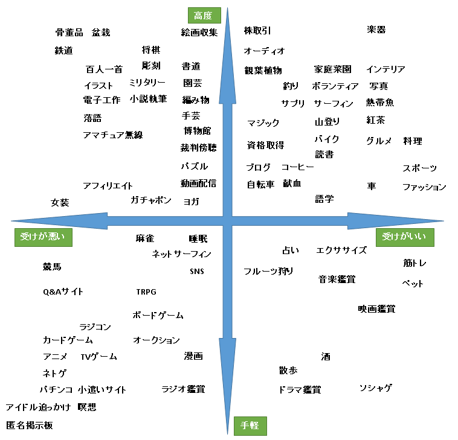

# この文書の目的
趣味学という形で「趣味」に関する持論を整理することで、以下を目論む。

- 新たな趣味を手に入れるための知見や視点を入手し、鍛える
- 「趣味」について持論を言語化し、整理し、形にしたいという創作欲求を満たす

# 注意事項
- 特に断りがなければ日本国内の状況を前提とする

# 趣味とは
趣味とは趣味候補から昇格したものである。

趣味候補とは「人間が取り組んで楽しむことのできる対象(行動や行為も含む)」である。これに対して昇格判定を行い、判定を通ったものが趣味となる。

## 昇格判定
昇格判定とは、趣味候補が趣味であるかどうかを見極めるプロセスである。人は無意識あるいは意識的に昇格判定を行っている。

```
趣味候補

  ||
  || 昇格判定
  VV

趣味 or 非趣味
```

昇格判定は「～～の条件を満たすかどうか」という視点で行われる。条件は定量的ではなく定性的になることもある。また、どの条件をどの程度重視するかは人次第、状況次第である。

## 昇格判定条件
昇格判定においてよく用いられる条件を以下に挙げる。

- 娯楽性
- 専門性
- 高尚性
- 定期性
- 道徳性
- 閉鎖性
- 進行性
- 命名性
- 行動性

### 娯楽性
趣味候補が楽しみ続けられるものかどうか(辛い、苦しい、面倒くさい、退屈すぎるといった側面が少ない)。

- ラノベを読むことは趣味である
- 古典を読むことは趣味ではない
- 技術書を読むことは趣味ではない
- 好き勝手に小説を書くことは趣味である
- 人気やお金のために大衆が望む(個人的に別段好きではない)小説を書くことは趣味ではない

### 専門性
趣味候補に対する習熟度、成熟度、利益や貢献の有無など。

- 仕事は趣味ではない
- プロは趣味ではない(アマは趣味である)
- お金を稼いでいるものは趣味ではない

### 高尚性
趣味候補に対する高尚さの程度。

- 読書
  - 古典は趣味である
  - マンガは趣味ではない
- 観賞
  - 美術館巡りは趣味である
  - 同人ショップ巡りは趣味ではない

### 定期性
趣味候補に対する実施頻度。

- 日に 1 分以上行うものが趣味である
- 週に 1 時間以上行うものが趣味である
- 月に 1 時間以上行うものが趣味である

### 道徳性
趣味候補に対する正邪や善悪の程度。

- スリは趣味ではない
- 盗撮は趣味ではない
- 喧嘩は趣味ではない

### 閉鎖性
趣味候補以外の事物(特に承認を満たせる観客)が無くても成立するかどうか。

- 人類が自分一人(あるいは対象を行うのに最低限必要な人数)だけになったとしても行えるなら趣味である
- 行えない、または行わないなら趣味ではない

### 進行性
趣味候補がもたらす結果のみが欲しいかどうか(結果が得られるなら行動は少ないに越したことはないか)。

- 結果さえ手に入れば行動は一切無くても良いなら趣味ではない
- 結果だけでなく行動そのものにも意味がある、楽しみを見出しているなら趣味である

### 命名性
趣味候補に「第三者に通じる名前」が存在するかどうか。

- 野球は趣味である
- 壁当ては趣味である
- バッティングセンターは趣味である
- 「硬球の手触りを堪能すること」は趣味ではない
- 「バットを何本重ねられるかを競う遊び」は趣味ではない
- 「一人野球(一人でボールを高く投げ、落ちる前に追いかけてバットを持ってそれを打ち上げ、落ちる前にグローブを持ってそれをキャッチする)」は趣味ではない

### 行動性
趣味候補に何らかの具体的な行動が存在し、かつ「その対象に取り組む≒その行動を行う」になっているかどうか。

- ジャニーズのライブに行くことは趣味である
- ジャニーズは趣味ではない
  - これはファン(対象に対する愛好)であって趣味(行為に対する愛好)ではない

# 趣味の四分類

## 四分類の詳細
- 消費
- 創作
- ゲーム
- 奉仕

### 消費
何らかのコンテンツを消費するもの。

例: 映像、絵、音楽、文章

特徴:

- 刺激の享受や欲望の発散もここに含まれる
  - 五感から得る刺激
  - 好奇心の充足(知識や概念という名の刺激)
  - 性欲や運動欲などの充足
- 満たし方が明確で、行動すればすぐに満たせるが、一時的にしか満たされない欲望を満たす
- 一度満たしても、日が経てばまた満たしたくなるか、あるいは別の類似品で満たしたくなる

### 創作
ものづくり全般。

例: 作詞、作曲、執筆、建築、プログラミング、デザイン、園芸、ファッション

特徴:

- 「指示に従って手を動かしているだけ」はものづくりではなく、消費である
  - 創作には「何をつくるか」「どうやってつくるか」を自主的に考える要素が必須

### ゲーム
競うこと全般。

例: テレビゲーム、スポーツ、テーブルゲーム、マインスイーパ etc――

特徴:

- さらに二種類に分かれる
  - スコア形式(目に見えるアウトプットの質で競う)
  - 対戦形式(事前に定めた「ゴール」に早く辿り着くことを競う)
- 収入の有無、プロアマ、団体か個人かは問わないスコアを競うか、ゴールへの到達を目指すか、あるいはゴールへの効率的な到達を競うものがあれば、何であってもゲーム型に分類できる

### 奉仕
ボランティア。利他的な行動(利己的でない行動)と言い換えることもできる。家族や恋人に尽くすこともここに含まれる。

## 分類例
- 運動
  - 健康目的のウォーキングやランニングなら消費
  - マラソン大会でハイスコアを目指すならゲーム
  - ダンスで自己表現を追求するならものづくり
- 写真
  - ただ撮って記録したいだけなら消費
  - 作品として意識するならものづくり
  - 「SNS にアップして、いかに人気を狙うか」はものづくりあるいはゲーム
- コレクション
  - 消費
  - 陳列にこだわる場合は、ものづくりの側面も出てくる
- 料理
  - 家族など他人のためにつくっているなら奉仕
  - 手順になぞってつくり、それを食べて楽しむだけなら消費
  - 自分で見栄えや栄養をアレンジするとものづくり
  - 低費用で食費を抑えるなど節約料理ならゲームです(費用がスコアになっている)
- 勉強
  - 消費
  - 成績を競うとゲームになる
  - 資格取得もゲーム(取得というゴールを目指している)
- 筋トレ
  - ゲームです(成長後の自分というスコアやゴールを目指している)
- ナンパ
  - セックスが目的なら消費
  - 「今月は n 人釣った」のように目標を定めて活動しているならゲーム
- 災害ボランティア
  - 世のため人のためなら奉仕
  - 災害地のリアルについて知りたいなら消費
  - 就活を有利に進めるためのカードを集めるという目的があるならゲーム
  - 時間内に何人救えるか、どれだけ貢献できるかで楽しんでいてもゲーム
- ペット
  - 「自分よりも我が子が優先！」なら奉仕
  - 可愛さを満喫したり好奇心を満たしたりしているなら消費
  - SNS で人気を集めることが目的ならゲーム

## 四分類の性質

### どこに分類されるかは人によって違う
同じ趣味であっても、人によって分類先は異なる。勉強を例で言うと、週末の余暇に HTML/CSS を学習している社会人なら「消費」だが、受験勉強中の学生なら「ゲーム」になる。また前者の社会人についても、「一ヶ月以内にホームページ作成の仕事があるからそれまでにマスターしなければ」といった目的があるなら「ゲーム」になる。

### 分類先の候補は複数になりえる
この四分類はあらゆる趣味を完全に四つに分類できるものではない。

勉強の例で言うと、週末の余暇に HTML/CSS を学習している社会人は「消費」あるいは「ゲーム」が 100% を占めるとは限らない。たとえば純粋に内容を楽しみつつ、一ヶ月以内の仕事に間に合わせるようにしているとしたら、「消費」の面と「ゲーム」の面が合わさっている。

このような場合は「最も重要な分類(最も欠かせない性質を持つ分類)」に分けます。この例であれば、内容を楽しむよりも仕事に間に合わせることの方が重要だから「ゲーム」に分類する。

# ホビーアクセシビリティ
ホビーアクセシビリティ(Hobby Accessibility)とは趣味の遊びやすさのこと。

ホビーアクセシビリティは以下指標から定性的に判断する。

※例としては指標をよく満たすものもあまり満たさないものも雑多に挙げる。当該指標がどのような性質を表すかを、複数の例から感じ取ってもらうことを意図している。

## 時間
いつでも好きな時に遊べるか。

- 店や施設などに依存する趣味(ゲーセン、カフェ巡り)
- 夜にしか遊べない趣味(天体観測、肝試し、深夜徘徊)
- 特定の時間帯にしか盛り上がらない趣味(オンラインゲーム、Twitter)

## 金
タダで or 自分の経済力の範囲内で支障なく遊べるか。

- 購入して一回消費したらおわりな趣味(本、飲食物、体験サービス)
- 入会費、年会費などが高い趣味(婚活サイト、ライフハック系の Web サービス有料プラン)
- 旅行

## 人数
ひとりで遊べるか。

- 対戦前提の趣味(ゲーム、身体スポーツ、知能スポーツ)
- 恋愛
- ボランティア

## 場所
特定の場所や施設に依存せずにどこでも遊べるか。

- 個人では入手できない施設や設備などに依存する趣味(ダーツ、ジム、パチンコ)
- 自然で行う趣味(キャンプ、登山、ハイキング)
- 集中を要する趣味(執筆)

## 利害
利益を得ることを度外視して遊べるか。

- 金儲けのためにその趣味を行っている
- 承認のためにその趣味を行っている
- 嫌われたない、繋がりたいからその趣味を行っている
- 恋愛的に狙っている人がいるからその趣味を行っている

## 品質
高品質が要求されることなく妥協や手抜きでも遊べるか。

- 創作や芸術
- 他者の迷惑や生命に関わる趣味(ドライブ、人気があるブログの運営、スポーツの指導)

## 疲労
疲れずに遊べるか、また疲れていても遊べるか。

- 頭を使う趣味(パズル、読書、創作)
- 身体を使う趣味(スポーツ、筋トレ、長時間動く移動系のアクティビティ)
- 精神的に疲弊する趣味(コミュニティ運営、登壇やプレゼン)

## 不揮発
経過を残しながら遊べるか。

- その場の一瞬一瞬で発揮しなければ先に進めない趣味(瞬発的な趣味)
    - FPS、演劇、演奏、球技格闘技全般
- つくったものを保存しながら足していける趣味
    - 絵、小説、楽譜、プログラミング
- つくったものを保存しながら足していけるが、保存するものは一瞬一瞬で発揮しなければつくれない趣味
    - DTM、BMSなど音楽ゲーム譜面作成、瞬発的な趣味をコンテンツとした動画の収録

# 未分類

## トピックイーティング
自分が携わる趣味に関する話題を調べて読んで楽しむことをトピックイーティング(Topic Eating)という。

例: [ポメラ dm200 -"オークション" -"新品" -from:@salarymaZ -from:@naokomike - Twitter検索](https://twitter.com/search?f=tweets&q=%E3%83%9D%E3%83%A1%E3%83%A9%20dm200%20-%22%E3%82%AA%E3%83%BC%E3%82%AF%E3%82%B7%E3%83%A7%E3%83%B3%22%20-%22%E6%96%B0%E5%93%81%22%20-from%3A%40salarymaZ%20-from%3A%40naokomike&src=typd)

上記はポメラ DM200 という筆者の趣味をトピックイーティングした例である。Twitter で DM200 について検索することで、関連する話題を探すことができている(ただしノイズが多いため検索キーワードを工夫して弾いている)。

トピックイーティングは趣味仲間がいなくても楽しめる。

## イニシャルコスト
趣味を実施するためにはイニシャルコスト(Initial Cost)が必要である。

イニシャルコストは二種類ある。

- 初回イニシャルコスト(First Initial Cost) - 初回のみ必要となるイニシャルコスト
- 毎回イニシャルコスト(Daily Initial Cost) - 実施前に毎回必要となるイニシャルコスト

たとえばテニスを例にすると、ラケットやウェアの購入、ラリー等が行えるレベルの事前練習などは初回イニシャルコストであり、会場や対戦相手の調達は毎回イニシャルコストである。

趣味に要する手間暇は少なからずイニシャルコストが占めている(ことが多い)ため、少ないリソースやストレスで賢く楽しみたい者はイニシャルコストをしっかりと把握すると良い。あるいは、最初からイニシャルコストの小さな趣味のみを選ぶこともできる。

## 人口レベル
- レベル1: ～100人
  - Google 検索結果: 皆無に等しい
  - 実践者遭遇率: まず出会わない
  - 収入: なし
- レベル2: ～1000人
  - Google 検索結果: 一日で読み切れる程度の分量
  - 実践者遭遇率: まず出会わない
  - 収入: なし
- レベル3: ～10000人
  - Google 検索結果: 複数の小さなメディアで取り上げられている
  - 実践者遭遇率: 人によっては稀に偶然出会うことがある
  - 収入: 有(一部のトップ実践者のみ。専任で暮らせるほどではない)
- レベル4: ～10万人
  - Google 検索結果: 何万何十万の数にのぼり、ノイズも多い
  - 実践者遭遇率: 素人「見たことある」も珍しくない
  - 収入: 有(で暮らせる者も存在し、競技や職業もある程度は確立され始めている)
- レベル5: ～100万
  - Google 検索結果: メジャーの手前くらい
  - 実践者遭遇率: よほど無知でない限りは知られている
  - 収入: 有(競技や職業が確立されている)

## 独り歩き
独り歩きとは、ある趣味 A に含まれる一部の要素のみが A として広まること。

- 例1: パルクール
  - 単に「常人の能力を超えた身体的な移動」をパルクールと呼称している
  - 本来のパルクールは身体鍛錬や地形移動を関する哲学や体系であり、単なる高度な身体的移動を指すものではない
- 例2: シャッフルダンスにおけるランニングマン
  - ランニングマンというと三代目 J SOUL BROTHERS の R.Y.U.S.E.I. におけるものが想起されやすい
  - シャッフラー(シャッフルダンス実践者)人口はせいぜい数千未満だが、 (R.Y.U.S.E.I. を想起する)ランニングマンを知る者は何十万人といる

## 趣味の指向性
趣味の指向性とは、どのような楽しみ方をするかという方向性を表した概念である。

以下の 5 種類が存在する。

- 創作型 - 何をつくるか次第で無限の結果や楽しみ方がある
  - 例1: プログラミング
  - 例2: 小説執筆
  - 例3: レゴブロック
- 進行型 - 終わりのない(無限であることが証明されているか、まだ証明されていない)道をどこまで歩くか
  - 例1: マラソン
  - 例2: 将棋
  - 例3: 円周率の暗唱
- 固定型 - 代わり映えのしない刺激を定期的または不定期的に楽しむ
  - 例1: 週一、一時間行っている河原でのランニング
  - 例2: 毎週土曜日に半日を費やす「風来のシレン2 最果ての道」挑戦
    - ※1000回遊べるRPG、というキャッチコピーの TV ゲームである
- 準固定型 - 固定型と似ているが刺激の内容に幅がある
  - 例1: ネットサーフィン
  - 例2: 映画観賞
  - 例3: マンガ読み
- カオス型: 本質的に複雑すぎる事象の複雑性を楽しむ
  - 例1: 人付き合い全般
  - 例2: ペット全般
  - 例3: バズゲーム(バズらせることを狙う遊び)

ある趣味の指向性は人によって異なる。また、同じ人であっても状況次第(特に長期に渡る習熟具合の変化など)で変わることがある。

# その他の情報源
情報源を雑多に。

## 筆者ブログの趣味カテゴリ
- [趣味全般 カテゴリーの記事一覧 - ストレスフリーなソロ充ライフ](https://stressfree-fulfilling-solo.hatenablog.com/archive/category/%E8%B6%A3%E5%91%B3%E5%85%A8%E8%88%AC)
- [【趣味探し】趣味を探す時に意識したいポイント 6 選【多趣味】 - ストレスフリーなソロ充ライフ](https://stressfree-fulfilling-solo.hatenablog.com/entry/2019/02/27/075900)
- [その趣味が好きかどうかを判断する 6 の問い - ストレスフリーなソロ充ライフ](https://stressfree-fulfilling-solo.hatenablog.com/entry/2019/01/16/073300)

本文書の元ネタ。

## Wikipedia

### 自己完結と習慣とエンターテイメント性
- [Category:趣味 - Wikipedia](https://ja.wikipedia.org/wiki/Category:%E8%B6%A3%E5%91%B3)
  - 趣味：自己完結型、習慣的なもの(パズル、ペット、読書、コレクション)
  - 娯楽：エンターテイメント的なもの(アニメ、インターネット、ギャンブル、ゲーム)
  - レジャー：それ以外の散発的、自己完結しないようなもの(買い物、観光)

全然ピンと来ない。読書一つとって見ても習慣の有無と散発的かどうかにはバリエーションがある。自己完結やエンターテイメント性といった言葉も曖昧。

### アマプロ
- [アマチュア - Wikipedia](https://ja.wikipedia.org/wiki/%E3%82%A2%E3%83%9E%E3%83%81%E3%83%A5%E3%82%A2)
  - 職業(プロ)に対する趣味(アマ)

職業であれば趣味とは言えない、とする単純だが明快な解釈。

### ファン
- [ファン - Wikipedia](https://ja.wikipedia.org/wiki/%E3%83%95%E3%82%A1%E3%83%B3)
  - 特定の人物や事象に対する支持者や愛好者

趣味とは関係がない概念である。というのも、ある事物のファンだからといって、その事物が趣味であるとは限らないからである。たとえば芸能人 A のファンだからといって、芸能人 A や芸能が趣味であるとは限らない。

趣味は特定の行動に対する愛好。ファンは特定の生物や事象に対する愛好。

## コトバンク
[趣味(しゅみ)とは - コトバンク](https://kotobank.jp/word/%E8%B6%A3%E5%91%B3-78244)

### ブリタニカ
> 一般にはより広く教養や美的感受性を養うこと，それに役立つ活動をいい，読書，各種の芸術の鑑賞，職業としてでなく作品の製作を楽しむことなどが趣味の代表といえよう。単に知的な興味を満たすことや娯楽にとどまるものは趣味とはいえない。 

ニュアンスがだいぶ限定的で、高尚さがにじんでいる。

### デジタル大辞泉
> １ 仕事・職業としてでなく、個人が楽しみとしてしている事柄。「趣味は読書です」「趣味と実益を兼ねる」「多趣味」
> 
> ２ どういうものに美しさやおもしろさを感じるかという、その人の感覚のあり方。好みの傾向。「趣味の悪い飾り付け」「少女趣味」
> 
> ３ 物事のもっている味わい。おもむき。情趣。

3 の趣きと 2 の傾向は除外するとして、アマプロと同じく仕事・職業で分けている。

## ワイ趣味学者(マトリックス)
[ワイ趣味学者、趣味を4つに分類することに成功:哲学ニュースnwk](http://blog.livedoor.jp/nwknews/archives/5332465.html)



要点:

- 高度/手軽、ウケがいい/ウケが悪い、の二軸
- サンプル
  - 高度でウケがいい → 楽器
  - 高度でウケが悪い → 骨董品、鉄道、盆栽
  - 手軽でウケがいい → ソシャゲ
  - 手軽でウケが悪い → アイドル追っかけ、匿名掲示板、パチンコ、瞑想

感想:

- 主観的すぎて汎用的ではないが「自分にとっての」マトリックスを持っていくのは良いかも

## ワイ趣味学者(4つの型)
[ワイ趣味学者、趣味を4つの型に分類することに成功！ : 鈴木さん速報](http://suzusoku.blog.jp/archives/24497080.html)

引用:

> 収集型：執着心が強く閉鎖的で他者との隔たりがある。内向的だが自己完結して本人は幸福感を持っていることが多い
> 
> スポーツと楽器：向上心があり建設的。他人に対しての批判と敬意がはっきりとわかれる傾向。完璧主義の傾向があるならこのタイプの趣味を長く趣味とするのは難しい。コミュニケーション能力は高め
> 
> クリエイティブ型：独立心や自己顕示欲が強い。情緒不安定になりやすいがそれも強みになる。自分や作品に対してネガティブな側面とポジティブな側面を併せ持つならば能力が向上していく。面倒な奴が多い
> 
> 鑑賞型：受動的で生産性は低い。誰かに何かを発信する行為をしないとすると人間的に腐っていく。一方で他人に発信する能力があれば実益を伴い満足感を得るががその割合は低い

感想:

- 名前が紛らわしい
  - 収集 → 閉鎖的自己完結
  - スポーツと楽器 → 対戦
  - クリエイティブ型 → ものづくり
  - 鑑賞型 → 消費
  - ……こんな感じの方がしっくりくる
- 「収集」というネーミングは秀逸かも。「集めたい」という欲求を上手く捉えている(たとえばこの monolithic ページも自分のテキストを集めたいという収集欲求の現れ)
  - 旅行は『経験を集める』ということらしい。上手い。
  - 収集と鑑賞の違いは？ぼっち/ソロ充みたいな主観的に有益かどうか？たとえばアニメ鑑賞はどっち？本人が満足してるなら収集？
- 楽器は全くの未経験なので全くピンと来ない
- スポーツや楽器でも一人でできる分ならコミュ能力は関係ない

## e-Stat 社会生活基本調査
[社会生活基本調査 平成28年社会生活基本調査 調査票Ａに基づく結果 生活行動に関する結果 生活行動編（全国） 趣味・娯楽 28-1 男女,ふだんの健康状態,頻度,年齢,趣味・娯楽の種類別行動者数(10歳以上)－全国 - ファイル - 統計データを探す - 政府統計の総合窓口](https://www.e-stat.go.jp/stat-search/files?page=1&layout=datalist&toukei=00200533&tstat=000001095335&cycle=0&tclass1=000001095377&tclass2=000001095378&tclass3=000001095380&tclass4=000001095383&stat_infid=000031592973)

```
01_スポーツ観覧(テレビ・スマートフォン・パソコンなどは除く)
02_美術鑑賞(テレビ・スマートフォン・パソコンなどは除く)
03_演芸・演劇・舞踊鑑賞(テレビ・スマートフォン・パソコンなどは除く)
04_映画館での映画鑑賞
05_映画館以外での映画鑑賞（テレビ・DVD・パソコンなど）
06_音楽会などによるクラシック音楽鑑賞
07_音楽会などによるポピュラー音楽・歌謡曲鑑賞
08_ＣＤ・スマートフォンなどによる音楽鑑賞
09_楽器の演奏
10_邦楽(民謡、日本古来の音楽を含む)
11_コーラス・声楽
12_カラオケ
13_邦舞・おどり
14_洋舞・社交ダンス
15_書道
16_華道
17_茶道
18_和裁・洋裁
19_編み物・手芸
20_趣味としての料理・菓子作り
21_園芸・庭いじり・ガーデニング
22_日曜大工
23_絵画・彫刻の制作
24_陶芸・工芸
25_写真の撮影・プリント
26_詩・和歌・俳句・小説などの創作
27_趣味としての読書
28_囲碁
29_将棋
30_パチンコ
31_テレビゲーム・パソコンゲーム(家庭で行うもの、携帯用を含む)
32_遊園地、動植物園、水族館などの見物
33_キャンプ
34_その他
```

# 更新履歴
- 2019/06/13 v1.0.0
  - 初版
  - 所感: 散在的だが「趣味」という概念を捉えるヒントを多数洗い出せたと思う。何もひらめかなくなったのでいったんここでリリース。
