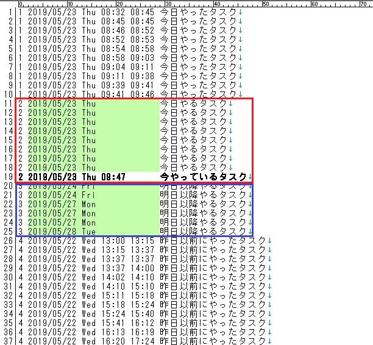

# Life Programming(ライフプログラミング)
Life Programming(ライフプログラミング)とは自分の行動をリスト化し、そのリストに従って日々行動していくことで「システマチックに日常生活を遂行する」ことを目指した概念である。LP と略す。

# LP の基本概念
基本的な概念は以下のとおり。

- モード
- 行動
- リスト
- プラグイン
- ツール

## モード
Vim にはコマンドモードと編集モードがあるが、LP にも同様の概念がある。名前は同様にモード(Mode)という。LP には以下のモードがある。

- 実装モード(リストを編集するモード)
- 実行モード(リストに書いた各項目に従って行動するモード)

実装モードではリストの編集を行う。たとえば今日一日の行動を洗い出す、一週間後の講演に向けた行動を随所(今日、明日、3日後、前日など)に配置するなど。

実行モードではリストに従った行動を行う。具体的にはリスト項目を一つずつ消化する。

実装モードと実行モードの切り替え頻度は様々である。数時間かけて実装したものを数時間かけて実行することもあれば、数分単位で実行と実装を繰り返すこともできる。

## 行動
具体的に行動可能で端的に書かれた文章または言葉を行動(Action)と呼ぶ。一般論ではタスクや TODO といった言葉で表されることも多いが、LP では行動と呼称する。

## リスト
リスト(List)とは行動を格納するコンテナである。

LP では以下の原則に従う。

- 一行原則
  - 一行に一つの行動を書き並べる
- 順序原則
  - 行動の並び順には意味がある
  - 例1: 実行順
  - 例2: 追加順
  - 例3: 重要順
- 平文原則
  - リストはプレインテキストで記述する

## プラグイン
LP はプラガブル(Pluggable)なメソッドである。LP 自体はあくまでも最低限の指針を示すだけであり、具体的な運用において各自が適当に概念や機能を拡張することができる。このようなものをプラグイン(Plugin)と呼ぶ。

## ツール
LP を実現するアプリケーション、プログラム、サービスなどをツール(Tool)という。

LP を自分の頭のみで(たとえば紙のリストやテキストファイルのみで)運用するのは厳しいため、何らかのツールは必要不可欠である。その際、既存のタスク管理ツールやメモアプリを応用して LP を実現するやり方と、LP 用のツールを自製するやり方がある。

# LP のコンセプト

## LP が目指すもの
やり忘れをなくし、計画力と集中力を手に入れる。

- 集中の獲得
  - 必要な行動はすべてリストに書いてあるため、ユーザーはリストに従うだけでいい
  - 今は「(リストが示している)今やること」だけに集中すればいい、というノイズフリーな集中状態が手に入る
- 忘却防止の獲得
  - 今やらなくていいことはとりあえず「後で目を通す」リストに入れておく
  - 意識だけだと忘れるが、リストに入れておけば(「後で目を通す」リストに目を通す行動を担保していれば)忘れない
- 計画性の獲得
  - LP では行動をリスト化する作業を繰り返す
  - 日常生活や仕事を「何となく」こなすのではなく、言葉で捉えて計画的にこなしていく要領が身に付く

## なぜ LP が必要か

### なぜ頭で意識しておくだけではダメなのか
Ans: 頭で意識するだけでは効率的に処理できないから。

私たち現代人は慌ただしく、多くのタスクや行動を抱えている。一日に数十以上のそれらを行うことも珍しくない。

一方で、人の頭には何十ものタスクを処理する能力はない。ゆえにこそ学生から主婦や社会人まで、日々タスクのやり忘れや(忘れないよう絶えず意識したり無駄に心配したりといった)ストレスに悩まされているし、ビジネスの分野では TODO リストやタスク管理といった概念が生まれ、実地的に発展してきた。

### なぜ TODO リストではダメなのか
Ans: ただ TODO を書き並べるだけでは管理運用が破綻するから

TODO リストの本質は「書いておけば忘れない」という忘却防止にあるが、ただ単に TODO を書き並べるだけで日常が上手く回るほど甘くはないのが現実である。以下は TODO リスト利用者が直面する問題の、ほんの一部である。

- TODO リストを見ること自体を忘れてしまう
- 一向に手を付けない TODO が溜まっていく
- TODO リストの書き方に統一性がないせいで読みづらく、読むものをやめてしまう
- 何十何百という TODO が並んで混沌と化している
- TODO リストには記載していたが、締切以前に目を通すことができず対応を失念してしまった

### なぜタスク管理ではダメなのか
Ans: ダメではないが、タスク管理はわかりづらいから

たしかにタスク管理は有益であり、タスク管理をきちんと習得できれば LP は不要である。しかしタスク管理はその習得が難しい。

タスク管理という概念は一部のビジネスパーソンやコンサル会社によって実地的に発展してきたものであり、理論的体系的学術的に整備されたものではない。学習し、試行し、習得できるのはごくごく一部の組織やコミュニティ、あるいは単にタスク管理が好きなマニアだけである。

加えてタスク管理はビジネス色の強い界隈でもあり、すぐに有料だのセミナーだのコンサルだのといった側面が顔を出す。オープンやフリーの恩恵を享受してきたエンジニアにとって、これは中々に耐え難い。かくいう私もその一人であり、このような現状を打開するべく、LP を考案した。

### LP はエンジニア向けのタスク管理である
LP は言うなればエンジニア向けに設計されたタスク管理メソッドである。

以下の特徴を持っており、エンジニアにとって親しみやすい。

- 体系的に整備され、フリーかつオープンに公開されている
- プログラミングやソフトウェアの世界に登場した概念を取り入れており、理解しやすい
- 汎用的で拡張可能な仕様として整備しており、各個人が自分好みに取り入れやすい

# 標準プラグイン
LP では「基本的に使った方が良い」プラグインを定めている。これを標準プラグイン(Standard Plugin)という。本章ではいくつかの標準プラグインについて概要を述べる。

本章では以下の標準プラグインを扱う。

- リスト駆動生活
- デイリーリスト
- 行動パラメーター
- 定期的な行動
- ジャンプ
- リマインダー

以降では各標準プラグインの概要を述べる。

## リスト駆動生活
【一言で要点】毎日リストを見ながら生活するという習慣を手に入れよ

### リスト駆動生活とは
いくらリストを拡充させたところで、そのリストを適切なタイミングで読まなければ意味がない。また「適切なタイミング」の検討に下手に手間暇をかけるのも本末転倒である。

端的な解決方法は「毎日リストを見ながら生活する」という習慣を身に付けてしまうことである。このような習慣をリスト駆動生活(LDL - List Driven Life)という。

LDL では一日に何十回もリストを何回も読み返しながら生活をおくることになる。

### LDL は xDL の一種
LDL についてイメージを掴むために、xDL についても簡単に取り上げておく。

一日に何十回も何かを読みながら生活することを xDL という。xDL の例をいくつか挙げておく。

- SDL(Sns Driven Life)
  - SNS を見ながら生活する
  - 例1: Twitter のタイムライン(ツイ廃)
  - 例2: LINE
  - 例3: GitHub
- NDL(News Driven Life)
  - ニュースサイト、RSS、各種ポータルなど最新情報の配信場所を見ながら生活する
- TDL(Television Driven Life)
  - テレビを見ながら生活する

xDL とは要するに何か(XXXX)を一日何回も読みながら生活すること、つまりは何か XXXX を駆動とした生活を意味する概念である。LDL は言うなればこれの List 版である。

## デイリーリスト
【一言で要点】「今日行う行動のリスト」をつくれ

デイリーリスト(Daily List)とは「今日行う行動」のみを扱ったリスト、またはこのようなリストを用いたリスト運用手法。

デイリーリストの意義は「今日はここまでやればおわり」という区切りを明示的につくるところにある。人は終わりがないとモチベーションを発揮しづらいが、デイリーリストでは日単位で「ここまでやれば OK」という終わりを定量的に設ける。

デイリーリストが持つ制約:

- デイリーリストに書いた行動はその日のうちに空にしなければならない
  - 空にしたことをもって「今日やることはすべて終わり」とみなす
- 空にするための手段として以下がある
  - 行動を消化する
  - 行動を削除する
  - 行動を翌日以降にスキップする

デイリーリストの実現方式:

- 独立型 …… dailylist.txt など
- インライン型 …… list.md 内の `# Daily` セクションなど
- パラメーター型 …… list.md 内の `- 2019/05/15 Aさんにメールを出す` 行動など
  - ※今日が 2019/05/15 とした場合

## 行動パラメーター
【一言で要点】各行動はパラメーター(属性)を付与すると管理しやすくなる

行動パラメーター(Action Parameter)とは「行動はいくつかのパラメーター(Parameter)から成る」という前提を取る立場。またはそのようなパラメーターのこと。

行動パラメーターを導入することにより、各行動をパラメーター単位で操作できるようになる。たとえば単純に読みやすくなったり、ソートや抽出や分類がしやすくなったりする。また、LP ツールを自製する際にプログラミングしやすくなる(パースしやすくなる)というメリットもある(厳密に言えば「パースしやすいようなフォーマットを考えて採用する」必要がある)。

以下に行動パラメーターの有無を比較できる例を示す。

行動パラメーターが存在しない場合:

```
Project-A 定例会議
メールチェック
給与明細印刷
バックアップ dotfiles
キーボード掃除
チャットチェック
Firefox と Outlook をバックアップ
人事通知読む
はてブを読む
AWS インスタンスの電源をすべて切る
```

行動パラメーターが存在する場合:

```
今日: 2019/05/16 Thu
フォーマット: (実行日) (実行時間帯) (記述) (実行頻度)

  2019/05/16 Thu    チケット #123 ファーストレスポンス
  2019/05/16 Thu    チケット #127 とりあえず読んで全体像理解
  2019/05/16 Thu    次期開発項目案をチャットに書く
  2019/05/16 Thu 13 メールチェック昼(@毎日)
  2019/05/16 Thu 13 チャットチェック昼(@毎日)
  2019/05/16 Thu 17 メールチェック夕方(@毎日)
  2019/05/16 Thu 17 チャットチェック夕方(@毎日)
  2019/05/16 Thu __ バックアップ dotfiles(@毎日)
  2019/05/16 Thu __ バックアップ Firefox と Outlook(@週に1回)
  2019/05/16 Thu 17 はてブを読む(@2日に1回)
  2019/05/17 Thu 17 AWS インスタンスの電源をすべて切る(@週に1回)
  2019/05/16 Thu 17 キーボード掃除(@週に1回)
  2019/05/16 Thu 14 Project-A 定例会議(@週に1回)
  2019/05/16 Thu 17 人事通知読む(@5日に1回)
  2019/05/27 Mon 09 給与明細印刷(@毎月25日)
```

## 定期的な行動
【一言で要点】定期的に繰り返す行動はツールに覚えさせる

まずはルーチンタスクの概念に触れた後、定期的な行動について取り上げる。

### ルーチンタスク
ルーチンタスク(Routine Task)とは定期的に実施するタスク(やること)のこと。タスク管理用語である。ルーチンタスクの例を以下に示す。

- 1日1回行っている掃除
- 週に2日ほど行っている買い物
- 月に一度の勤怠情報確認
- 10日くらいに1回行っている GitHub や Qiita の Trend チェック

そもそも人が抱えるタスクの大半はルーチンタスクであり、また大半の活動はルーチンタスクで扱うことができる(例:毎日少しずつ勉強するという習慣的行動をルーチンタスクで実現する)。したがって、ルーチンタスクという概念を上手く取り入れ、一元管理することができれば、やり忘れや迷いの一切をなくすとともに、日々の所要時間を時単位で減らすことも可能となる。タスク管理における最重要概念の一つである。

### 定期的な行動
LP ではルーチンタスクを「定期的な行動(Routine Action)」と表現する。LP において定期的な行動を実現するためには、さらにいくつかの概念が必要となる。

- 行動パラメーター(実行日と実行頻度)
- 再配置

まずは各行動に「実行日」と「実行頻度」パラメーターを付与する。これにより各行動は「いつ行うか」「どれくらいの頻度で行うか」という意味を持つことができる。ただし、これだけでは一度実施した行動が浮上しないため、各行動を「実行頻度パラメーターに指定された頻度で再出現させる」必要がある。これを再配置という。

### 定期的な行動の例
以下に定期的な行動の例として、「毎週月木にゴミ捨てを行う」行動を LP で運用する例を取り上げる。

まずツール上では以下のようなデータになるだろう。

```
今日: 2019/05/16 Thu

- 2019/05/16 Thu ...
- 2019/05/16 Thu ゴミ捨てを行う(@毎週月木)
- 2019/05/16 Thu ...
- ...
- 2019/05/17 Fri ...
- ...
- 2019/05/18 Sat ...
- ...
- ...
```

ユーザーはリストに書かれた行動を消化していく。ゴミ捨ての行動を消化したとする。すると、ツール上では以下のようになる。

```
今日: 2019/05/16 Thu

- 2019/05/16 Thu ...
- [X] 2019/05/16 Thu ゴミ捨てを行う(@毎週月木) ※1
- 2019/05/16 Thu ...
- ...
- 2019/05/17 Fri ...
- ...
- 2019/05/18 Sat ...
- ...
- ...
- 2019/05/20 Mon ゴミ捨てを行う(@毎週月木) ※2
- ...
```

※1 では消化済である旨が反映されている。同時に ※2 として次のごみ捨て予定が配置されている(再配置)。再配置はツール側が自動的に行う。この場合、実行頻度が「毎週月木」であるから、次の実行日である 5/20 月曜日が導出され再配置されている。

無論、※1 や ※2 の操作は手動で行うのではなく、ツール側で省力化する。手動でも構わないが、特に ※2 の再配置は(自力で日付時刻計算が必要なため)非現実的だろう。

## ジャンプ
【一言で要点】リストの肥大化を「別のリストに分ける」「分けたリストに読みに行く行動をつくる」の二段階で防ぐ

ジャンプ(Jump)とは、あるリスト A を実行している最中に、別のリスト B の実行に移ること。

### ジャンプの意義
LP に取り組み始めるとリストは長大化していく。

たとえば「週に一度行うべき個人バックアップ作業」があるとして、その手順が 10 のチェックリストから成っているとする。愚直に実装するならば、10 の行動各々を「定期的な行動(頻度=週に一度)」として扱えばよいが、これでは週一ペースで 10 個の行動が生じてしまう。このような「定期的な行動」が多数あれば、リスト中の行動の数は肥大化し、簡単に何百を超えてしまう。肥大化したリストは見通しが悪く扱いづらい。

このような肥大化を防ぐのはジャンプである。ジャンプを導入すると、上記のチェックリストは以下のように実装される。

- 定期的な行動として「個人バックアップ 手順はXXXX.txtを参照(頻度=週に一度)」のみを扱う
- 手順は別途 XXXX.txt にまとめておく

こうすれば行動の数は 10 から 1 に減る。また行動として「XXXX.txtを参照」と明示的に書いているため、ユーザーも迷うことがない。この明示的な誘導こそがジャンプである。

### ジャンプは関数呼び出しのようなものである
ジャンプという概念は関数呼び出しのようなものである。

プログラミングでは長いコードを適宜関数に分解することで見通しや再利用性を確保するが、LP でも同じことを行える。それがジャンプである。すなわち、「(自分の日常という)すべての行動を記したリスト」を適宜別のリストに分解するのである。

## リマインダー
【一言で要点】直近の予定を確実に忘れないための唯一の方法は「指定日時に知らせてくれる」仕組みにあらかじめ仕込んでおくこと

リマインダー(Reminder)とは指定日時に指定内容を知らせてくれる仕組みのこと。

せっかく行動をプログラミングしておいても、ある行動に集中しすぎると(その間はリストを見ないため)次の行動を失念してしまう。これを防ぐためには、次の行動の少し前に「次はこういう行動がありますよ」という知らせを割り込ませれば良い。この割り込みをリマインド(Remind)と呼び、リマインドを実現する仕組みをリマインダーと呼ぶ。

リマインドにはいくつか種類がある。以下で取り上げる。

### アクティブリマインダー
最も有名なリマインダーは目覚まし時計である。目覚まし時計は「指定日時に」「音を」知らせるリマインダーだと言える。他にも音とメッセージを知らせるアラームアプリなどがある。

このようなリマインダーをアクティブリマインダー(Active Reminder)と呼ぶ。リマインダーの方からユーザーにはたらきかけてくれるのが特徴で、リマインダーの影響範囲にさえいれば高い確率でリマインドを受けられる。

### パッシブリマインダー
冷蔵庫、ドア、毎日書いている日記ファイルなど動線(日常生活において必ず通る物理的または電子的な場所)にメッセージを配置しておく(張り紙を張る、メッセージを書く)こともまた一種のリマインダーである。

このようなリマインダーをパッシブリマインダー(Passive Reminder)と呼ぶ。リマインダーの方からはたらきかけてくれることはないが、高頻度で通る動線に置いていけば高頻度で目に入るため、実質高頻度で思い出せるという意味でリマインドになる。

### 人間リマインダー
「～～に行く時は声掛けてね、一緒に行こう」などと誰かに頼むこともまた一種のリマインダーである。このようなリマインダーを人間リマインダー(Human Reminder)と呼ぶ。

# LP ツールの具体例
本章では LP を実現するツールの具体例として拙作の [Tritask](https://tritask.github.io/tritask-web/) を取り上げる。左記リンク先のウェブサイトでは既に一通りのドキュメントを整えている。本章では Tritask を LP という観点で簡単に覗いてみるに留める。

## Tritask のイメージ
Tritask でどんな風に LP を行えるかのイメージを示す。

Tritask では以下のような使い方をする。

- .trita ファイルに、一行につき一つの行動を所定フォーマットで書く
- .trita ファイルは愛用のテキストエディタで編集する
- 行動の記入や変更において面倒な操作はエディタの拡張機能 or 外部ツール呼び出しで省力化する

.trita ファイルは以下のようなフォーマットを取る。

```
1 2019/05/23 Thu 09:41 09:46 今日やったタスク
2 2019/05/23 Thu             今日やるタスク
2 2019/05/23 Thu 09:47       今やっているタスク
3 2019/05/24 Fri             明日以降やるタスク
4 2019/05/22 Wed 13:00 13:15 昨日以前にやったタスク

(ソート用番号) (実行日) (実行日の曜日) (開始時刻) (終了時刻) (行動の記述)
```

Tritask は標準プラグイン「デイリーリスト」をサポートしている(赤枠)。今日やることはここに書く。逆に今日やらないことは明日以降に書いておく(青枠)。今日 or 明日以降の指定は日付部分の修正にて行う。省力化機能があり楽に修正できる。



行動の並び替えはソートにて行う。昇順ソートするだけでうまい具合に並ぶように設計されている(1=今日やった、2=今日やる、2=今日やっている、3=明日以降やる、4=昨日以前やった、の順)。ちなみに「Tritask における今日」は現在日付基点で認識される。たとえば現在日付が 2019/05/23 であれば、「Tritask における今日」は 2019/05/23 Thu である。

行動を開始する時は開始時刻を入れる。終わったら終了時刻を入れる。こうやって終わった行動を蓄積していく。後の振り返りや分析集計に役立つ。「時刻の記入って面倒じゃない？」 ショートカットキー一発で行けるので問題無い。

```
2 2019/05/23 Thu             今日やるタスク

         ||  09:47 に開始した
         VV

2 2019/05/23 Thu 09:47       今日やるタスク

         ||  09:58 に終了した
         VV

2 2019/05/23 Thu 09:47 08:42 今日やるタスク(ソートすると 1 2019/05/23 になる)
```

Tritask は標準プラグイン「定期的な行動」もサポートしている。たとえば以下は毎週月木で行うゴミ捨てを定めている。 `rep:1` は「1日毎に繰り返す」の意で、 `skip:火水金休` は「火、水、金、休日には再配置しない」の意。したがってこれは月曜日と木曜日にのみ再配置される。ゆえにユーザーはいちいち頭で「今日は月曜日だから……」などと判断する必要はない。Tritask だけ見ていればいい。

```
  2019/05/23 Thu             ゴミ捨て rep:1 skip:火水金休

         ||  この定期的な行動を終了してソートすると、
         ||  次の月曜日に再配置される。
         VV

3 2019/05/27 Mon             ゴミ捨て rep:1 skip:火水金休
```

## こんな時はどうするか？
いくつかの「～～したい」について、LP でどのように実装すればいいかを Tritask を例にして解説する。

凡例:

- 定期的な行動
  - `rep:1` 繰り返し頻度毎日(1日毎)の意
  - `skip:休` 休日には再配置しない
- 見積もり
  - `m:3` この行動には 3 分を要する

### 平日朝、家を出る前の 30 分を創作に充てたい
7:45 に家を出たいとする。また着替え、身嗜み、荷物準備等に 10 分かかるとする。

逆算して 7:35 までにリマインドしてやればよい。

```
  2019/05/23 Thu             7:35でタイマー鳴るようセットしてレッツ創作！ rep:1 skip:休 m:1
```

### 今日やることを計画したい
以下の手順を踏む。

- 1: 洗い出し
  - .trita ファイル上で「今日やること」に関するネタをガシガシと洗い出す
  - 愛用のテキストエディタなので素早くかつ快適に洗い出せるはず
- 2: 整理
  - 今日やることを FIX していく
  - 例1: 各行に文字を付与 → ソート、を繰り返して実行したい順に並び替える
  - 例2: 今日やらなくていいものは実行日を明日以降に→ ソート、でどける
- 3: 実行
  - FIX できたら、あとは上から順に実施する

以下に例を示す。

まずは Add Task にて記入領域を量産する。

```
  2019/05/23 Thu             
  2019/05/23 Thu             
  2019/05/23 Thu             
  2019/05/23 Thu             
  2019/05/23 Thu             
  2019/05/23 Thu             
  2019/05/23 Thu             
  2019/05/23 Thu             
  2019/05/23 Thu             
  2019/05/23 Thu             
  2019/05/23 Thu             
```

今日やる行動を書き殴っていく(上手い例が思いつかないので記述内容はダミー)。

```
  2019/05/23 Thu             行動
  2019/05/23 Thu             こうどう
  2019/05/23 Thu             コウドウ
  2019/05/23 Thu             行 動
  2019/05/23 Thu             action
  2019/05/23 Thu             Action
  2019/05/23 Thu             a c t i o n
```

ちなみに Copy Task を使えば関連する行動を簡単に増やせる。以下は行動「Action」に関連する行動を増やしている。

```
  2019/05/23 Thu             行動
  2019/05/23 Thu             こうどう
  2019/05/23 Thu             コウドウ
  2019/05/23 Thu             行 動
  2019/05/23 Thu             action
  2019/05/23 Thu             Action
  2019/05/23 Thu             Action
  2019/05/23 Thu             Action
  2019/05/23 Thu             Action
  2019/05/23 Thu             Action
  2019/05/23 Thu             a c t i o n

           ||
           ||
           VV

  2019/05/23 Thu             行動
  2019/05/23 Thu             こうどう
  2019/05/23 Thu             コウドウ
  2019/05/23 Thu             行 動
  2019/05/23 Thu             action
  2019/05/23 Thu             Action-1
  2019/05/23 Thu             Action-2
  2019/05/23 Thu             Action-3
  2019/05/23 Thu             Action-4 ここは最悪明日でいい
  2019/05/23 Thu             Action-5 これも明日かなぁ
  2019/05/23 Thu             a c t i o n
```

洗い出せたので実行順序を決める。「ソートすれば昇順で並ぶ」ことを意識して、先頭に文字を加える。ここでは午前やる行動に `a`、昼から 15 時までにやる行動に `b`、15時から定時までにやる行動に `c` を付けた。

```
  2019/05/23 Thu             a 行動
  2019/05/23 Thu             c こうどう
  2019/05/23 Thu             b コウドウ
  2019/05/23 Thu             b 行 動
  2019/05/23 Thu             a action
  2019/05/23 Thu             a Action-1
  2019/05/23 Thu             a Action-2
  2019/05/23 Thu             b Action-3
  2019/05/23 Thu             c Action-4 ここは最悪明日でいい
  2019/05/23 Thu             c Action-5 これも明日かなぁ
  2019/05/23 Thu             c a c t i o n
```

先頭に文字を付けたら適宜ソートする。すると見易くなる。以下では午前、午後前半、午後後半と三つのブロックに分かれていて見やすい。

```
2 2019/05/23 Thu             a Action-1
2 2019/05/23 Thu             a Action-2
2 2019/05/23 Thu             a action
2 2019/05/23 Thu             a 行動
2 2019/05/23 Thu             b Action-3
2 2019/05/23 Thu             b コウドウ
2 2019/05/23 Thu             b 行 動
2 2019/05/23 Thu             c Action-4 ここは最悪明日でいい
2 2019/05/23 Thu             c Action-5 これも明日かなぁ
2 2019/05/23 Thu             c a c t i o n
2 2019/05/23 Thu             c こうどう
```

一通り整ったら、あとはこれを上から順番に消化していく。

### 「今日やることを決める」を忘れず行えるようにしたい
定期的な行動として記述しておく。うっかり脱線しないよう具体的な指示にしておくのがポイント。

```
  2019/05/23 Thu             0 1 メールチェック まだ行動には移さない rep:1 m:5
  2019/05/23 Thu             0 2 チャットチェック まだ行動には移さない rep:1 m:3
  2019/05/23 Thu             0 3 社内通知チェック まだ行動には移さない rep:1 m:4
  2019/05/23 Thu             0 4 今日やることを洗い出そう！ rep:1 m:15
```

上記では最初にメール、チャット、社内通知を確認した後、今日やることを洗い出すという流れを実現している。先頭に `0` がついているので、ソートしても上に表示され目に付きやすい。

また、「まだ行動には移さない」と注意も書いているので、うっかり今読んでるメールにすぐ対応しちゃうといった愚行(そうやって目先に飛びついていると「今日やることを決める」という計画的行動ができない)も犯しにくい。

### 今日の最後に「明日やることを決める」を毎日忘れず行いたい
定期的な行動を使う。表示順が下になるよう、先頭には `z` を付けている。

```
  2019/05/23 Thu             z 明日やることを洗い出しておこう rep:1 m:7
```

もちろん何の文字を使うかは運用次第である。重要なのは、なるべく今日の最後に表示される(目につく)よう、なるべく下に表示されるような文字を使うこと。

### 毎週火曜 14:00-14:30 で定例会議が開催されることになった
定期的な行動を仕込む。

```
  2019/05/23 Thu             14 定例会議 rep:7 skip:月水木金土日
```

上記はソートすると以下のように次の火曜日に再配置される。

```
3 2019/05/28 Tue             14 定例会議 rep:7 skip:月水木金土日
```

ただし、この定期的な行動を仕込んだから安心、とは言えない。極端な話、5/28 の 13 時から別の仕事に集中してしまい 14 時を過ぎても Tritask を見なかった場合、この会議の存在を忘れてしまう。「14 時までに Tritask を読む」必要がある。

忘れたくない時はリマインダーを使う。リマインダーの設定も定期的な行動にしてしまうのが良い。さらに準備作業も加えてやると万全。

```
3 2019/05/28 Tue             13 定例会議 1 13:45 にタイマー鳴るように仕込め rep:7 skip:月水木金土日
3 2019/05/28 Tue             14 定例会議 2 準備しましょうrep:7 skip:月水木金土日
3 2019/05/28 Tue             14 定例会議 3 そろそろ会議室向かいましょう rep:7 skip:月水木金土日
```
### 毎月15日に更新されるマンガを忘れずチェックしたい
定期的な行動を使う。実行日は 15 日にして、実行頻度は 30 日にする。

```
4 2019/05/15 Wed             マンガ XXXX を読む rep:30
```

頻度 30 日だと微妙なズレが生じる(7月は30日じゃないので再配置時に15日からズレる)が、別に数日ズレても問題はないので気にしなくて良い。たとえば、もし 14 日の時にこの行動を見たとしたら、次の日に送ればいい。そうすれば明日 15 日になった時にまた目に入る。

### 毎月15日に更新されるマンガが15日なのに更新されてなかった
定期的な行動自体は来月に再配置しておき、別途「今月のマンガ見る」タスクを明日に置いておく。

```
4 2019/05/15 Wed             マンガ XXXX を読む rep:30

             ||
             VV

4 2019/06/14 Fri             マンガ XXXX を読む rep:30
  2019/05/16 Thu             マンガ XXXX を読む
```

もし明日 16 日になってもまだ更新されてなかったら、次は 17 日に置けばいい。毎日見るのがだるいなら、少し飛ばして 20 日くらいに置いてもいい。

### 明日土曜日は時間たっぷり、創作に没頭したい、でも掃除もしたい
ポモドーロテクニック(25分集中→5分休憩を繰り返す)を応用して、創作と掃除を繰り返す。定期的な行動で実装できる。

```
3 2019/05/25 Sat             a 1 40分タイマーセットして創作 m:40
3 2019/05/25 Sat             a 2 休憩もしくはどこかを掃除 m:8
3 2019/05/25 Sat             b 1 40分タイマーセットして創作 m:40
3 2019/05/25 Sat             b 2 休憩もしくはどこかを掃除 m:8
3 2019/05/25 Sat             c 1 40分タイマーセットして創作 m:40
3 2019/05/25 Sat             c 2 休憩もしくはどこかを掃除 m:8
3 2019/05/25 Sat             d 1 40分タイマーセットして創作 m:40
3 2019/05/25 Sat             d 2 休憩もしくはどこかを掃除 m:8
3 2019/05/25 Sat             e 1 40分タイマーセットして創作 m:40
3 2019/05/25 Sat             e 2 休憩もしくはどこかを掃除 m:8
3 2019/05/25 Sat             f 1 40分タイマーセットして創作 m:40
3 2019/05/25 Sat             f 2 休憩もしくはどこかを掃除 m:8
3 2019/05/25 Sat             g 1 40分タイマーセットして創作 m:40
3 2019/05/25 Sat             g 2 休憩もしくはどこかを掃除 m:8
```

上記は 40分x8分 を 7 セット実装している。

無論、現実はこんな単純には行かないが、上記に従えば少なくとも「創作→休憩or掃除」のサイクルを 7 回行うことができる。これは掃除のタイミングを 7 回獲得したことに等しい。タイマーもセットしているので、没頭して忘れるということもない(タイマーに気付けないほど没頭しているケースは除く)。

ちなみに、より LP らしくしたいなら、以下のようにさらに具体化する。

```
3 2019/05/25 Sat             a 1 40分タイマーセットして創作 m:40
3 2019/05/25 Sat             a 2 休憩もしくは雑事(下記候補見て) m:8
3 2019/05/25 Sat             b 1 40分タイマーセットして創作 m:40
3 2019/05/25 Sat             b 2 休憩もしくは雑事(下記候補見て) m:8
3 2019/05/25 Sat             c 1 40分タイマーセットして創作 m:40
3 2019/05/25 Sat             c 2 休憩もしくは雑事(下記候補見て) m:8
3 2019/05/25 Sat             d 1 40分タイマーセットして創作 m:40
3 2019/05/25 Sat             d 2 休憩もしくは雑事(下記候補見て) m:8
3 2019/05/25 Sat             e 1 40分タイマーセットして創作 m:40
3 2019/05/25 Sat             e 2 休憩もしくは雑事(下記候補見て) m:8
3 2019/05/25 Sat             f 1 40分タイマーセットして創作 m:40
3 2019/05/25 Sat             f 2 休憩もしくは雑事(下記候補見て) m:8
3 2019/05/25 Sat             g 1 40分タイマーセットして創作 m:40
3 2019/05/25 Sat             g 2 休憩もしくは雑事(下記候補見て) m:8
3 2019/05/25 Sat             z 雑事候補: 来週分の買い出し
3 2019/05/25 Sat             z 雑事候補: 掃除: 居間床
3 2019/05/25 Sat             z 雑事候補: 掃除: キッチン床
3 2019/05/25 Sat             z 雑事候補: 掃除: トイレ便器
3 2019/05/25 Sat             z 雑事候補: 掃除: 洗面台
3 2019/05/25 Sat             z 雑事候補: 掃除: 風呂排水口
3 2019/05/25 Sat             z 雑事候補: 掃除: 机まわり
```

これなら「どこを掃除しようかな」と悩むことなくてきぱきと行動できるし、「あー、トイレ掃除してなかった」と漏れが生じることもない。もちろん、事前に候補をしっかりと設計・洗い出しておく必要はある。

### 「XXXXの件でAさん待ち」 こういうのを漏れなく管理したい
「連絡待ち行」と「連絡待ち行を確認する定期的な行動」を仕込む。

```
  2019/05/23 Thu              waiting 2019/05/18- XXXX
  2019/05/23 Thu              waiting 2019/05/21- YYYY Aさん
  2019/05/23 Thu              waiting 2019/05/23- ZZZZ Bさん
  2019/05/23 Thu             z 連絡待ちリストを確認して必要なら行動する rep:1
```

上記では連絡待ちが 3 件ある。これら連絡待ちは定期的な行動「連絡待ちリストを確認して必要なら行動する」によって毎日漏らさず確認できる。

対処できた連絡待ちは普通に終了してしまえばいい。

```
  2019/05/23 Thu              waiting 2019/05/18- XXXX
  2019/05/23 Thu 11:28 11:28  waiting 2019/05/21- YYYY Aさん
  2019/05/23 Thu              waiting 2019/05/23- ZZZZ Bさん
  2019/05/23 Thu             z 連絡待ちリストを確認して必要なら行動する rep:1
```

### おわりに
以上、いくつか LP の実装例を示した。

これらはほんの一部である。自分の行動は、このように工夫次第で賢く管理できる。Tritask に従うだけで日常が回る、Tritask に全部書いてある、Tritask に入れておけばいい――そんなストレスフリーな状態を実現できる。

無論、他の LP ツールを使っても良い。ただし 2019/05/23 現在ではそのようなツールは無いように思える。だからこそ筆者も Tritask を開発した。

# その他のプラグイン
★書いていく

セクション(実行時間帯パラメーター)
タイムトラッキング(開始時間終了時間パラメーター)
ソート駆動整理
ズーム
リマインダー

# ●misc
LP プログラマのことをなんと呼ぶ？ユーザー？

行動モードと実装モードの使い分け解説がまだ少ない。わからんと思う。

原則もまとめたい？
- 明示的に命じよ
- 未来の自分
でもプログラミングと被るんだよな。プログラミングの原則を「自然言語で行動を記述すること」にも生かせ ← こうするか。原則をピックアップして、LP ならこう解釈するってのまとめるとか
