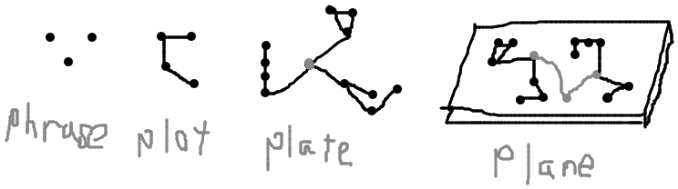

# Phrase Network

# Phrase Network とは
Phrase Network(pnと略す)とは、phrase(短文) 単位で情報を扱ったりコラボレーションしたりするための仕組みである。

利用者はまず Twitter のように phrase を書いていく。その後、phrase を二次元空間上に並べ、関連付けていくことで整理やコラボレーションを行う。この営みは n 人で行うこともできる。

## Chat との違い
チャットはメールに代わるコミュニケーション手段として普及しているが、以下の点が弱い。

- コラボレーションしづらい
    - 時系列にメッセージを並べることしかできない
    - 今現在盛り上がっている話題にのみフォーカスされており、他の話題を出しづらい

pn ではこの weak collaborative を解消する。pn は n 人が、二次元空間上に、phrase を自由に配置するモデルであるため、時系列の呪いにとらわれない。

## Twitter との違い
Twitter は短文の投稿と共有には向いているが、以下の点が弱い。

- 後から参照・活用するのが難しい
    - 文脈や関連が保存されていない、「ツイート単位」の羅列しかない
- きりの良い単位の成果物やコラボレーションエリアを確保できない
    - たとえば数千文字ボリュームの主張を Twitter だけでつくるのは難しい
    - たとえば会議単位ごとのエリアを設けることができない
- ツイートを俯瞰できない

pn ではすべて可能である。

pn では、いわゆる project という単位があり、利用者は必要に応じてつくることができる。また各 project には plane という「レイヤー」ともいうべき単位があり、ここに n 人が自由に phrase を配置していける。レイヤーは複数枚つくれるので柔軟な運用もできる。そもそもレイヤーは二次元空間であるため、phrase の俯瞰も行える。

## Scrapbox との違い
Scrapbox はテキストベースの情報管理およびコラボレーションに向いており、n 人同時編集や 10000 ページ以上にも耐えるなどポテンシャル面でのスケーラビリティも備えているが、以下の点が弱い。

- 書き手に要求される素養が高い
    - 多数のページや関連を自分でフィルターすること
    - 箇条書きを用いて端的に書くこと
    - タグで分類せず、リンクでネットワークをつくること
    - 自動投稿やコピペに終始せず、自分の言葉で紡ぐこと・加工すること etc
- トピックシェアリング的であること
    - 1つのページにn人が書くモデルであり、nを1に集約する何らかの協調・妥協が必要
    - いわゆる「場の空気」が発動し、各自がのびのびと書きづらくなる
    - かといって各個人用のエリア(personal project)に書けば、他人に読んでもらえない

pn ではどちらも緩和できる。

まず、要求素養については、「短文を投稿する」「二次元空間上に並べて関連付ける」という二つの直感的営為によって緩和する。自然言語で文章を書くことも、文章というパーツの配置と接続で関連付けることも、どちらも特殊な訓練は（さほど）必要とせず行える。少なくとも Scrapbox のように、デジタルの作法や知的生産のセンスを養う必要はない。

次にトピックシェアリングについては、並べるコミュニケーションによって緩和する。pn では n 人全員が phrase を書き、その塊を整理して提示できる。各 phrase は本人以外は修正できない。よって、pn では「n 人全員の意見が並んだ状態」が実現される。無論、意思決定に向けた収束は必要であるが、それは「並んでいる n 人の意見」をベースに行えば良い。トピックシェアリングでは個人の意見は残らないが、pn など並べるコミュニケーションでは残せるのである。

# データ単位

## 基礎単位「4P」
- Plane
    - Plate
        - Plot
            - Phrase



### Phrase
- 1つの短文
- グラフとしては 1-phrase 1-node に相当する

### Plot
- n-phrase から成る塊
- 主な用途
    - n の短文を何らかの関連でまとめる
    - n の短文から 1 の長文を表現する

### Plate
- n-plot + n-phrase から成る塊
- 主な用途
    - n の短文やプロットから 1 の「まとまった情報」を表現する
    - n 人の意見をまとめたセットを表現する

### Plane
- n-plane + n-plot + n-phrase を持つ単位
- 平面を並べて行き来させたり重ねたりするため、Layer のニュアンスでもある

## ワークスペース単位「3P」
- Project
    - Plane
    - Pool

### Project
- 一つのワークスペースを表現する単位
- n-(plane,pool) を持つ

### Plane
割愛

### Pool
- n-phrase を貯める単位
- ユーザーはまず pool に phrase を投下し、その後、pool 内の phrase を plane に配置していく
- pool は plane とは切り離され、各ユーザーの持ち物として管理される

詳細はプールの項を参照。

# トポロジー ～繋ぎ方のパターン～
plane は phrase をノードとしたグラフと言えるが、ノードの繋ぎ方には主なパターンがある（名称はネットワーク・トポロジーの基本系とほぼ同じ）。

## Dot

```
 1
    2
        4
  3
```

繋がりがなく点在している状態。

頻繁に組み替えたい場合や、脳内で思考したい場合によく使う。

## Line

```
1--2--3--4
```

主に文章や時系列を表現する。

## Star

```
 2--1--3
    |
    4
```

Mediator(仲介者)とも呼ばれる。主従、親子、抽象と具現、収束と発散など利用例は多い。

## Ring

```
  1--2
  |  |
  4--3
```

Closed Chain(閉路)とも呼ばれる。終点から始点に戻れるという意味で、Line よりも利便性が高い。

## Tree

```
  1--2--3
  |  |
  4  5
     |
     6--7--9
     |
     8
```

主に文書構造を始めとした何らかの分類構造を表現する。

## Mesh

```
   +-----+
   |     |
   1--2--3
   |  |  |
   +--4--+
```

怪しい臭い(Smelly)を示す。メッシュは phrase の整理が上手くいっていないことを示す。

# グラフネットワーク
pn は phrase をノードとしたグラフ構造とも言える。

本節では、pn の性質をグラフ的な見方から整理する。

## グラフ
- plane は n-グラフを持つことができる

## ノードとエッジ
- ノードは phrase である
- エッジ
    - phrase と phrase を繋ぐ( **リンク** という)
    - 有向である

## リンク

### 内部リンク(inlink)
- ノードは基本的に同一 plane 内でのみリンクできる
    - これを **内部リンク** という
- 内部リンクは何本でも張れるが、同じノードには 1 本だけ張れる

### 外部リンク(exlink)
- ノードは、異なる plane にあるノードにもリンクできる
    - これを **外部リンク** という
- 外部リンクは、異なる plane に対して 1 本のみ張ることができる

### 表面から表面にリンクするということ
一般的にリンクには以下の 4種類がある。例とともに示す。なおここでいう in や ex は、上述の inlink や exlink とは関係がないため注意。

- in-in: Scrapboxの`[ページ名#XXXXXXXXXXXXXXXXXXXXXXXX]`
- in-ex: Scrapboxの`[ページ名]`
- ex-in: -
- ex-ex: **★pnが扱うのはここである**

in とはリンク先オブジェクトの「内部」を指すものだ。Scrapbox は基本的にこの形態で、from としてはページ内の本文単位で行う。また、to としては、行リンクを使えば in になる。

pn では、from も to も ex のみ扱う。表面から表面にリンクすると言っても良い。これにより、リンクは「phrase」というノード同士を繋ぐものになる。phrase の本文（詳細）レベルをいちいち気にする必要がなく、ノードという単位で関連をつくっていける。

# ユーザーカーソル

## カーソル
plane は n 人が同時編集できる。各ユーザーは **カーソル** を持っており、これが plane 上で動く。

ユーザーの操作はカーソルから反映される。たとえば A さんが phrase を追加したり、phrase-A と phrase-B にリンクをつけたりするときは、その部分には A さんのカーソルが表示されている。これにより、A さんがそういう行動をしているのだとリアルタイムに知ることができる。

## 場所同居性を高める
カーソルの主目的は、一緒にいる感（場所同居性）を高めることである。

人は社会的動物であるため場所同居性を求めるが、リモートワークでは不足しやすい。しかし都度対面会議を設定するのもコスト面や自由度の面で望ましくない。

カーソルであれば、対面会議ほど強制約的ではないが程々の場所同居性を確保できる。たとえばカーソルの有無により誰がいるかがわかるし、カーソルの動き方やそこから映えている内容を見れば誰が何しているかもわかる。カーソルの集まり方次第で盛り上がりを表現することもできる。

## カーソルミュート
自分のカーソルは一時的に非表示にできる。これを **カーソルミュート** という。

カーソルミュートは、監視の目を緩めるための機能である。もしミュートできない場合、休憩したい場合やサボりたい場合にカーソルが止まったままに見えてしまい不信感を与える。ミュート機能があれば、ミュートすることでそのような状態を曖昧にできる。

### Q: ミュート≒サボっていると取られないか？
Ans: そうはならない。

なぜな人は心理上、不要なときはカーソルを自ら非表示しにいくからである。たとえば他人の活動を見たい場合、愚直にカーソルを合わせにいくと相手にも見えてしまうが、ミュートしてから見れば相手には気付かれない（覗ける）。そのような自己隠蔽的な使い方を皆が行えば、カーソルミュートは自然な営為となる。「ミュート＝サボっているかもしれないが、皆普通に使うことだからまあそういうものだ」という認識に収束できるのだ。


### Q: ミュートを解除し忘れたらどうなる？
Ans: ある程度は仕組みで防げる

たとえば以下の仕組みを入れる。

- ある plane 上でカーソルミュートしているユーザー A が、その plane 上で活動を再開した場合、A のミュートを自動で解除する
- plane presence を設ける
    - ある plane P をユーザー A が開いている場合、P には「Aさんは今ここにいます」という情報(plane presence)を表示する
    - A が P を閉じた場合、plane presence もなくなる

# レイヤーコントロール
pn では plane 上に phrase を配置していく。plane は言わば「レイヤー」であり、ある phrase 群が載った一枚の世界と言える。

このレイヤーはしばしば複数枚を運用することになる。pn としても使い方、使い分け方、連携方法などを定めているため、本節にて解説する。

※データ単位としての正式名称は plane であるが、layer(レイヤー)の方がニュアンスとしてわかりやすいため、本節では後者の言葉を使う。つまり plane = layer。

## レイヤーは n 枚つくれるが、1-main n-sub 構造となる
project には n 枚の layer をつくることができる。

layer は必ず 1 枚の main layer を持つ。main layer 以外はすべて sub layer となる。

**レイヤー間リンクは main から sub の方向しか行えない**。すなわち Star 型になる。

例:

```

   [sub-layer]   +--->[sub-layer]
        A        |
        |        |
       [main-layer]--------------
          |                      |
          |                      V
          V                   [sub-layer]
    [sub-layer]
```

## レイヤー間リンク
phrase と phrase はリンクで繋げることができるが、基本的に同一 layer 内でしか繋げない。

しかし 各 phrase は、異なるレイヤーに対しては、1つのみリンクを繋げることができる。上記のとおり main-sub 制約もあるため、結論を言うと **main layer に存在する各 phrase は、各 sub layer ごとに 1 つだけリンクを繋ぐことができる** となる。

## レイヤー操作
基本的な CRUD はできて当たり前なので割愛する。

### Duplicate
ある layer-a を、layer-b として複製する。

- b は必ず sub layer になる

### Copy
ある layer-a 内の **部分グラフ** を、layer-b に複製する。

- b は main layer も指定できる
    - たとえば個人用 sub layer で仕上げたグラフを、main layer にコピーできる
- b は a と同じでも良い
    - たとえば main layer 内の部分グラフを複製できる

Duplicate との違い

- Duplicate は
    - main から sub をつくる操作である
    - layer 単位で複製する
- Copy は
    - main から sub でも、sub から main でも可能（一方向ではなく双方向）
    - layer 単位ではなく、laner 内のグラフ単位
    - 同じ layer 内でも行える

### Extract
ある layer-a 内の部分グラフを、layer-b として切り出す。

- b は必ず sub layer になる

### Merge
ある layer-a の内容を、layer-b にマージする。

- a 側のすべてのノードとエッジを、b 側に追記する挙動となる
    - node1@a と node2@b が同じ phrase 内容だからといって重複処理は発生しない
        - (phrase にはすべて固有のidが振られておりオブジェクトとして別物である)
- マージ時、layer のどの部分に描画するか（この場合は b のどの部分）はそのとき選ぶ

### Export
ある layer の内容を、様々な形式でエクスポートする。

エクスポートの形式の例

- Readble Text
    - txt
    - markdown
    - HTML
- Parsable Text
    - XML
    - json
- Image
    - SVG
    - PNG
    - JPEG

Export は可逆的であり、バックアップや移行用途として使える。

### Essential Export
ある layer の内容の「要点」をエクスポートする。

要点とは、starting-node から辿れるグラフである（詳細は特殊ノードの項を参照）。

Essential Export はあくまでも for human（人間が読む用）であり、不可逆的である。たとえば node の配置情報（二次元空間上のどこに何があるか）は出力しない。もちろん、Essential Export したデータを import することもできない。

## レイヤーコンセプト
上記のような設計になっている理由を記載する。

### 管理や分類に忙殺させない
layer を無秩序に作成・リンクできるようにすると収拾がつかなくなる。

pn では 1-main N-sub、main から sub へのリンクのみ許す、sub へのリンクは layer ごとに 1 つのみ、と制約を課すことで秩序を与えている。これにより利用者は、基本的に main で活動を行い、本質でないものを sub に分ける（そして必要ならリンクを張る）というシンプルな運用に強制される。

### 無尽蔵なデータストアではない
pn の触発元である Scrapbox は 10000 ページでも破綻しないポテンシャルを持っているが、pn はそうではない。また肥大化するデータに対処する仕組みもサポートしていない。

pn は汎用的で長期的な用途としては想定されていない。あくまでも特定の仕事やコラボレーションを解決するための一時的手段にすぎない。たとえば pn にて全体像が明らかになった後は、タスク管理なり文書化なりツールのフィールドを移すべきだし、別の仕事やコラボレーションが必要になったのなら新たな project を立てるのが良い。

## ベストプラクティス
ここで挙げたテクニックはごく一部にすぎない。

共通して言えることは、main layer ではコラボレーションに集中し、それ以外の非本質は sub layer に切り離す（必要なときに見に行けば良い）ことである。

### 定義レイヤーをつくる
用語の定義を書いた phrase を集めたレイヤー。

コラボレーションにおいて共通理解は重要である。その根幹を支えるのが（用語の）意味の統一だが、これを実現するためには定義を書くしかない。しかし、main layer に定義を並べてしまうと layer 内がごちゃごちゃするため、定義を扱った専用の layer をつくる。それが定義レイヤーである。

定義レイヤー（内のphrase）へのリンクは適当に行う。「この言葉の意味はこうですよ」と強調・周知したい場合に使っても良いし、片っ端から使っても良いだろう。

### 個人ワークレイヤーをつくる
自分ひとりだけが自由にいじれるレイヤー。

main layer は共同エリアであるため、（自覚がなくとも心理的にどうしても）のびのびと活動しづらい。そこで自分用の sub layer を設け、まずはそこで作業すると良い。

ただし、個人ワークレイヤーが行き過ぎると main layer がただのお披露目場になってしまい、コラボレーションが促進されない。コラボレーションは、皆が main layer を同時編集することで実現できる。多用には注意が要る。

### 履歴レイヤーで履歴を保存する
現時点の main layer を複製して保存したのが履歴レイヤーである。その名のとおり、main layer の履歴を保存することができる。

特にドラスティックな変更を行う前後で保存すると良い。適宜保存しておくことで、（後で戻せるようになるため）思い切って作業しやすくなる。

### 決定事項レイヤーをつくる
会議において pn を用いる場合、決定事項をどう記述していくかという問題がある。無論、main layer に並べても良いが、main layer は作業エリアであり「変化しないもの」を置いておくのはあまり適さない。そこで、決定した事項は sub layer に保存しておく。これを決定事項レイヤーという。

決定事項レイヤーにより、利用者は main layer では作業に集中できる。決定事項を見たければ、sub layer を見れば良い。

決定事項レイヤーには「決定事項そのもの」と「それを支える背景や根拠」を両方置くと良い。前者を目立たせておき、後者は必要に応じて辿れるようにする。もっとも、後者を整理するのは手間であるから、最悪そのまま（main layer で作業していた時の状態）で置いても良い。

決定事項レイヤーの粒度は、1-決定事項 1-sublayer が良い。

# 特殊ノード
phrase はノードだと述べたが、ノードには他にもいくつかの種類がある。

## phrase node
pn におけるノードは基本的にこれ。一つの短文を表現する。

## 視覚制御系

### pointer node
何らかの uri を表現するノード。

内部的には phrase node だが、視覚的表現（アイコン）が異なる。phrase ではなく uri であることを視覚的に強調するために使う。

また、uri を pointer node としてつくっておくと、あとで「参考情報の一覧」を取り出すのが楽になる（pointer nodeを列挙するだけで良い）。あるいは（pn 開発者の目線になるが）layer や project に「参考情報一覧」機能をつくるのも良い。

ちなみに uri の記述は強制ではない。本質は所在を記すことであるため、たとえば「ロッカーの A3 棚」などと書いても良い。

### warp node
ある plane において、2 点間を（リンクを張らずに）繋ぐノード。必ず 2 ノードでワンセットとなる。

warp node は見た目がごちゃごちゃしそうなときに使う。たとえば繋ぎたいノードAとBがあるとして、そのまま繋ごうとするとごちゃごちゃするという場合、ワープノードWをつくり、AとW、BとWを繋ぐ。

warp node は、手続き型プログラミングで言えば goto 文のようなものである。多用すると、いわゆる「スパゲッティ」状態を生み出すため注意が要る。

## 走査系

### starting node
ある plane において、「ここから読み始めると（辿り始めると）良いですよ」を示したノード。1-plane 1-starting-node。

### block node
「ここから先は辿らなくてもいいですよ」を示したノード。1-plane N-block-node。

block node は、layer の essential export 時に使われる。具体的には block node を行き止まりとみなし、その先を辿らないようにする。これにより、エッジ（リンク）を設定していながらも「ここから先は辿らなくていい」と指示できる。

## リアルタイム更新系

### timer node
時刻、ストップウォッチ、カウントダウンなどを刻むノード。

### counter node
カウントを行うノード。

利用者がこのノードに対してカウント操作を行うと、値が +1 される。

### vote node
投票を行うノード。

このノードは選択肢を持っており、利用者は選択肢を一つ選べる。選ぶとその旨がグラフとして反映される。

以下はA,B,C,Dさんが投票した例である。

```

                          +----->B
                          |
                 [selection-3]
                    A
                    |
            [vote-note]
             |       |
             |       |
             V       V
   [selection-1]     [selection-2]--->E
     |     |
     |     |
     V     V
     A     D


```

# ノードの操作
基本的な CRUD は割愛する。

## リンク(link)
ノードAからノードBに繋ぐこと。

## アンリンク(unlink)
リンクを解除すること。

## コピー(copy)
ノードを複製すること。

内部的には id が異なるだけであり、phrase の内容そのものは全く同じになる。ただしリンク情報はコピーしない。

コピーの挙動は deep である。そのためAをコピーしてBをつくった後、Bをいじっても、Aは変更されない。

## 同期コピー(sync)
ノードを同期すること。

ノードAを同期してノードBをつくると、ノードBは以下の性質を持つ。

- 内容を直接変更できない
    - ノードAの内容が常に反映される
- リンクは行える
    - ただしノードAのリンク状況は反映されない
- ノードAが削除された場合、その時点で同期を停止する（コピーと同じ挙動になる）
- 同期コピーは行えない

主な用途

- timer node などを自分（が活動している場所）の近くに表示しておく
- n 人のサマリーノード（自分の見解を一言で表現した phrase）を同期コピーして一箇所に配置することで、俯瞰できるようにする
- 「何かあったらノードAの中身を書き換えてコメントしてね」と周知した上で、ノードAを自分の近くに表示しておく
    - 誰かがコメントすれば書き換わるので気付ける

🐰 煩雑かなぁ。実装も複雑だろうし。

## トポロジャイズ(Topologize)
複数のノードに対して、ネットワークトロポジーの基本形を構築すること。

以下をサポートする。

- Line
- Star
- Ring

操作として右記の順となる――トポロジャイズ開始、n個のノードを順に選択、どの基本形を構築するかを選択。つまり、選ばれた順番に従って基本形を構築する。line の場合は選ばれた順に繋ぐ。star の場合は1番目に選ばれたノードを中心にする。ring の場合は line に加え、最初に選ばれたノードと最後に選ばれたノードも繋ぐ。

## グルーピング(Grouping)
複数のノードを一つのグラフとみなすこと。

いわゆる「グループ化」であり、グルーピングされたノード群はまとめて操作できる。対応操作には限りがある。たとえば削除、コピー、二次元空間(plane)上の配置変更などが行える。

グルーピングは空間的な（視覚的な）グループ化である。二次元空間上で線で囲むと、その内部にあるノードすべてをグループ化するイメージ。この性質上、グルーピング情報は内部的にデータとして保存する。

## グラファイズ(Graphize)
複数のノードを一つのグラフとみなすこと。

グラファイズは論理的なグループ化であり、選択したノードから辿れる部分グラフ（閉路）を検出してグループ化する。グルーピングとは違い、内部的にはデータを持たない（都度検出するだけである）。

活用について。ある部分グラフG上のノードAを操作する際、通常はノードAのみが操作対象となる。が、ここでグラファイズを行うと、部分グラフGが操作対象となる。いちいちグルーピング操作を使わずとも、Aから辿れる部分すべてを対象にできるという点で利便性が高い。

# プール ～plane に phrase を置く前段階～
pn には pool と plane があると述べた。ユーザーは phrase をまず pool に吐いていき、その後で plane に配置していく。これにより、Twitter でツイートするような直感的なやり方で書ける。

## Pool is private
プールはプライベートな領域であり、本人以外が見ることはできない。

## Pool is not a content
プールは plane が保持する情報 **ではない**。

たとえば plane を export しても、プールに書いた情報は出力されない。プールはプライベートなものだから当然である。

## Pool is personal
プールはパーソナルな領域であり、保存場所は layer ではなく各個人の領域である。

したがって、plane-A を削除したからといって、そこで書いた（プール内の）phrase が消えることはない。phrase 自体は、その人の持ち物として保存されている。ただ「作業場所だった plane-A はもうなくなってます」のような警告を表示するだけである。

# misc
subへのリンクを張ったグラフをsubにした場合、どうなる？

チャットは？個人的にはナシにしたい。phrase 書くことに集中させたいから。下手にチャットがあればチャットで物事が進められてしまう。 → 放送室。必ず全員に届くエリア。通知だとうざいのでテロップ表示みたいな感じにする。

# 日付ベースの検討残骸

## 2021/11/10
前提から再び整理してみる

- teeting を実現するツール案を見つけたい
- 今のところ scrapbox だが、これ以外のアプローチもあるのではないか？
- scrapbox ではない、とは？
    - 行指向でない
    - 箇条書きでない
    - ページではない
    - リンク記法ではない etc
- twitter やミニブログのような「短文」が頭から離れない
- 👉 では、短文をベースとしたアプローチを考えてみよう
    - 短文のことは phrase と呼ぶことにしよう
    - 階層もリレーショナルもコラボレーティブではないしアジャイルでもないから、構造はネットワークになるだろう
    - 👉 phrase network？

何が嬉しいと考えられる？

- 形式にとらわれず、短文で書くという自然な営みの延長で使える
- コラボレーションを短文の「連結」「関連付け」といった接続行為で行えるようになる
    - ローコードではないが、直感的でやりやすい
    - 接続行為が半ば強制されるので、全員が接続について意識することになる（なあなあを許さない）
    - リンクも「本文中の文章を `[]` で囲む」ではなく、短文同士をつなぐという形で行う
- 文脈を切り離して本来の仕事に集中できる
    - レイヤーの概念
    - たとえば言葉の定義は「定義レイヤー」で扱い、定義は全部そっちにつっこむ
    - Scrapboxみたいに全部混ぜるのではなくて
- バーチャル空間が楽しい
    - ネットワーク（グラフ）が表示され、誰がどこにいるかがアイコンで表示される
    - ロックマンEXEみたいな？

2

- グラフィカルな見せ方は破綻 or カオスになりかねないので、やめる
    - scrapbox みたいにフラットにする
- ex-ex リンクを使う
    - in-in: Scrapboxの`[ページ名#XXXXXXXXXXXXXXXXXXXXXXXX]`
    - in-ex: Scrapboxの`[ページ名]`
    - ex-in: -
    - ex-ex: ★Phrase Network で扱いたいのはここ
- リンクの種類
    - 同レイヤーへのリンク: n本使える
    - 別レイヤーへのリンク: 1本だけ使える(nレイヤー分リンクしたいなら計n本)
- レイヤー上での俯瞰
    - 孤立ノードを表示
    - 閉路を表示
    - 指定ノードから辿れるノードを表示
    - 🐰 network topology elements で出せばいいかも
        - tree になっている部分は木アイコンで示す
        - star になっている部分は星アイコンで示す etc
- phrase の投稿手段(括弧は network topology 用語)
    - つぶやきモード(Line)
        - `1->2->3`
    - フリーモード
        - `1`
        - `2`
        - `3`
    - 集約モード(Star)
        - `2->1<-3`
    - 閉路モード(Ring)
        - `1->2->3(->1)`
    - メッシュ(Mesh)
        - 使いみちある？
    - 🐰 カスタムできると使いやすい？
        - 8-star の 2 段にすれば「マンダラチャート」ができる

2 ユースケース別

- フリーライティングしたい
    - twitter のようにガンガンつぶやいて、それを後からまとめられるといい
    - ガンガン linear につぶやけること
    - つぶやいたあと、まとめられること
    - まとめるためには？
        - 古典的には一次元テキストエリアに並べて並べ替えたり整形したり
        - KJ法など二次元に並べてグルーピングしたり
        - 三次元は、ディスプレイが二次元なので無理がある（VR・AR次第ではわからないが）
        - Scrapbox は（視覚的には無理だが）構造的には n 次元のネットワークグラフ
    - pn としてどうアプローチする？
        - ユーザー層はテキストベースでゴリゴリできる層ではない
        - 直感的に整理・整形したい
        - 二次元ではないか
    - 「レイヤーに配置してノード間を繋ぐ」と「ノード（phrase）をつくる」は分けたい
        - 後者は twitter のように単につぶやくエリア
        - で、後者エリアで溜まったものを、前者エリアに持ってくる
            - 後者のプールから、前者のレイヤーに持ってくる
            - プールのphrase10個を選択して「starとして追加」みたいなことができる
    - Phrase set
        - n-phrase が集まった単位
        - n-phrase を 1 ノードとして見せるために使う
        - ネストはサポートしない（絶対ややこしくなって破綻するので）
        - Phrase set は head phrase を持つ
            - 外からはこのhead phraseだけが見える
            - 適切なheadがないなら、適当にphraseつくってそいつをheadにする
        - Phrase set はトポロジーアイコンで表現される
            - たとえば閉路なら Ring のアイコン
    - Layer
        - n-phrase、n-sentence が集まった単位
        - バージョン管理できると楽
            - 今の状態に名前をつけて保存 ← これくらい
            - git みたいな複雑なのは要らない
            - 既存の「バージョン番号だけ増やすバックアップ」は足りない（名前はほしい）
    - Layer にガンガン phrase を配置して、ネットワークをつくっていく
    - 一通り整理整形できたら？
        - 出力したい
        - 画像として？
        - permalink？
        - テキスト化？
            - テキストの整形をするためのノード仕様がエグそう
            - 案1: そういうサポートしないで、原始的に出力するだけにする
            - 案2: ~~あえてサポートしにいく(topology-like network to sentence tree 変換を体系化しなきゃいけない。。。)~~
            - 原始的な出力とは……？
            - 🐰 いったんおいとく
    - 複数 layer はどうやってコラボする？
    - 重ねがけ
        - お絵かきツールみたいに重ねがけできるといいのでは？
        - が、二次元表示面で明らかに死ぬ。。。二次元グラフの merge ってことだから……
        - 純粋に「新規ノードとして追加」するしかない
            - 重複（同名 phrase）は別途視覚化して気づかせるまでにする（その後の対応はユーザーに任せる）
        - 「合成」と呼ぼう
    - レイヤーをまたがったリンク
        - 🐰 定義レイヤーの概念扱いたいから、ここはぜひサポートしたい
        - 「串刺し」と呼ぼう
        - 串刺ししたレイヤー間は（L1のnodeからL2のnodeに）リンクが可能になる
    - 1レイヤーをnレイヤーにする
        - 「分離」と呼ぼう
        - レイヤー内の特定部分を、別レイヤーに切り離す or 複製できる
        - 🐰 分離元には「跡地ノード」的な跡があるとわかりやすい？
- 2人でフリーライティングしたい
    - たとえばAさんBさんがいて「20%ルールとしてこの半年間何をするか決める」
    - やり方1: layerA、layerB をつくって、お互い読み合う
    - やり方2: layerA をつくって、B に見てもらう
    - やり方3: layerA をつくって、B に見てもらう + 直してもらう
    - やり方4: layerX をつくって、AとBが一緒に作っていく
    - 同時編集はサポートするか
        - したい
        - phrase(node)にカーソルを割り当てて、ロックする
            - こうすれば誰がどのノードにいるのかも表示されて楽しい
        - カーソルミュートを使えばロックの解除も自然に行える
        - プールは個人の持ち物にする + ノードは uuid 振って全部一意にする
            - （上でも書いたが）意味的な重複の対処はユーザー達に任せる
    - やり方4でコラボレーションするとして
    - たとえばこうなるだろう
        - やり方1: 各自離れた場所でグラフつくって、お互い確認しながら、どっかでマージしていく
        - やり方2: どっちかがファシリテーターになって、ノード追加して、そこにその都度追加していく（同期的）
        - やり方3: ファシリテーターが「こういうのほしい」的なテンプレをつくり、そこに追加していく
    - 会話はどこでやる？
        - 別ツール
        - 会話エリアつくってそこで
        - チャット機能をつくってそこで（ 🐰 たぶんこれが直感的）
            - チャットノードつくってそこに来たときだけ表示する、にすれば集中しやすい（割り込まれない）
- 20人で定例会議したい(not teeting)
    - 部長
        - M1
            - 4人
        - M2
            - 3人
        - M3
            - 2人
        - M4
            - 6人
    - 20人が見るレイヤーが一つつくられる（オリジナルレイヤー）
    - 意思決定者 = 部長のファシリテートで進んでいく
    - 各アジェンダでは担当者が喋る
    - ワークショップやブレストなどで即席チームつくってn分間活動させる
    - ===
    - teeting はきつそうだからいったんなし
    - 会議中に使うツールとして
    - とりあえず
        - 指定 URI を開く「URI ノード」的なのがあると便利
    - オリジナルレイヤーをコピーして、各自メモを取る(自分用private layer上でphraseつくって繋げる)
    - オリジナルレイヤーに書き込んでいく
    - チーム活動時は
        - チームごとのエリアは、node 一つつくって「ここから広げていこう」でいい
        - 🐰 n人でのやり方、色々ありそうだなぁ……（2人でも4つあったのでn人だともっとありそう）
    - 要するに「塊」をつくって、それを連結していくことでオリジナルレイヤー内を整然にできる
        - チームごとに発表資料つくる＝チームごとに（他者が読めるような）塊をつくる
        - 🐰 この塊を何と表現するか
    - 人ひとりが自分の主張するときは phrase set を使う
    - チームレベルで発表資料これでーす、とするときは phrase cluster でまとめる

いけそうだが。

### IRN の I と N を解決できないか？
[Teeting](teeting.md) において IRN について取り上げた。

> IRN とは Input、voiceRecognition、Normalize の略である。音声入力、音声認識によるテキスト化、認識されたテキストの整形を意味する。

このうち I と N は、phrase network 上で実装できうる。

- I(音声入力)はかなり楽に行えるようにする
    - ボタン押して喋るだけでカーソル位置に表示されていくとか
- R(音声認識されたテキスト)を、phrase として並べていく
- N(認識されたテキストの整形)は、phrase の操作をもって行う
    - 文章を分けたりくっつけたりをタッチだけでサクサクできると良い
        - が、スマホだと小さいのでタブレット必須か
        - クリックでもいけるだろうか？
            - 選択文字のドラッグで分離、とかすればいける？

### 単位
- Layer
    - Phrase Cluster
        - Phrase Set
            - Phrase

phrase set は n-phrase をカプセル化する。外見えでは head phrase 一つしか見えない。

phrase cluster は n-phrase-set + n-phrase をカプセル化する。外見えではやはり head phrase 一つしか見えない。

layer は n-phrase-cluster, n-phrase-set, n-phrase を持つ単位。


### ❌topology-like network to sentence tree
input

- line
- ring
- star
- full mesh
- tree
- 孤立ノードたち
- その他のノードたち

これらだけで文書構造ツリーに落とし込むことは明らかにできない。やはり文書構造を示す何らかのノードが必要……結局、マークアップ言語みたいに文法を指示することになる。

それも木構造的に整えていくしかない。たとえば第一章を示す部分グラフは、第一章ノードをルートとした tree として整える必要がある。

結局、こうなる

- 始点ノードから順に辿っていくことで、文書構造ツリーをつくる
- 追加が必要なノード
    - starting node
    - section node
        - lv1 node/章
        - lv2 node/節
        - lv3 node/項
        - lv4 node/号
- どうパースする？
    - 案1: star
        - starting node からは、star 構造で lv1 に繋ぐ……
        - こんな感じで、star で辿っていく（各接続先に優先順位が必要）
        - x 二次元で書くのが無理ゲー（表示非表示切り替えていくしかない）
    - 案2: sequencial
        - starting node から end node まで、line で辿っていく
        - 章節項の判断は、特殊ノードにて行うしかない
        - ……

と、こんな感じで苦戦するし、二次元上で文書構造ツリー（のもと）をつくるのは人間にはしんどそう。

## 2021/10/26
- Layer によりネットワークを n に分ける
- Joint により「抽出対象すべきメイン」と「抽出しなくていいサブ」を分ける

### Layer
レイヤー。ネットワークの層。ネットワーク情報システムは「1ネットワーク上に全部つくる」を前提としがちだが、そのせいで窮屈になってる。分ければいい。n層にすればいい。Scrapboxでいうと、projectがlayerになっている。1-project N-layerをサポートできるようにするイメージ。

定義レイヤー。言葉の定義ページを扱ったレイヤー。

specific layer。同じレイヤー内のノード間は自由に繋げるが、他のlayerのノードにはつなぎに行けない。しかし他layerから繋がれるのはアリ。

リンク。 `L@N` でレイヤー L のノード N へのリンク。`@N` または `N` で今のレイヤーのノード N へのリンク。

### main と joint
レイヤーから main を抽出する。sub はメッシュでもいい。

node と joint node。

```
(node1)-->[joint-node]-->(node2)
              |
              V
           (node3)<--(node4)
              |
              V
           (node5)

```

node1はjoint master。node2とnode3はjoint slave。node4とnode5はsubnode。

抽出は joint と直接繋がったものだけ行う。sub は付随なので要らない。

### hybrid copy
ノードの浅いコピーと深いコピーを同時に行う。

node1からhybrid copyでnode2をつくったとする。

```
node1 ----> node2

     hybrid
      copy
```

node2は「node1の浅いコピー」と「node1の深いコピー」を両方持っている。なので「node1の更新を追いかける」こともできるし、「node1が変化しても（極論死んでも）内容を残す」こともできる。

浅いのと深いのどっちを使うかは切り替えられる。デフォルトはたぶん layer の設定として持った方が良い。

## 2021/10/19 

### 背景
[teeting](teeting.md) の手段としては、筆者は Scrapbox をベースにして考えている。が、これ以外のアプローチもあろう。たとえば Scrapbox は行指向なので、行指向ではないデータ構造について考えてみることでなにかひらめくかもしれない。

で、早速ひらめいたのがこのモデルだった。phrase network とでも呼べばいいのだろうか。

### 基本概念
- phrase という単位
    - TwitterでいうTweetみたいなもの
    - 「短文」くらいの単位
- phrase と phrase は繋げることができる
    - 連接
    - 例示
    - 根拠
    - メリット・デメリット etc
- この繋げる部分を「関連(relation)」という
- グラフ理論で言えば、
    - phrase がノード
    - relation がエッジ

```
(phrase) ----------> (phrase)
          relation

```

やり取りするためには？

- たとえば以下
    - 他人の phrase に、自分の phrase を繋げる
    - 話題 X に関する phrase をつくり、A について言及したい人が各自の phrase を A に繋げる

```
反論したいなら、

    (B's phrase) ----------> (A's phrase)
                    反論

補足したいなら、

    (B's phrase) ----------> (A's phrase)
                    補足
```

```
話題XについてA、B、C、Dさんが言及している

    (A's phrase)
        |
        |
        |
        V
    (Topic-X) <------(B's phrase)
      A  A
      |  |
      |  +-----------(D's phrase)
      |
    (C's phrase)


話題Xの情報量が多い場合は、その補足phraseを繋げば良い

                  (補足phrase2)
                      |
                      |
                      |
    (A's phrase)      |
        |             V
        | +-------(Xの補足) <------(補足phrase1)
        | | 
        V V
    (Topic-X) <------(B's phrase)
      A  A
      |  |
      |  +-----------(D's phrase)
      |
    (C's phrase)

```

### phrase と topic
そもそも topic 要る？topicって何？

ハッシュタグ使うのが直感的ではある。phrase に `#XXXについて` とか書けば、`XXXについて` topic が生成される＆phraseとの関係も表現される。

### Differences

#### Q: Scrapboxと何が違う？
- Scrapboxは
    - Pageというノード
    - Page内は複数人が編集できる
    - Page内からリンクを張ることで繋がる
        - Page内コンテンツとして接続を表現する
        - 別の言い方をすると「エッジ」というデータ構造がない
    - エッジ自体に意味はない
        - 厳密に言えば `#hashtag` と `[link]` は別物扱いされているが
- このモデルは
    - Phraseというノード
    - Phraseは **本人しか編集できない**
    - PhraseからPhraseへの接続は、専用の操作で行う
        - 別の言い方をすると **「エッジ」というデータ構造がある**

つまり、

- Scrapboxは「ノードは他人もいじれる」「エッジはただの無属性有向」
- このモデルは「ノードは他人はいじれない」「エッジは有属性有向」

#### Q: Twitterとは何が違う？
Phrase Network は

- Phrase は後から編集できる（Twitterはできない）
- Phrase はグラフ構造である（Twitterはリプライに基づく木構造）
    - まあ引用リツイートやらURLで言及やらすれば繋げないこともないが
- Phrase にはタイムラインがない（Twitterには必ずついている）
    - ノードを工夫すればつくることもできる（と思う）
- project という部屋概念がある（Twitterにはない）
    - 鍵垢 + フォローで一応できるが、それでも 1-account 1-room
- ★


### ステルスノード
自分にしか見えないノードをつくれる。これをステルスノードという。

主な用途

- ブックマーク
- フィルタリング
- メモ etc

以下例。

```
話題XについてA、B、C、Dさんが言及しているとする。

    (A's phrase)
        |
        |
        |
        V
    (Topic-X) <------(B's phrase)
      A  A
      |  |
      |  +-----------(D's phrase)
      |
    (C's phrase)


Aさんは、BCDさんの意見を咀嚼したいとする。


CDは似ていることがわかったので、その旨を書きたい。

    (A's phrase)
        |
        |
        |
        V
    (Topic-X) <------(B's phrase)
      A  A                                 
      |  |                                 
      |  +-----------(D's phrase) <--- [似ている] <---(A's stealth node)
      |                                    |
    (C's phrase) <-------------------------+


Bはハラスメントが混じっていて「ないわ」なので、その旨を記録しておきたい。

    (A's phrase)
        |
        |
        |
        V
    (Topic-X) <------(B's phrase) <------------------- [ないわ]
      A  A                                                 A
      |  |                                                 |
      |  +-----------(D's phrase) <--- [似ている] <---(A's stealth node)
      |                                    |
    (C's phrase) <-------------------------+
```

フィルタリング

- 例
    - ステルスノード「ないわ」から直接繋がっているノードは表示しない
    - ステルスノード「似ている」から直接繋がっているノードだけを表示する
    - ステルスノード「似ている」から直接繋がっているノード + その 2hop までを表示する

強制フィルタリング

- 他人のステルスノードは見えてはいけない。システム側で強制的に「見せない」に倒す必要がある。

### カスケード
ノードAにノード1,2,3,4,5が繋がっているとする。

このとき、Aをカスケードすると、Aの見た目はA(+5)みたいになる。つまり直接繋がったノードを重ねることで見た目を「nノードが散らばっている」から「1ノードに重なっている」にする。重なった見た目があるので（1,2,3,4,5の存在を）見失うリスクは低い。

ネットワーク視覚化のテクニックかも。たぶん二次元表示になるだろうから。

### ツイート一覧
的なものもつくれる。

単に一覧ノードTをつくって、Tから「自分のphraseすべて（あるいは一覧に表示したいphraseだけでもいいが）」に繋げば良い。

### relation をどう制御するか
- 無属性だとわけわかめになる
- 下手に属性を定めてもどうせ例外が出てくる or 守られない

バランスが必要であろう

- 個人レベルなら好きにすればいい
    - 究極無属性でもいい
- teeting であれば、全員の便宜や円滑を考えれば「ある程度は決める」のが良いだろう
- そもそも「あると便利な属性」については、やはりある程度は取り入れたい
    - 初学者は勉強しなければならないが

misc

- デザインパターンならぬ relation pattern なる分野が生まれるかもしれない
    - たとえば「ワンクッションノード」
        - 上記でいう `(Xの補足)` はこれ
        - 直接 `(Topic-X)` に繋ぐのではなく、`(Xの補足)` でワンクッションはさんでいる
    - たとえば「ガイドノード」
        - 「このノードから辿れる n の道は、～～に関するものです」というのを説明したノード
        - 例示です
        - 賛成意見です
        - 反対意見です
        - 全然まとまりないです etc
- 縛る
    - たとえば「このteetingでは以下のrelationしか使えません」とか
    - もちろんその場合もステルスノードは各自自由に使えるので、メモや整理は個人レベルでは自由にできる

### phrase network をどう見せるか
- ネットワーク図みたいな外観になろう
- 人のアイコンは、ノードに乗っかる or ひっつく？感じで表示される
    - これがリアルタイムに動く

毛玉問題にはどう対処するか。たぶん「大量の情報が乗ったネットワーク」は諦めるしかない or 思いつけばいいけど。 ~~ここは teeting の文脈だから、「ある一つの会議（でのやり取り）を表現したネットワーク」という単位を扱うことになろう。であれば、毛玉問題というほどの規模にはならないだろう。仮になるとしたら、その前に仕切り直すべきである。~~ いや、切り離して汎用的なツールや概念にしてるのでなし。

phrase node を強調する。文章をそのまま表示しても表示領域的にでかくてきつそう。いかに小さく表示するかが鍵。が、全部小さくすると見えないので「何かを強調」する必要はあるだろう。or relation があるならあえて「クリックするまで見せない」くらいしてもいいかもしれんが……いや俯瞰できないか。一つ思いついたのは `phrase node を[強調]する。文章をそのまま表示しても[表示領域的にでかく]てきつそう。` のように `[]` でくくった部分を強調とみなして目立たせる（あるいはこれら以外を小さくする）


## 更新履歴
- ★
- 2021/10/19 開始
