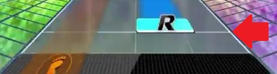
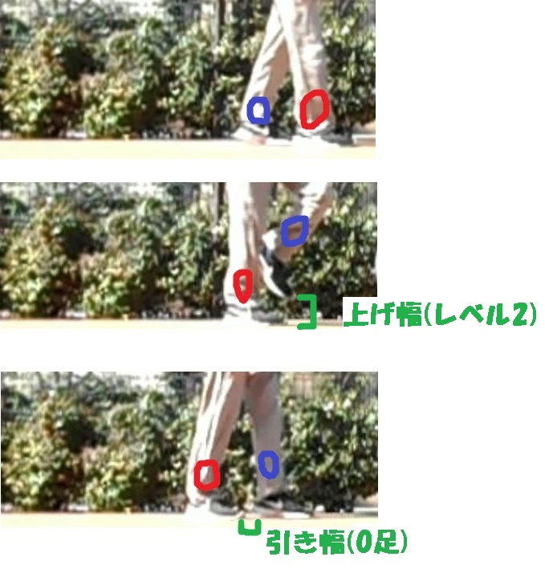
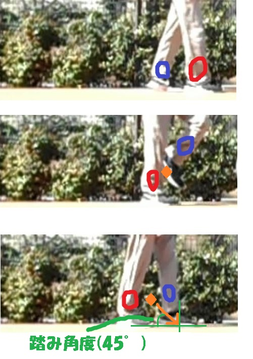
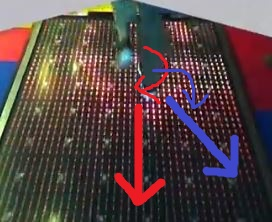
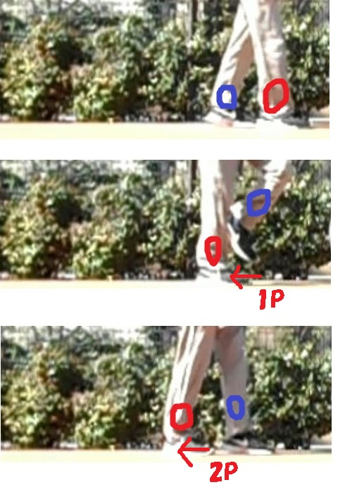
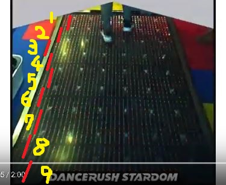

# このページについて
このページでは [ランニングマン](#ランニングマン) に関する筆者の持論がまとめられている。

# 注意事項
- このページは筆者が好き勝手に書いているだけであり、一般的な意味(たとえばシャッフルダンスにおける意味)とは異なる場合がある
- 関連事項、特にしばしば登場するダンスラこと [DANCERUSH STARDOM](https://p.eagate.573.jp/game/dan/1st/top/entrance.html) そのものの解説は行っていない

# 基礎用語

## ランマー
ランマー(Runmer)とはランニングマンを実践する者のこと。

他に適切な用語がないため造語するに至った。

## ランニングマン
ランニングマン(RM - Runningman)とはダンスステップとしてのランニングマンのこと。

### この文書での定義
以下をすべて満たす動きのこと。

- 片足を二回ずつ引くこと
- 引き足が二回引くまでの間に地面から離れないこと
- 引き足を引く角度は、常に上体正面から見て 180～270 度であること
  - 後方または側方に引いていることを表す
  - → [リバースランニングマン](#リバースランニングマン)
- 奇数回目の引きでは、引いた足のみが接地していること
- 偶数階目の引きでは、引いた足と他方の足の両方が接地しており、かつ他方の足が引いた足より前に出ていること

(この定義の意図) つまり重要なのは足の引きであり、それ以外の要因(上半身の動き、引き幅、上げ幅など)には関知しない。逆を言えば、上記さえ満たしておれば、それ以外の要因がどうであってもランニングマンだと言える。このような緩い解釈により、「上記の定義さえ満たせば誰でもランマーになれる」というハードルの低さを実現できる。

### 一般的な定義
色んな意味がある。

- 1: ダンスステップの一つ
- 2: (1の中でも特に)三代目 J SOUL BROTHERS の楽曲「R.Y.U.S.E.I.」で用いられるもの
- 3: 韓国のテレビ番組
- 4: 「走っている人」を表す言葉
  - 常用語ではなく各自が単に「走る = ランニング」「～～する人 = マン」と当てはめて使っているケースがある
  - 参考: [ランニングマン - Twitter検索](https://twitter.com/search?q=%E3%83%A9%E3%83%B3%E3%83%8B%E3%83%B3%E3%82%B0%E3%83%9E%E3%83%B3%20-from%3A%40Juigyao)

## 一段引き
片足を一回ずつ引くこと。あるいはそのようなランニングマンのこと。

一段引きは厳密にはランニングマンではない(ランニングマンは二段で引くものである)が、二段引きは難易度が高いため、特にダンスラプレイヤーや「R.Y.U.S.E.I. ネタとしてのランニングマン実践者」によく見られる。

## 二段引き
片足を二回ずつ引くこと。あるいはそのようなランニングマンのこと。

いわゆる通常のランニングマンを指すが、一段引きという概念が存在するがゆえに二段引きという [レトロニム](https://ja.wikipedia.org/wiki/%E3%83%AC%E3%83%88%E3%83%AD%E3%83%8B%E3%83%A0) が生まれた。

## 踏む
ランニングマンを行うこと。

ただし「シャッフルダンスを行う」などの意味を指すこともあるので文脈から判断すること。

## 4分
4分とはここでは手拍子一回分の間隔と定義する。四分音符の四分にちなむ。

ランニングマンは 4 分間隔で交互に踏む動作だと言える。

ただし 4 Minutes を意味する場合もあるから文脈に注意すること。

## 8分
8分とは4分の2倍の間隔。

ランニングマンは 8 分間隔で足を引き続ける動作だと言える。

## 小節
ここでは小節を「手拍子 4 回分」の時間と定義する。

ちなみにダンスラで言えば、譜面中に現れる区切り線が小節単位である。



## 引き幅


引き幅(Pulling Length)とは「ランニングマンの引き」の距離。定量的には足の大きさ(1足、1.5足、1.5足)を使って示す。

## 上げ幅
上げ幅(Raising Length)とはランニングマンの「二回目の引き」の時に上げる「上げ足」の高さ。定量的には「地面」から「上げ足の最下部」までの高さを以下の 5 段階で記す。

- レベル1: くるぶし以下
- レベル2: ふくらはぎ
- レベル3: 膝
- レベル4: ふともも
- レベル5: 股以上

## 踏み角度


踏み角度(Stomp Angle)とはランニングマンの「上げ足」を下ろす時の角度。

定量的には角度の値で示す。代表的な値には 30～45、90 などがある。

- 30～45: 一般的なランニングマン
- 90: MAS のランニングマン

## 引き角度
引き角度(Pulling Angle)は足を引く角度である。

正面を向いた状態からの角度で表す。以下に例を示す。



赤矢印は真後ろに引いており、引き角度 180 度である。青矢印は斜め右後ろに引いており、引き角度は 135 度である。

## 1P


1P(First Pull)とはランニングマンにおける(引き足の)一回目の引き。

## 2P
2P(Second Pull)とはランニングマンにおける(引き足の)ニ回目の引き。

## リバースランニングマン
引き角度が 0～90、270～360 のランニングマンはリバースランニングマン(Reverse Runningman)と呼ぶ。

## バックランニングマン
バックランニングマン(Back Runningman)とはランニングマンしながら後方に下がること。

## フロントランニングマン
フロントランニングマン(Front Runningman)とは、ランニングマンしながら前進すること。

## クロスランニングマン
クロスランニングマン(Cross Runningman)とは、引き足の軌道がクロス(X)になるようなランニングマンのこと。

例: https://youtu.be/OPnz8nijuxU?t=84

ダンスラの話だが [ランニングマン縛り](#ランニングマン縛り) において特に重要なテクニックで、踏み足とは反対側にあるノーツを自然に取ることができる。上体のひねりが入るため腹筋に負担がかかる。

## フラットランニングマン
フラットランニングマン(Flat Runningman)とは、身体が上下方向に揺れないランニングマンのこと。「揺れない」の目安は(ダンスラの話になるが) DOWN 地帯でランニングマンをしても DOWN が反応しない程度である。

フラットランニングマンの発動にはいくつか条件がある。

- 1: BPM 170 以上の高速なランニングマンであること
- 2: 上半身のアップダウンを使わず、体幹と脚力のみで 1: のランニングマンを行える地力があること
- 3: 靴と地面の組み合わせが(シャッフルダンスに慣れた者の視点で快適と感じる程度に)滑りやすいこと

やはりダンスラが適している。具体的には smooooch や SigSig といった楽曲 + 滑りづらくないパネル + SigSig ふつうの 4 分単発ノーツをランニングマンで取れる地力により、スタートラインに立てる。

## 女引き
女引きとは [一段引き](#一段引き) の一種で、8 分間隔で片足を引き切ること。二段引きランニングマンの、最初の一段目の引きのみを繰り返す形となる。

主にランニングマン初心者に多く見られる一段引きであり、ダンスラにおいては特に(エクセレベルの高スコアを狙おうとすることが少ない)女性に多く見られる。

※女引き、男引きという命名は筆者の観測範囲における傾向から採用した名前であり、他意は無い。

女引きではランニングマンノーツを正確に取ることができないため、高スコアを狙う者は自然と [男引き](#男引き) あるいは [二段引き](#二段引き) に移行していく。

## 男引き
男引きとは [一段引き](#一段引き) の一種で、4 分間隔で片足を引き切ること。

ダンスラにおいてはランニングマンノーツを正確に、かつ省エネで捌くために必須となるテクニックで、エクセレベルの高スコアを狙う男性プレイヤーに多く見られる。ただし、BPM が速い(150以上など)曲では、女引きよりも簡単に行えるため、普段女引きを行うプレイヤーも男引きになることが多い。

また、パフォーマンスとして意図的にこの引き方を行うプレイヤーも存在する( [Atz Snake](https://www.youtube.com/watch?v=irDedEIaQ4g) など)。

# ランニングマンの楽しみ方
本章ではランニングマンを楽しむためのヒントやアプローチを雑多に述べる。ただしダンスラが絡むものは次の章にまとめた。

## BGM
音楽を聴きながらランニングマンを楽しむ。

## 素音
素音(Plain)とは音楽無しでランニングマンを楽しむこと。

- 自然素音(Natural Plain) …… 場所に元々存在する喧騒を BGM にする(喧騒を許す)
- 完全素音(Strict Plain) …… 喧騒の無い場所でのランニングマン
- ASMR Plain …… いわゆる ASMR を素音ランニングマンで実現すること
  - 参考: [ASMR - Wikipedia](https://ja.wikipedia.org/wiki/ASMR)

## レース
ランニングマンの移動距離を競って楽しむ。

→ [シャトルランニングマン](#シャトルランニングマン)

## タイムアタック
ランニングマンの指定移動距離を移動しきるタイムを競って楽しむ。

## スピードラン
どれだけ高い BPM でランニングマンが行えるかを競って楽しむ。

一般的には 8 小節以上の持続をもって成功とみなす。

例:

- [Runningman BPM190 ランニングマン - YouTube](https://www.youtube.com/watch?v=AQw87QeNsG0)

以下はスピードランではないが、ダンスラで取り入れてみた例:

- [Sakura Sunrise ランニングマン練習 #DANCERUSH_STARDOM - YouTube](https://www.youtube.com/watch?v=q5QNhHxO2cM)
  - BPM 181
- [「SigSig / kors k」 #DANCERUSH_STARDOM - YouTube](https://www.youtube.com/watch?v=jQEL3ggUtHI)
  - BPM 179

以下は他者による(スピードランではなくシャッフルだが) BPM 190 以上の例:

- [yoshi@EXS(エクス)さんのツイート: &quot;EXStyleのご参考までに！(*´-`) 以前も同じのあげてますが、BPM190くらいでもこんな感じです！！ ＊早送りではありません！（╹◡╹）… &quot;](https://twitter.com/frozvitnir/status/1041824413753139200)
  - 左で休んでいる HBoy さんが笑っているのが印象的である(この速さはネタの範疇なのだと思われる)
- [LapinLait/178shuffle@ダンスラ民🥀💎さんのツイート: &quot;190BPM ﾑﾘ… &quot;](https://twitter.com/lapinlait178/status/1103873701487927296)
- [melbourne shuffle practice (BPM training) - YouTube](https://www.youtube.com/watch?v=XL383db8kdA)
  - 後半は半分ギャグとのことだが 200 まである

## 基礎トレ
ランスペを向上させたり変化させたりすることを楽しむ。

→ [ランスペ](#ランスペ)

## 有酸素運動ランニングマン
ランニングマンを有酸素運動として楽しむこと。

ポイントは以下のとおり。

- 2分以上継続できる負担とテンポで踏む
- 上半身も動かす
  - 最低でも走るフォームのように振る
  - 踊るようにアレンジを加えると上半身も運動になる、頭の体操になる、見栄えが格好良くなるとメリットづくし
  - シャッフルダンスをはじめ、既存ダンスの主な振り付けを参考にするのが近道
- ダンスラで [ランニングマン縛り](#ランニングマン縛り) や [シャトルランニングマン](#シャトルランニングマン) を行う

## ダンスラ
[DANCERUSH STARDOM](https://p.eagate.573.jp/game/dan/1st/top/entrance.html) でランニングマンを楽しむ。

# ランニングマンの楽しみ方(ダンスラ編)
本章ではダンスラが絡む楽しみ方をまとめる。なおダンスラ自体の解説は行わない。

解説は以下動画も参照。

- 19/10/24 [ランニングマンだけで遊べるダンスラの遊び方５選 #DANCERUSH_STARDOM - YouTube](https://www.youtube.com/watch?v=zLRV9dDmHW4)

## ランニングマン縛り
二段引きのランニングマンのみで曲中のすべてのノーツを取り、できるだけ高いスコアを目指すこと。

### コツ
- 最低でも曲中絶えずランニングマンを続けられる程度の地力は必要
- 普通に遊んで 97% を難なく取れる程度の地力は必要
- 踏み足で取れないノーツの対処は以下三通り
  - 1: パネル内を移動しながら踏むことで、踏み足で取れるようにする
  - 2: ひねりを入れる(クロスランニングマン)
  - 3: 2P 時の引き足で取る(バックタップという。FLOWER ふつうのサビで見られる)
- ジャンプ時はほんの少しだけ浮かせる(バックタップで可能)

### 96% の壁
ランニングマン縛りの目安はスコア 96% である。

そもそもの前提として、ランニングマン縛りには絶え間なく踏み続ける「体力」と譜面を正確に捌く「正確性」の両方が要求されるべきである。そうでなければ単なる体力ゲーかスコアゲーに成り下がってしまう。しかし、ランニングマン縛りでエクセに到達するのは非現実的であった。そこで筆者は、色んな譜面でランニングマン縛りを行い、体力と正確性のちょうど良い「あるべきバランス」を求めてきた。結果、96 という数字に落ち着いた。

以下に 96 を採用した根拠を端的に述べる。

- 96% は最後まで体力が保たなければ到達できないラインである
- 96% は普通に遊んで 97-98% が取れる程度の地力が無ければ到達できないラインであるが、エクセほど過酷なラインではない
- 96% はランニングマンで取れないノーツを多数含むレベル 8 以上の譜面においても、何とか達成できることがあるラインである

### BPM 目安
見方は以下のとおり。

- 見方 (BPM)
  - (主な曲)
  - (筆者主観)

目安を以下に示す。

- BPM 106
  - Small Steps、ラブリーレイディオ
  - 余裕で出来る
- BPM 120
  - Nightlife、幽霊王国
  - 普通にできる
- BPM 128
  - Summery、Don't Stop、Special One
  - 疲れてなければできる
- BPM 133
  - Love2Shuffle、Impress、S7AGE
  - 疲れてなければできるが、連続は控えたい
- BPM 138
  - Gimme a Big Beat、Party Jumpin'
  - 万全の体調で一日数回まで
- BPM 150
  - Dual Bladez、Shiva、Raw Clawler
  - 万全の体調で一日一回、かつ最後まで保たないこともある
- BPM 160
  - The Light
  - 最後まで保たない(開幕 8 小節分は踏まないなど)
- BPM 177
  - smooooch
  - 最後までどころかサビの間しか保たない

### 譜面の難易度を構成する要素
ランニングマン縛りとして遊ぶことを前提とした場合の、譜面の難易度を構成する要素について。

以下が高い、多い、激しいほど難易度が高くなる。

- 1: BPM
- 2: 両足ノーツ
- 3: ジャンプノーツ
- 4: 8 分ノーツ
- 5: ノーツの配置的ばらつき
- 6: 4n でないノーツ(4分でも8分でもない間隔で配置されたノーツ)(例: take me higher ふつう)
- 7: スポンジボブノーツ
- 8: 両足拘束片足クランク(例: Crazy Shuffle ふつう終盤)
- 9: 両足拘束両足クランク(例: FLOWER ふつう後半サビ)

特に「8分ノーツ」と「4nでないノーツ」はランニングマンで物理的に取ることができない無理ゲーノーツであり、これら無理ゲーノーツが相対的に多い譜面はそもそも 96% が不可能となる。

### 筆者実績
96% を達成したもの

- 2019/07/06 [Disco Nights ふつう](https://www.youtube.com/watch?v=_WGLyOLhbDA)
- 2019/06/09 [Catch Our Fire! ふつう](https://www.youtube.com/watch?v=aPTpSH0vCuI)
- 2019/05/30 [Love 2 Shuffle ふつう](https://www.youtube.com/watch?v=O_qvdHUVgO0)
- 2019/05/25 [LUV CAN SAVE U ふつう](https://www.youtube.com/watch?v=Ddm-FhmJnQ0)
  - :sweat: 4n 崩し地帯が怪しい……

まだ達成できてないもの

- Shiva ふつう
  - 体力保たない、後半足が動かなくてノーツに追いつかずバックタップもできず、せいぜい一日一回挑めるかどうか
  - ~~切り返し地帯、癖でランニングマンが崩れる~~ ok 2019/09/07 09:38:41
  - 2019/08/24 [94% 前半のライン(ようやく失格無し)](https://www.youtube.com/watch?v=2LSssOR8Dok)
  - 2019/06/16 [94% 後半のライン(途中失格)](https://www.youtube.com/watch?v=Mk5DZUKtFY4)
  - 2019/05/06 [93% のライン(切り返し地帯全部失格)](https://www.youtube.com/watch?v=oV7NexYaHss)
- The Light ふつう
  - 2019/06/02 [開幕 8 小節を除けばギリで達成できた](https://www.youtube.com/watch?v=_cMUO6bfG10)
- smooooch ふつう
  - 2019/07/13 [ランニングマンチャレンジで 79%](https://www.youtube.com/watch?v=2Zh9apouojA)
  - 2019/06/09 現在で半分も保たないし、身体能力的にあと数年は無理なのではという気がしている……

## シャトルランニングマン
シャトルランニングマンとは、譜面無視前提で、ただただ往復の回数を競うことに特化したシャトルランニングマン。

例:

- [ダンスラ CoF でシャトルランニングマン 39 回 #DANCERUSH_STARDOM - YouTube](https://www.youtube.com/watch?v=tdqR7JKtzK0)
- [Love 2 Shuffle(BPM=133) 純粋シャトルランニングマン 41回 #DANCERUSH_STARDOM - YouTube](https://www.youtube.com/watch?v=kYIdygOATPk)

:memo: 用語の変遷。元々「シャトルランニングマン」とは「往復回数を競う＆スコアは90%以上」を指し、スコアを求めないものは「純粋シャトルランニングマン(Pure Shuttle Running-Man / PSRM)」と呼んでいた。しかし前者のシャトルランニングマンは難易度が極めて高いため廃止し、PSRM をシャトルランニングマンと呼ぶことにした。

### 往復とみなす位置(縦の場合)
往復とは下記の第 1 辺と第 9 辺間を行き来すること。

```

  +---+---+---+---+---+
  |   |   |   |   |   |  1 ← 上端
  +---+---+---+---+---+  
  |   |   |   |   |   |  2
  +---+---+---+---+---+  
  |   |   |   |   |   |  3
  +---+---+---+---+---+  
  |   |   |   |   |   |  4
  +---+---+---+---+---+  
  |   |   |   |   |   |  5
  +---+---+---+---+---+  
  |   |   |   |   |   |  6
  +---+---+---+---+---+  
  |   |   |   |   |   |  7
  +---+---+---+---+---+  
  |   |   |   |   |   |  8
  +---+---+---+---+---+  
  |   |   |   |   |   |  9 ← 下端
  +---+---+---+---+---+

  ====== Screen ======
```



### 40 の壁
純粋シャトルランニングマンの大台は 40 回と思われる。

この 40 という数字は曲の選定に始まり、ミスなしで最後まで走り切る安定性を発揮しないと達成できない。

### 曲と所感
純粋シャトルランニングマンにおいて重要なのは曲の選定である。

以下の性質がある。

- BPM が速すぎると体力が保たない
- BPM が速いと歩幅が小さくなる
- BPM が遅すぎると小節数が少ない
- 曲長が短いと小節数が少ない

したがって選定するべき曲は「BPM がなるべく速く、曲がなるべく長いもの」「しかし体力が保ち、かつ歩幅が小さくならない程度に BPM が遅いもの」が良いと言えるだろう。

以下にいくつか曲についてデータを示す。

- Small Steps(BPM=106、1:38、計 40 小節)
- Don't Stop!!(BPM=129、1:57、計 57 小節)
- Dual Bladez(BPM=150、1:55、計 67 小節)

## バーサーカースタイル
ランニングマン縛りを維持しつつ、上下左右に動き回って「暴れまわっている感」を表現したもの。

2019/12/27 with ♪ランカーキラーガール (STARDOM Remix) / 中島由貴 × いちか

<iframe width="560" height="315" src="https://www.youtube.com/embed/1u7eAzD6_M4" frameborder="0" allow="accelerometer; autoplay; encrypted-media; gyroscope; picture-in-picture" allowfullscreen></iframe>

- 19/12/27 [「Catch Our Fire! (STARDOM Remix) / kors k」 #DANCERUSH_STARDOM - YouTube](https://www.youtube.com/watch?v=qJlFSP116o0)
- 19/10/13 [「Catch Our Fire! (STARDOM Remix) / kors k」 #DANCERUSH_STARDOM - YouTube](https://www.youtube.com/watch?v=aKviP8fRcfw)
- 19/08/12 [「Catch Our Fire! (STARDOM Remix) / kors k」 #DANCERUSH_STARDOM - YouTube](https://www.youtube.com/watch?v=0LLUmMWjk2A)

### コツ
★

## ランニングマシーン
ランニングマン縛りは維持するが、常に向きを横向きに固定したままプレイしたもの。

- 19/10/20 [ギャラリー天国のウェアハウス川崎でダンスラッシュ #DANCERUSH_STARDOM - YouTube](https://www.youtube.com/watch?v=fCSXIx74g94)

### コツ
★

# ランニングマンの楽しみ方(ゲーム編)
→ [Shuffle Slide Skating(シャッフルスライドスケーティング)](shuffle_slide_skating.md)

ランニングマン縛りを存分に楽しむためには、ダンスラでは物足りない。ゲームとして楽しみたいなら「ランニングマン縛りで遊ぶことを前提としたゲームデザイン」が必要である。

上記ページでは「もしゲーム化するとしたら」をガチで考えている。

# ランスペ
ランスペとはランニングマンスペック(Runningman Specification)の略であり、ランニングマンの性質を定量的に表した指標。7 つの要素から成る。ランスペを用いることにより、特定のランニングマンを定量的な言葉で表現できる。

## ランスペの 7 要素
ランスペは以下の 7 つの要素から成る。

- 速さ
- [引き幅](#引き幅)
- [上げ幅](#上げ幅)
- [踏み角度](#踏み角度)
- [引き角度](#引き角度)
- 1P/2P 比
- 持続時間

### 速さ
ランニングマンが従っている BPM のこと。

たとえば BPM 135 のテンポでランニングマンを行っている場合、そのランニングマンの速さは 135 である。

### 1P/2P 比
1P と 2P の引き幅の比を 1P/2P 比という。 1-2 比ともいう。

厳密には `M:N` または `M/N` の形で表すが、主要な比は限られているため、実際は以下選択肢の中から最も近いものを選ぶ。

- 5(5:1)
- 4(4:1)
- 3(=3:1)
- 2(=2:1)
- 1=(1:1)
- 0.5(=1:2)
- 0.33(=1:3)
- 0.25(=1:4)
- 0.2(=1:5)

### 持続時間
ランニングマンの持続時間。単位は [小節](#小節) である。

たとえば 8 小節持続できるとしたら、持続時間は 8 である。

持続時間は最低でも 4 以上である必要がある。4 に至らないほど短い間しか繰り出せないランニングマンは、習得しているとは言えない。この定義はまぐれによる成功を防ぐために設けられているものである。

# ランニングマンエクササイズ
- 2019/10/24 有酸素運動は無理そう（ただの太もも低負荷筋トレに帰着される）？
- 2019/06/16 ブレスト中

## 19/10/24
以下の発見に辿り着いた。

低負荷ランニングマンとは、本質的に XXX である。

- :x: 有酸素運動である
- :o: 太ももの低負荷筋トレである

今まで低負荷長時間のランニングマンを続けてきたが、鍛えられるのは太ももばかり。心肺機能は全くと言っていいほど進展がない。

ただしランニングマン縛りなど「ダンスラ上でノーツを取るためにクロス(ひねり)を入れる」行為が多い場合は、腹筋もその対象となる。

## 19/06/16
What: 

- ランニングマンによるエクササイズを確立したい

Why: 

- ランニングマンという概念や運動方法をもっと広めて人口を増やしたいから(人口が増えればネタや刺激が増えてもっと楽しめる)
- ランニングマンエクササイズなるメソッド？を確立し、普及啓蒙してお金を稼ぎたい

how:

- 1 まずはランニングマンにエクササイズとして取り組める余地があることを突き止める
- 2 突き止めたブツを整備して、運動未経験の女性にも通じるレベルで整理
- 3 普及啓蒙活動開始

now:

- 1 余地
  - **まだ突き止めてないです**
  - 現状わかってる
    - ランニングマン二段引きは慣れれば運動未経験でか弱い女性でもできる(ダンスラでもできるようなった女性がたくさんいる)
    - ひねってノーツを取る動きには抵抗感を持つ人が多い(ランニングマン縛りを誰もやろうとしない根本だと仮説) ← 腹筋に負荷かかるからしんどい？
    - 単調だと飽きるが、音楽に合わせれば 2 分くらいは飽きない
    - **有酸素以前に足の骨、ふくらはぎ、太もも、膝あたりに限界が来る** ← 一番の障壁。これのせいでエクササイズになりえない。5 分くらい誰でも続けられる塩梅が欲しいんだが
      - bpm100 ← 一歩一歩が遅くて「片足立ちの連続」みたいになって意外と負担でかい
      - bpm120 ← 私なら省エネで 2-3 分くらいは持つが、それでも結構神経張らないとすぐに疲れるし限界が来る
    - 運動未経験初心者の実力がわからない(ので専用メニューなども何もつくれない)
      - 例: パルクールでいう [クライムアップ](https://www.youtube.com/watch?v=xGuslIXnXeM) の練習
      - 運動神経低い人はそもそもぶら下がることすらできないので練習にならない。ぶら下がれるという前提を持ってしまうとその人達を切り捨てることになる ← こういうバイアスに陥っちゃダメ
  - どうしたい？
    - 素人でも汗かくレベルまで続けられるようなランスペを探し出す
      - 現状の仮説は？ → bpm100-110 のラインだと思ってる(私はえいにゃ 107 なら疲れている時でも問題なくランニングマン縛り完走できる / でも smooooch の 1/2 だと遅すぎて逆につらい / 100-110 あたりに潜んでると思うんだよなー)
- ……

# 参考情報

## Web
- [DANCERUSH STARDOM - BEMANIWiki 2nd](http://bemaniwiki.com/index.php?DANCERUSH%20STARDOM)
- [DANCERUSH STARDOM(ダンスラ)で有酸素運動をする](https://stressfree-fulfilling-solo.hatenablog.com/entry/2018/11/21/120300)
- [音ゲーで運動もしたい人は DANCERUSH STARDOM(ダンスラ)すればいいかもという話](https://stressfree-fulfilling-solo.hatenablog.com/entry/2018/11/29/071100)

## Twitter
- [Hboy@えいちぼ〜いさんのツイート: &quot;注意 【バックランニングマン】 という技が出始めましたが この技は 【リバースランニングマン】 という技です 誤情報が広まる前に....&quot;](https://twitter.com/hboy_shuffle/status/1028523981995835392)

# 更新履歴
- 2019/11/04 v0.6
  - Add: Shuffle Slide Skating(シャッフルスライドスケーティング) へのリンクを追加
- 2019/10/24 v0.5
  - Add: バーサーカースタイル、ランニングマシーン
  - Remove: SSS
  - Add: ランニングマンエクササイズ進捗
  - Change: 純粋シャトルランニングマン、の用語を廃止してシャトルランニングマンに統一
  - Remove: シャトルランニングマンの動画例を 2 個に圧縮
- 2019/09/07 v0.4
  - Add: ランニングマン縛りに Shiva 94% 完走例を追加
  - Add: SSS に夏休み以降の成果を追加
  - Remove: SSS の動画例が数撃ち気味だったので間引いた
- 2019/07/26 v0.3
  - Change: シャトルランニングマンの扱いが(高難度ゆえに)非推奨であることを明示
- 2019/07/21 v0.2
  - Add: SSS のサンプルとして CoF を追加
- 2019/07/17 v0.1
  - 初版
- 2019/06/09 再燃したので再開(主にダンスラ絡みの楽しみ方を拡充)
- 2019/05/15 一時的な熱でしかなかったので中止。そもそもランニングマンは習慣的な運動兼娯楽に留めるのが現実的
- 2019/05/03 作成
