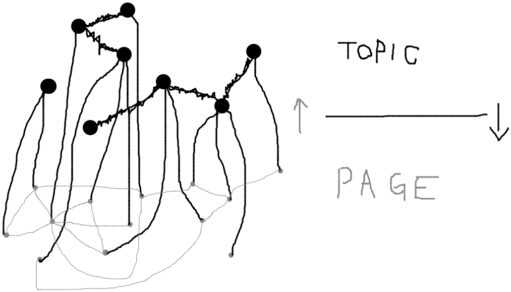

# Topic pick

## トピックピックとは
**トピックに対する記述が最大n人分並ぶ** という情報のあり方のこと。トピックという対象に各自の棒（記述）をぶっ刺す、というニュアンス。

トピックピックは [並べるコミュニケーション](https://scrapbox.io/sta/%E4%B8%A6%E3%81%B9%E3%82%8B%E3%82%B3%E3%83%9F%E3%83%A5%E3%83%8B%E3%82%B1%E3%83%BC%E3%82%B7%E3%83%A7%E3%83%B3) の一種である。あるトピックには、常に（最大）n人分の記述が並んでいる。

## トピックピックの必要性
従来のあり方は「ページが一つあって、その中を皆で編集する」であった。最終的に残るのは「皆のための記述」だけである。

この従来のやり方を **トピックシェアリング** と呼ぼう。一つの場を皆でシェアするこのやり方は、言及や協調がしやすい反面、各自が自由に振る舞いづらい。これでは生産的に動けない。

無論、個人で生産的に動きたいなら、個人のワークエリアで動けば良いのであるが、そうすると今度は言及や協調がしづらくなる。他人の個人的なエリアを好き好んで見る物好きはそうはいないし、見たところでその人のワールドなどわかるはずもない。そもそも個人ワークエリアが「他者が見ることができる」機能を持っているとは限らない。

共同の場でありながらも、個人が遠慮なく生産的に動く――

そのような微妙なバランスを欲しがっているのは、私だけだろうか。否、そうではないと思うからこそ、私は一案を投じることにした。

## 必ず n 人の意見が並ぶ世界
トピックピックは、n人分の意見が並ぶことを保証する。

トピック（話題） X に対し、n人がそれぞれ自分のページを刺す（刺さなくても良い）。Xに刺さったページは、誰でも自由に目を通すことができる。しかしページは個人の持ち物であるため、他人には編集できない――このような世界になる。

これにより、

- 自分の意見を存分に書くことができる
- 他人の意見をかんたんに見ることができる
- 望みの情報に整えるためには、自分が手を動かす必要がある
    - 他人のページを変えることはできない
    - 他人のページを参考に、自分のページをつくりこむ

トピックに対する情報を「人」から辿ることになる点にも注目したい。たとえば「Aさんならどう書くだろうか」「このトピックは B さんのページが一番詳しそうだ」「Cさんはいつも定義をはっきりさせるから最初に覗く」といったような辿り方になる。これは人間にとって自然な営為である。人は内容よりも人で物を選ぶ。

ここで「特定の人のページしか見ないのでは」との懸念があるかもしれないが、意外と杞憂である。というのも、何が書いてあるかは見に行くまでわからないし、見る際にお互いを拘束することがないということもあって、普段見ない相手（何なら嫌っている相手）のページも覗きやすいからだ。

ちなみに「最終的な意思決定はどうすればいいのか」という疑問もあるかもしれない。これについては、意思決定者がページを刺せば良い。

# 各種概念

## 図示
topic と page

```
        [topic]
         A A A
         | | |
    +----+ | +-----+     Pick
    |      |       |
    |      |       |
 [page]  [page]  [page]
    A      A       A
    |      |       |     Edit
    |      |       |
  user1  user2   user3
```

topic collection

```
    [topic]  [topic]  [topic]
       A       A        A
       |       |        |
       +----+  |        |       Link
            |  |        |
           [topiccollection]
                 A       A
                 |       |      Edit
                 |       |
               user1   user2
```

page は topic collection にもリンクできる

```
                       Link
    [topic]<---------+
       A             |
       |             |
       |             |
  Pick |      [topiccollection]
       |             A
       |             |
     [page]----------+
       A               Link
       | Edit
       |
     user1
```

## 単位

### トピック/Topic
話題。

- トピックに言及するためには、ページを刺す必要がある
- トピックはページと共同リンク集からリンクされる

トピックは実はページタイトルである。

- 例
    - UさんがページPのタイトルをXにすると、Pは「トピックXに刺さっているUさんのページ」となる
    - この状態で、UさんがPのタイトルをYにしたとする
        - Pに刺さっていたUさんのページはなくなる
        - トピックYに刺さる

### ページ/Page
あるトピックに関する記述。

- 1-topic につき最大 N ページ（ユーザー数）が刺さる
    - 1-topic につき N-page を刺すことができる
    - 1-user は 1-page per topic しかつくれない
- ページはページからリンクされる

ページとは personal page である。

- U さんが書いたページ P は、U さんにしかいじれない

ページには private と public がある。どちらも 1-topic につき 1-page のみ刺すことができる。private は自分にしか見えない。public は他者にも見える。

### 共同リンク集/Topic Collection
トピックへのリンクをn個並べたもの。

- トピックへのリンクのみ並べることができる
- 共同リンク集はページからリンクされる

共同リンク集は non personal である。

- ユーザー全員が自由に編集できる

## 単位(その他)

### プロジェクト/Project
n-Topic、n-Page、n-TopicCollection、n-Userを持つ単位。ScrapboxでいうProjectみたいなもの。

## 操作

### リンクする
`[pagename]` や `[topicname]` の形で、文法として書いて繋げること。

### 刺す(Pick)
各ユーザーが自分の personal public pageを繋げること。刺される先には、最大でn人分のpersonal public pageが刺す。刺される先からは、刺さっているpersonal public pageを自由に辿れるが、他人のそれは編集できない。

### フリーズする
ページまたはトピックに対して「現時点の内容を保存」して「エクスポートできるようにする」こと。

フリーズされたものはフローズンという。

- フローズンページ
    - ページPのフローズン
- フローズントピック
    - トピックTと、そこに刺さっているページPすべて（private pageは含まない）のフローズン

以下もフローズンであるが、エクスポートの意味合いが強い。

- フローズンユーザー
    - ユーザーUと、書いたページ（private page含む）のフローズン
- フローズンプロジェクト
    - プロジェクトと、書いたページ（private page含まない）のフローズン
- センシティブ・フローズンプロジェクト
    - プロジェクトと、書いたページ（private page含む）のフローズン
    - :rabbit: まだどう実現するかは決めていない。そもそも要る？

その他

- フローズンは実施した本人のみが利用できる
    - ただしリンクを共有すれば他者も利用できる
- フローズンは永続的でない
    - 一定期間がすぎると削除される
    - 永続化したい場合、後述のリリースを行う必要がある
- フローズンはいろいろな形式をサポートする
    - Topick internal format
    - Markdown
    - HTML
    - PDF etc

### リリースする
フローズンを正式採用すること。リリースされたフローズンは、当該ページやトピックの「リリース一覧」から誰でも閲覧・ダウンロードできるようになる。

リリースできるフローズンはページとトピックのみ。

- リリースドフローズントピック
    - リリースされたフローズントピック
    - トピックTを例にすると、Tと、そこに刺さっているページPすべてを対応形式で閲覧 or ダウンロードできる
- リリースドフローズンページ
    - リリースされたフローズンページ
    - トピックTに刺さったページPを例にすると、Tの画面からPの対応形式を閲覧・ダウンロードできる、またPの画面からもできる
        - Tから（自身に刺さっている）フローズンページPを直接見に行けるのがポイント
        - なぜなら **トピックTの正式内容として特定のページを使いたいシチュ** があるはずで、これを実現できるから

## リンク

### 記法
まだあまり真面目に考えてない。scbベース。区切りは「刺す」ニュアンスが出てそうな`<`を使うことに。

- トピックへのリンク
    - `[sta]`
- トピックstaに刺してるstaさんのページ、へのリンク
    - `[sta<sta]`
- トピックstaに刺してるkiranoさんのページ、へのリンク
    - `[sta<kirano]`
- url and alttext
    - `[sta https://scrapbox.io/sta]`
    - `[https://scrapbox.io/sta sta]`
- to external project
    - `[/projectname]`
- to external project specific topic
    - `[/projectname<topicX]`
- to external project specific topic specific page
    - `[/projectname<topicX<satoh]`

リンクの視覚的区別

- Scrapboxと同様、実在へのリンクと未存在へのリンクを視覚的に区別する
    - topickでは「このトピック（ページタイトル）にしてくれ」と収束が働く力学になると思ってる
        - 共同リンク集でn個の表記ゆれを書いた後、「あとこれとこれが修正できてねえぞ」ってのを可視化する
        - 1つを除いたすべてが未存在リンクになった＝表記ゆれ吸収した
    - 視覚的区別があると、こういう作業をしやすい
    - あって損はない

# プロジェクトの俯瞰
n-topic n-page が集まってる世界をどう俯瞰するか。

## 単位ごと
単位ごとに俯瞰

- トピックを俯瞰する
    - プロジェクト内の全トピック
    - 共同リンク集Cからリンクされているトピック
- ページを俯瞰する
    - プロジェクト内の全ページ
    - トピックTに刺さってるページ
    - ユーザーUが刺したページ
- 共同リンク集を俯瞰する
    - プロジェクト内の全共同リンク集
    - トピックTにリンクしている共同リンク集
    - ページPがリンクしている共同リンク集

単位ごとに何がぶら下がるか

- プロジェクト
    - 全トピック
    - 全ページ
    - 全共同リンク集
- トピック
    - このトピックに刺さっているページ
    - このトピックにリンクしている共同リンク集
- ページ
    - ~~このページが刺しているトピック~~ 自明。＝ページタイトル
    - このページがリンクしているページ
    - このページがリンクしているトピック
    - このページがリンクしている共同リンク集
- 共同リンク集
    - ~~この共同リンク集がリンクしているトピック~~ 自明。内容そのもの。
    - この共同リンク集にリンクしているページ

## 何を知りたいか
- 自分が書いたもの
- 自分が書いたものに対する更新
- 自分が書いたものへの言及
- Aさんが書いたもの
- Aさんが刺したもの
- 最近更新されたもの
- 盛り上がっているもの
    - ピック率の高さ？
- ピックキャンセルの痕跡と移動先
    - トピックT1にa,b,cさんがページを刺していたとする(page_a, page_b, page_c)
    - aさんがpage_aのタイトルをT1に変えた
    - before
        - T1 <== page_a, page_b, page_c
    - after
        - T1 <== page_b, page_c
        - T2 <== page_a
    - T1をウォッチしている人が page_a の行く先を知るには？
    - :rabbit: トピック内で見せるなら俯瞰とは関係がない。「最近キャンセルされたもの一覧」などを用意するなら俯瞰の範疇になる。

以下は俯瞰とは関係ない

- トピックTにまだページを刺していない人
- トピックTのピック率
    - `(刺さった数) / (ユーザー数)`
- Aさんのピック率
    - `(ページつくった数) / (トピック総数)`

## UI
Scrapbox

- Card UI
- 豊富なソート
- フィルタリングはサポートしない
- 強力な検索
    - 素早い補完
    - あいまい検索


# FAQ

## Q: topickとは？
Ans: Topic Pickの略

## Q: 意思決定者や他者のページに物申したいときは？
- topickで行う場合
    - 「Aに対して言いたいこと」トピックをつくり、物申したい人がぶら下げる
    - 「Aに対する意見を集めた共同リンク集」をつくり、トピックAへのリンクを書く
        - このリンク集は「1の言及対象」と「nの言及内容」が並ぶ
        - 言及対象（トピックA）からは、この共同リンクが見える（ので辿ることができる）
- topick以外の外部ツールを使う

## Q: 通知やタスク管理はサポートする？
Ans: しない

topickが扱うのはタスク（実施と締切が確定した事柄）の前段階である。たとえば情報共有、アイデアや出来事の議論、言語化の練習、語り合いや娯楽としての議論などを想定している。別の言い方をすると、タスクを確定させる前段階の創造・コラボレーション・整理用途で使う。あるいは純粋に娯楽や気分転換として使う。

なぜタスクを扱わないかというと、ややこしくなるからである。通知も組み込まねばならないし、タスク管理（≒状態・アサイン・関係の管理）も必要になる。ツールあるいは思想として煩雑になることは目に見えている。

## Q: 共同編集機能を持たせないのはなぜ？
Ans: topickの思想ではないから

topickのコンセプトは **並べるコミュニケーション** である。従来の「皆でつくった代表的な情報だけが存在する」だと、一部の声も大きい者しか反映させることができないし、そもそもすべての意見を乗せることもできない。topick ではそれを憂いており、全員の意見を並べられるようにしてある（ページを刺すことでしか情報を記述できない）。

もし共同編集を入れてしまうと、ユーザーはこればかり使うことになるだろう。並べるコミュニケーションを実現するためには、そのような妨害因子は潰さねばならない。そもそも並べるコミュニケーションは見慣れない概念であろうから、これくらい荒療治しなければ定着しない。

## Q: トピックからトピックへのリンクをサポートしていないのはなぜ？
Ans: 並べるコミュニケーションの思想が妨害されるから

topickで行いたいことは、並べた意見（刺されたページ）を読ませることである。安易にトピック間リンクをサポートしてしまうと、ページを見に来る行動が減ってしまう。また、利用者はトピック間リンクを書くことに忙殺されてしまい、ページの記述が疎かになる。

しかしながら、トピック間リンクがないと不便なのも事実である。そこで自動リンクをサポートしている。

## === 未解決 ====

## Q: ユーザーが抜ける場合はどうすればいい？
Ans: -

- 抜けた場合もコンテンツはそのまま残る
    - 誰もいじれない
    - personal private page については
        - 全削除か全公開（personal public pageへのマージ）かを選べる
- 抜けたユーザー(レフトユーザー)に関する何らかのマーキングがあるといい
    - archive のような概念
    - left(leaveの過去分詞)？
    - 何らかの視覚効果で「このユーザーは既に離脱しています」的な意を表す
- ピック率 per topic はどう計算する？
    - 特にいじらない
        - `(刺さった数) / (ユーザー数)`
        - 分子も分母も変えない
    - なぜなら、どちらかを変えることは「虚偽を伝える」あるいは「離脱したユーザーのページには価値がない（（問答無用で見えなくしているため）」を意味するからである


## Q: topick上の他者の活動にはどうやって気付けば良い？アシストする仕組みはある？
Ans: 考えている

アプローチは以下であろう。

- 購読
    - ブックマーク、スター、サブスクライブ etc
- ソート
    - Scrapbox では Date created, Date modified, most linked, most viewed など使いやすい観点を用意している
- フィルタリング
    - トピックで言えば、たとえば
        - Already picked by me(既に自分が刺しているトピック)
        - Not picked yet by me(まだ自分が刺していないトピック)
    - ページで言えば、たとえば
        - my page and linked from other(自分のページで、他者のページからリンクされたもの)
- ソータリング
    - ソートしたものをさらにフィルタリングできると良い
    - このあたりはデフォルト内蔵にするか、カスタマイズできるようにするか
        - 前者が良い
        - 先進的なツールは、一番わかっている開発元が設定より規約を行いドッグフーディングして高めるのが良いのではないか
- 新着
    - Scrapbox では Stream
- 未読管理
    - どこが更新されたかがわかるようにするための、何らかの仕組み
    - Scrapboxではテロメアが使われている

ただしメンションなど通知はサポートしない。割り込みは個人の創造性を集中を妨げる。

# 例: 会議するとしたら

## 前提
- 部門の中に平社員が26人、管理職が5人、部長が1人いる30人くらいのチーム
    - 部門
        - B部長
            - M1マネージャ
                - Aさん
                - Bさん（B部長とは別人）
                - ……
            - M2マネージャ
            - M3マネージャ
                - Mさん（Miマネージャとは別人）
            - M4マネージャ
            - M5マネージャ
                - Vさん
                - ……
                - Zさん
- 毎月行っている部門定例
    - 主に情報共有の場だが、交流も重視しておりワークを行ったり、誰かに発表してもらったり、外から招いて勉強会開いてもらったりもする
    - たまにトップダウンで「この件について議論して感想を出せ」「会社が定めたこのビジョンについて議論して結果を報告せよ」などの指示が降りてくる（ので優先的に議題にする）
    - 各業務の話はしない
        - 情報共有・報告・新事業アイデアなどはする

## やり方の例
部門プロジェクトPがあるとして、ここに「2021/11/05定例会議」トピックをつくる

- 「2021/11/05定例会議」トピック
- (アジェンダ決定フェーズ)
    - B部長がページを差し込んでアジェンダとか書くのが一番早い
    - B部長「M1さん、アジェンダ書いといて。これとこれね」みたいにお願いするかもしれない
- (会議中)
    - 既に刺してあるページを見ながら会議に望む
    - 議事メモ担当のAさんは、自分のページを指してそこで書く
    - 全員が好きに読めばいいもの
        - 他の人も適当に刺して書けばいい
            - そして参加者全員はそれらを自由に読める
        - ワークショップ等の場合は、各自の意見やワークなどを各自のページに書き込むことになる
    - 全員にちゃんと読ませたいもの
        - 関連トピックをつくり、さらにページを刺す
        - 例: ワークショップW1を行う。マネージャ単位で分かれて取り組んでもらう。議事メモ各自取れ。
            - 1: 「2021/11/05定例会議 W1」トピックをつくる
            - 2: 各マネージャグループがページを刺して議事メモを取る
                - 計5ページが刺さるはず
                - あるいはマネージャが刺して「正式な議事メモはこれ」とポインタ張るのもいい
                    - このやり方なら正式じゃない人も好きに議事メモ書ける
                    - が、だいぶややこしくなるかな？
        - Q: 「2021/11/05定例会議 W1」トピックにはどうやって気づく？
            - Ans: 自動リンクが発動して、「2021/11/05定例会議」トピックから辿れるようになる
- (FIX)
    - 議事メモ完成や発表内容前の fix は、リリースにて行う
    - 議事メモ
        - 「2021/11/05定例会議」<「M1」ページをリリースすればいい
    - 各発表内容
        - 「2021/11/05定例会議 W1 M1チーム」トピックをリリースするとか
        - 「2021/11/05定例会議 W1」<「C」ページ（M1チームは C さんが議事メモ取った）をリリースするとか

## まとめ
- topick では共同編集の概念がないため、常に誰かがページを刺す必要がある
- 正式なコンテンツを用意するには？
    - 誰かが代表して書いたものをリリースする
- もちろんチームが許すなら無理にリリースしなくても（正式を用意しなくても）いい
    - 何なら「誰かが代表して」も決めずに、各自が自分なりにメモを取る＆全員他人のを自由に読める状態になっている、でもいい
    - むしろ topick としてはこっちが合っている
    - ただ、正式を用意するようなやり方もやろうと思えばできる、と示したのが今回の例
- ある会議のトピック T に、関連するページをぶら下げていくには？
    - T の名前を含んだトピックをつくる
        - すると自動リンクが働いて T から辿れるようになる
        - **この発想は超重要です**
    - 権限持ってる人が自分のページを刺す
        - たとえば部長がページを刺せば、そのトピックに関する部長の見解が明示されたも等しい

# misc

## トピックの表示内容を決める
トピックTを開いたとき、どのような内容を表示するべきだろうか。候補は以下のとおり。

- a: 特定の1ページ内容
- b: 複数のページ内容
- c: すべてのページへのリンク

少なくとも c は必要である。でなければ T から（それに刺さっている）ページを辿れない。

しかし c だけだと、何らかのページを見に行くためにワンクッション必要であり面倒である。最初からページが表示されていると楽である。ここで、 a と b が出てくる。つまり **「その最初に表示するページとして何を選ぶか」「表示数はどうするのか」という問題** である。

### デフォルトページ
極力シンプルでありたいので、topick では a のみをサポートする。つまりデフォルトで表示するページは高々一つである。このようなページを T の **デフォルトページ** と呼ぶ。

### デフォルトページの決定
デフォルトページの決定には **ユーザー投票** を用いる。

まずポイントを導入する。

- 各ユーザーはトピックごとに 1 ポイントを持っている
- ポイントは、何もしなければ、自分が刺したページ自身についている（つまり自分に付けている）
- ユーザーは、ポイントを他のユーザーのページにつけることができる
    - ただし当該トピックを越えることはできない

次にデフォルトページの決定方法を定める。

- ポイントが最も大きいページをデフォルトページとする
- ただし同列が 2 ページ以上存在する場合、デフォルトページは無しとする

ここから言えるのは、次のとおりである。

- トピックごとに **「どのページがデフォルトにふさわしいか」をユーザーが決める** ことができる
- 誰も何も付け替えなければ、デフォルトページは発生しない
    - 全員が自分のページにつけており、同列 1 ポイントであるため

## トピックレイヤーとページレイヤー


トピック間を辿るレイヤーと、ページ間を辿るレイヤーがある。

- トピックは「トピックのアタッチ」のみサポート
    - アタッチの性質上、木構造的なグラフになる
- ページはページ間リンクをサポート
    - Scrapboxのページと同様、普通のグラフになる
- トピック-ページ間は、ピック（トピックにページを刺す）のみサポート

利用者はトピックレイヤーとページレイヤーを意識しながら行き来することになる。

## トピックのアタッチ(自動リンク)
トピックTに関連するトピックT1をつくる際、TからT1までどうやって辿るかという問題がある（トピック間リンクはサポートしていないため）。これを解決するのが **アタッチ** である。

アタッチとは「あるトピックTから、Tに関連するトピックT1をつくる」こと。このとき、T1は`T T1`というトピック名になる。また T の関連情報として T1 が表示されるようになり、T を見ている読者が T1 に気づくことができる。この自動表示を **自動リンク** という。

アタッチはその名のとおり「連結」するニュアンス。T1 は T に連結している。

### アタッチのイメージ
以下にイメージを示す。

```
トピックT

    +---+
    |   |
    |   |
    +---+

トピックT1

    +===+
    |   |
    +===+

トピックTに、T1を連結させる

    +---+
    |   |+===+
    |   ||   |
    +---++===+
```

```
トピックTにはページが刺さっているとする

     |
     V
    +---+
    |   |<-
    |   |<-
    +---+
     A A
     | |

トピックT1にも刺さっているとする

     | |
     v v
    +===+
    |   |
    +===+
      A
      |

TにT1をアタッチした後は、こんな感じになっているだろう

     |||
     VVV   |
    +---+  V
    |   |+===+
    |   ||   |<-
    +---++===+
     A A   A
     | |   |

```

### 針でたとえる
- トピックは、針刺しである
    - 連結とは針刺しと針刺しとくっつけること
- ページは、針である
    - トピックという針刺しに刺すもの
- ページ間リンクは、糸である
    - 針と針が糸で繋がっているイメージ

## 拡張性
- カスタムユーザー
    - 話題Aにページを刺せるのはユーザーだけである
    - 特殊な情報を刺したい場合、そのような情報を生成する bot のようなものをつくると良い
    - API は、話題に紐づくページやユーザーの情報をgetできると良い
    - 例
        - ページ一覧を指定観点で並べる
        - まだページを刺してないユーザーの一覧を並べる
        - ページ内文字数ランキングをつくる
        - ページに含まれるリンクをすべてリストアップする with 出現回数カウントつき
- フローズンのエクスポートフォーマット
    - Markdown, HTML, PDF くらいはデフォでサポートしてあるとありがたいだろう
    - 自由に拡張できると良い
    - エクスポート画面からダウンロードできるとなお良い

# 更新履歴
- ★
- 2021/10/18 開始
